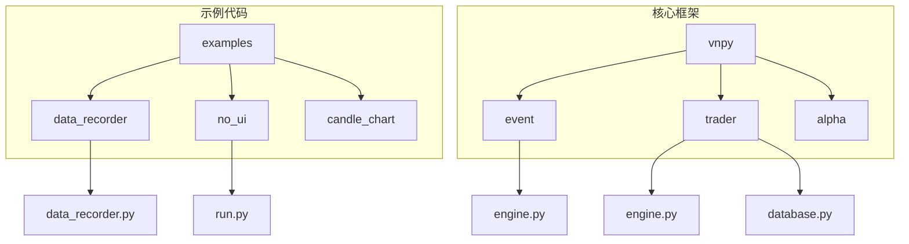
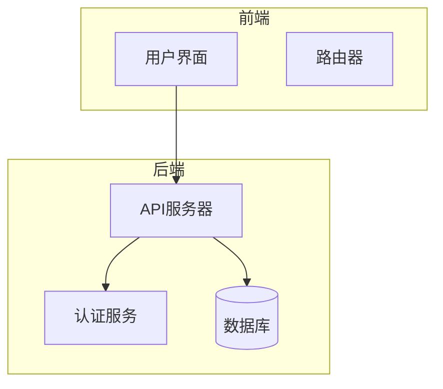
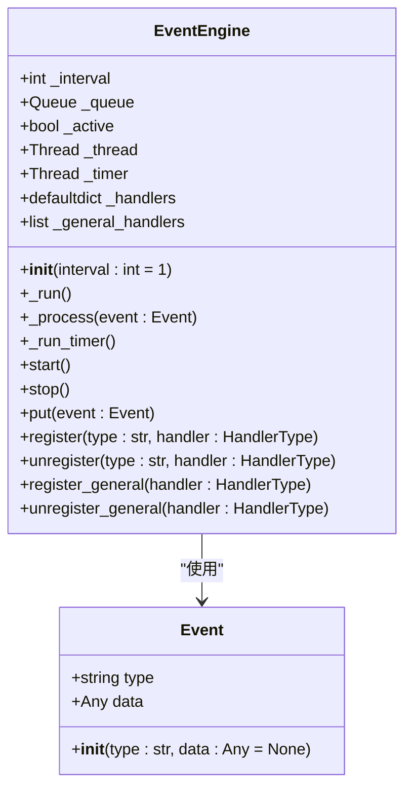
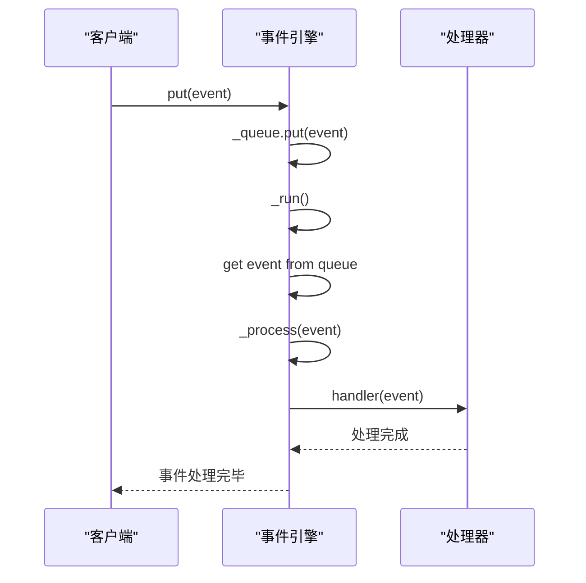
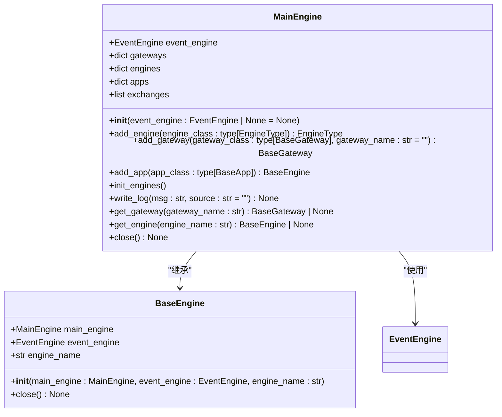
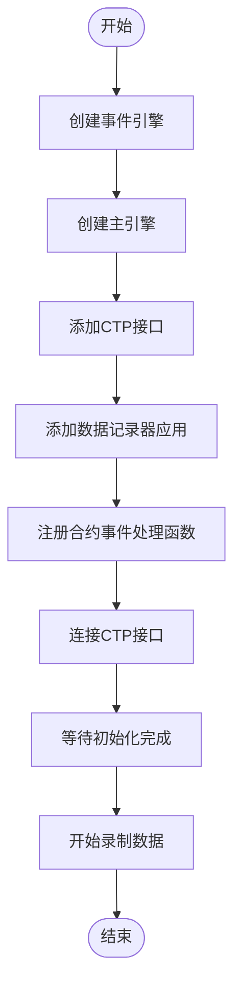
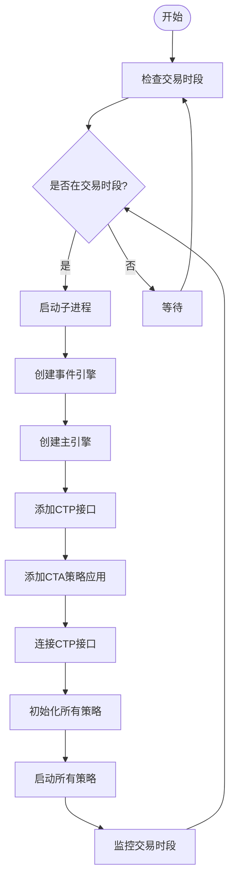
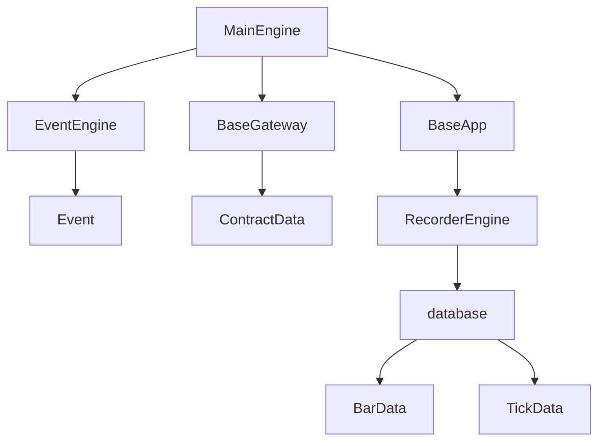

# 性能优化

<cite>
**本文档中引用的文件**
- [engine.py](file://vnpy/event/engine.py)
- [engine.py](file://vnpy/trader/engine.py)
- [data_recorder.py](file://examples/data_recorder/data_recorder.py)
- [run.py](file://examples/no_ui/run.py)
- [database.py](file://vnpy/trader/database.py)
</cite>

## 目录
1. [引言](#引言)
2. [项目结构](#项目结构)
3. [核心组件](#核心组件)
4. [架构概述](#架构概述)
5. [详细组件分析](#详细组件分析)
6. [依赖分析](#依赖分析)
7. [性能考虑](#性能考虑)
8. [故障排除指南](#故障排除指南)
9. [结论](#结论)
10. [附录](#附录)（如有必要）

## 引言
本文档旨在为高频交易场景下的延迟敏感性问题提供系统级调优方案。通过分析no_ui模式下移除GUI层带来的性能提升原理，量化不同组件的CPU与内存开销，探讨事件引擎的调度效率优化策略，并结合data_recorder.py示例说明高效数据写入的最佳实践。此外，还将讲解Python GC调优技巧、内存泄漏检测方法和对象复用模式的应用建议，最终设计低延迟消息传递通道以确保关键交易指令的快速响应。

## 项目结构
本项目采用模块化设计，主要分为示例代码和核心框架两大部分。示例代码位于`examples`目录下，包含多个使用场景的演示程序；核心框架位于`vnpy`目录下，实现了事件驱动架构、交易引擎、数据记录等功能。

**Diagram sources**
- [data_recorder.py](file://examples/data_recorder/data_recorder.py)
- [run.py](file://examples/no_ui/run.py)
- [engine.py](file://vnpy/event/engine.py)
- [engine.py](file://vnpy/trader/engine.py)
- [database.py](file://vnpy/trader/database.py)

**Section sources**
- [data_recorder.py](file://examples/data_recorder/data_recorder.py)
- [run.py](file://examples/no_ui/run.py)
- [engine.py](file://vnpy/event/engine.py)
- [engine.py](file://vnpy/trader/engine.py)
- [database.py](file://vnpy/trader/database.py)

## 核心组件
系统的核心组件包括事件引擎、主引擎、数据记录器和无UI模式运行机制。这些组件共同构成了一个高效的事件驱动交易系统。

**Section sources**
- [engine.py](file://vnpy/event/engine.py)
- [engine.py](file://vnpy/trader/engine.py)
- [data_recorder.py](file://examples/data_recorder/data_recorder.py)
- [run.py](file://examples/no_ui/run.py)

## 架构概述
系统采用事件驱动架构，通过事件引擎实现各模块间的松耦合通信。主引擎负责管理所有功能模块，包括底层接口、上层应用等。数据记录器作为独立应用模块，可灵活添加到系统中。

**Diagram sources**
- [engine.py](file://vnpy/event/engine.py)
- [engine.py](file://vnpy/trader/engine.py)

## 详细组件分析

### 事件引擎分析
事件引擎是整个系统的核心，负责事件的分发和处理。它通过多线程机制实现事件队列的异步处理，同时生成定时器事件用于周期性任务。

#### 类图

**Diagram sources**
- [engine.py](file://vnpy/event/engine.py#L1-L145)

#### 序列图

**Diagram sources**
- [engine.py](file://vnpy/event/engine.py#L1-L145)

**Section sources**
- [engine.py](file://vnpy/event/engine.py#L1-L145)

### 主引擎分析
主引擎作为交易系统的中枢，负责协调各个功能模块的工作。它通过事件引擎与其他模块进行通信，并提供统一的接口供外部调用。

#### 类图

**Diagram sources**
- [engine.py](file://vnpy/trader/engine.py#L1-L619)

**Section sources**
- [engine.py](file://vnpy/trader/engine.py#L1-L619)

### 数据记录器分析
数据记录器示例展示了如何高效地将市场行情数据持久化到数据库中。该组件通过事件驱动机制接收Tick数据，并批量写入数据库以提高性能。

#### 流程图

**Diagram sources**
- [data_recorder.py](file://examples/data_recorder/data_recorder.py#L1-L146)

**Section sources**
- [data_recorder.py](file://examples/data_recorder/data_recorder.py#L1-L146)

### 无UI模式分析
无UI模式通过移除图形用户界面层，显著降低了系统的CPU和内存开销。这种模式特别适合在服务器环境中运行自动化交易策略。

#### 流程图

**Diagram sources**
- [run.py](file://examples/no_ui/run.py#L1-L125)

**Section sources**
- [run.py](file://examples/no_ui/run.py#L1-L125)

## 依赖分析
系统各组件之间的依赖关系清晰，通过事件驱动机制实现了松耦合设计。主引擎依赖于事件引擎，而各种应用模块则通过事件引擎与主引擎通信。

**Diagram sources**
- [engine.py](file://vnpy/trader/engine.py#L1-L619)
- [engine.py](file://vnpy/event/engine.py#L1-L145)
- [database.py](file://vnpy/trader/database.py#L1-L159)

**Section sources**
- [engine.py](file://vnpy/trader/engine.py#L1-L619)
- [engine.py](file://vnpy/event/engine.py#L1-L145)
- [database.py](file://vnpy/trader/database.py#L1-L159)

## 性能考虑
在高频交易场景下，系统性能至关重要。以下是一些关键的性能优化建议：

1. **事件队列缓冲**：合理设置事件队列大小，避免因队列溢出导致事件丢失。
2. **批量处理**：对数据库写入操作采用批量处理方式，减少I/O开销。
3. **线程池配置**：根据系统资源情况优化线程池大小，平衡并发性能和资源消耗。
4. **异步持久化**：使用异步方式将数据写入数据库，避免阻塞主处理线程。
5. **索引优化**：为数据库表创建合适的索引，加快查询速度。
6. **Python GC调优**：调整垃圾回收参数，避免在关键路径上发生停顿。
7. **对象复用**：尽可能复用对象实例，减少内存分配和回收开销。

**Section sources**
- [engine.py](file://vnpy/event/engine.py#L1-L145)
- [engine.py](file://vnpy/trader/engine.py#L1-L619)
- [data_recorder.py](file://examples/data_recorder/data_recorder.py#L1-L146)
- [database.py](file://vnpy/trader/database.py#L1-L159)

## 故障排除指南
当系统出现性能问题时，可以按照以下步骤进行排查：

1. **监控CPU和内存使用率**：检查是否存在资源瓶颈。
2. **分析事件处理延迟**：确定事件从产生到处理的时间是否过长。
3. **检查数据库写入性能**：评估批量插入和索引对性能的影响。
4. **审查Python GC行为**：观察垃圾回收是否频繁发生并影响关键路径。
5. **检测内存泄漏**：使用专业工具检查是否存在内存泄漏问题。
6. **验证线程池配置**：确认线程池大小是否适合当前工作负载。

**Section sources**
- [engine.py](file://vnpy/event/engine.py#L1-L145)
- [engine.py](file://vnpy/trader/engine.py#L1-L619)
- [data_recorder.py](file://examples/data_recorder/data_recorder.py#L1-L146)
- [database.py](file://vnpy/trader/database.py#L1-L159)

## 结论
通过分析vnpy框架的架构和实现，我们得出了一系列针对高频交易场景的性能优化方案。移除GUI层可以显著降低系统开销，事件引擎的合理配置能够提高调度效率，而数据记录器的最佳实践则确保了高效的数据持久化。结合Python GC调优和内存管理技巧，可以构建一个低延迟、高可靠性的交易系统。

## 附录
本文档所引用的所有文件均已在"本文档中引用的文件"部分列出，具体实现细节可通过查阅相应源码获得。