# vnpy高级功能应用指南

<cite>
**本文档引用的文件**
- [examples/client_server/run_server.py](file://examples/client_server/run_server.py)
- [examples/client_server/run_client.py](file://examples/client_server/run_client.py)
- [examples/spread_backtesting/backtesting.ipynb](file://examples/spread_backtesting/backtesting.ipynb)
- [vnpy/trader/engine.py](file://vnpy/trader/engine.py)
- [vnpy/rpc/server.py](file://vnpy/rpc/server.py)
- [vnpy/rpc/client.py](file://vnpy/rpc/client.py)
- [vnpy/trader/optimize.py](file://vnpy/trader/optimize.py)
- [vnpy/chart/widget.py](file://vnpy/chart/widget.py)
</cite>

## 目录
1. [简介](#简介)
2. [分布式架构客户端-服务器协同](#分布式架构客户端-服务器协同)
3. [价差交易策略建模与回测](#价差交易策略建模与回测)
4. [多账户管理与跨市场套利](#多账户管理与跨市场套利)
5. [算法交易复杂场景实现](#算法交易复杂场景实现)
6. [系统性能调优技巧](#系统性能调优技巧)
7. [机构级交易系统构建](#机构级交易系统构建)
8. [总结](#总结)

## 简介

vnpy是一个功能强大的量化交易平台，提供了丰富的高级功能模块。本指南将深入探讨如何利用vnpy的高级特性，包括分布式架构、价差交易策略、多账户管理、算法优化以及系统性能调优等关键技术领域，帮助用户构建高性能的机构级交易系统。

## 分布式架构客户端-服务器协同

### 架构设计原理

vnpy的RPC服务模块实现了完整的客户端-服务器架构，通过ZeroMQ实现高效的网络通信。这种设计允许多个客户端同时连接到同一个服务器实例，实现资源共享和负载均衡。

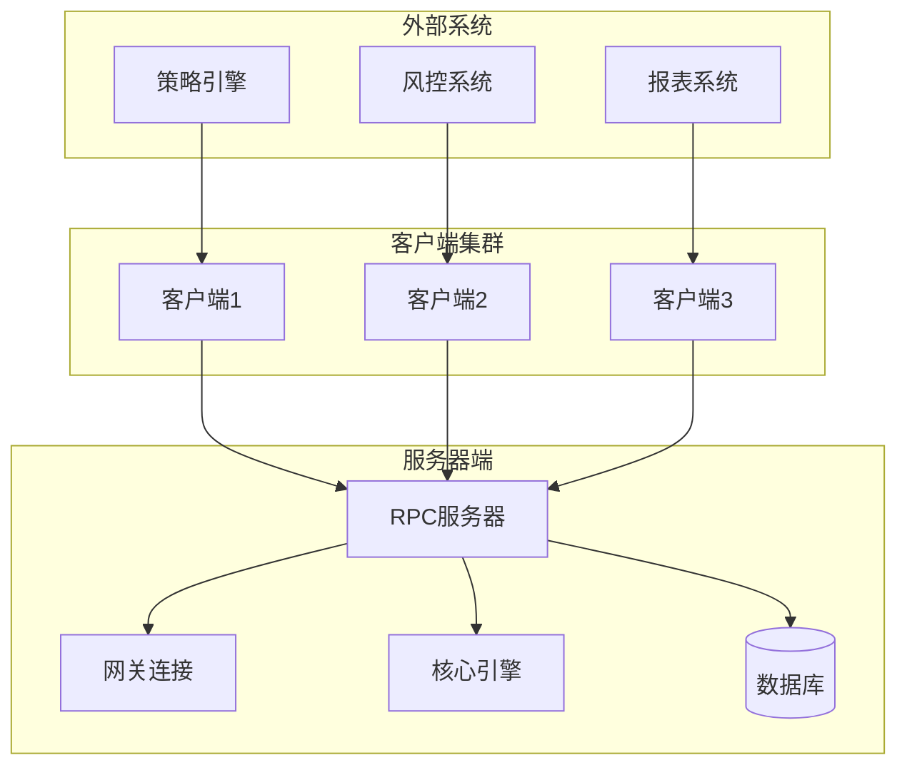

**图表来源**
- [examples/client_server/run_server.py](file://examples/client_server/run_server.py#L1-L74)
- [examples/client_server/run_client.py](file://examples/client_server/run_client.py#L1-L28)

### 服务器端实现

服务器端通过RPC服务应用启动，支持多种网关连接和应用程序集成：

```python
# 服务器端核心配置
def main_terminal() -> None:
    event_engine: EventEngine = EventEngine()
    main_engine: MainEngine = MainEngine(event_engine)
    
    # 添加CTP网关
    main_engine.add_gateway(CtpGateway)
    
    # 启动RPC服务
    rpc_engine: RpcEngine = main_engine.add_app(RpcServiceApp)
    rep_address: str = "tcp://127.0.0.1:2014"
    pub_address: str = "tcp://127.0.0.1:4102"
    rpc_engine.start(rep_address, pub_address)
```

### 客户端连接机制

客户端通过RPC网关连接到服务器，实现透明的远程过程调用：

```python
# 客户端连接配置
def main():
    event_engine = EventEngine()
    main_engine = MainEngine(event_engine)
    
    # 添加RPC网关
    main_engine.add_gateway(RpcGateway)
    
    # 添加策略应用
    main_engine.add_app(CtaStrategyApp)
```

### 高可用性设计

系统采用心跳检测机制确保连接稳定性：

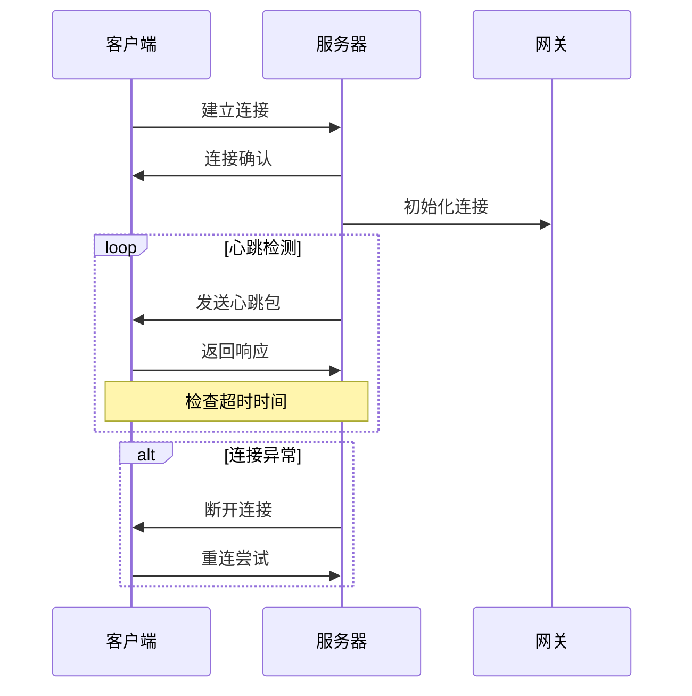

**图表来源**
- [vnpy/rpc/client.py](file://vnpy/rpc/client.py#L120-L140)
- [vnpy/rpc/server.py](file://vnpy/rpc/server.py#L120-L140)

**章节来源**
- [examples/client_server/run_server.py](file://examples/client_server/run_server.py#L30-L74)
- [examples/client_server/run_client.py](file://examples/client_server/run_client.py#L10-L28)
- [vnpy/rpc/server.py](file://vnpy/rpc/server.py#L1-L141)
- [vnpy/rpc/client.py](file://vnpy/rpc/client.py#L1-L170)

## 价差交易策略建模与回测

### 价差合约定义

价差交易是vnpy的重要特色功能，通过SpreadTrading模块实现复杂的套利策略：

```python
# 定义价差合约
spread = SpreadData(
    name="IF-Spread",
    legs=[LegData("IF1911.CFFEX"), LegData("IF1912.CFFEX")],
    variable_symbols={"A": "IF1911.CFFEX", "B": "IF1912.CFFEX"},
    variable_directions={"A": 1, "B": -1},
    price_formula="A-B",
    trading_multipliers={"IF1911.CFFEX": 1, "IF1912.CFFEX": 1},
    active_symbol="IF1911.CFFEX",
    min_volume=1,
    compile_formula=False
)
```

### 回测引擎架构

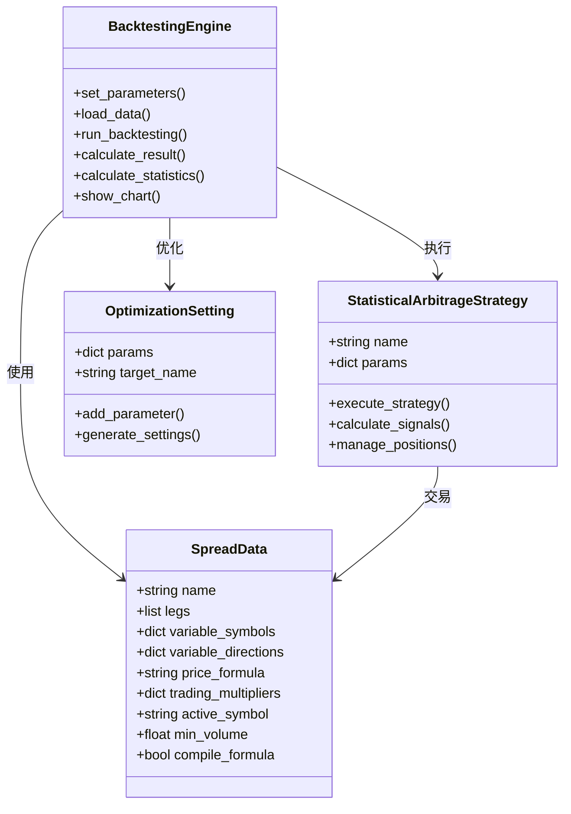

**图表来源**
- [examples/spread_backtesting/backtesting.ipynb](file://examples/spread_backtesting/backtesting.ipynb#L10-L30)

### 多进程优化策略

vnpy提供了两种优化算法：穷举法（Brute Force）和遗传算法（Genetic Algorithm），支持多进程并行计算：

```python
# 遗传算法优化配置
setting = OptimizationSetting()
setting.set_target("sharpe_ratio")
setting.add_parameter("boll_window", 10, 30, 1)
setting.add_parameter("boll_dev", 1, 3, 1)

# 运行遗传算法优化
engine.run_ga_optimization(setting)
```

### 性能优化技术

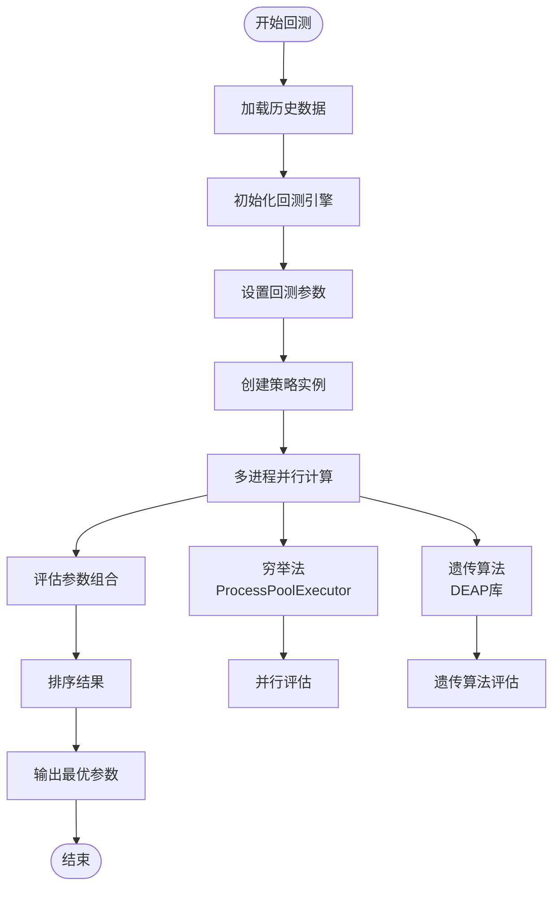

**图表来源**
- [vnpy/trader/optimize.py](file://vnpy/trader/optimize.py#L80-L120)

**章节来源**
- [examples/spread_backtesting/backtesting.ipynb](file://examples/spread_backtesting/backtesting.ipynb#L1-L131)
- [vnpy/trader/optimize.py](file://vnpy/trader/optimize.py#L1-L251)

## 多账户管理与跨市场套利

### 账户管理系统

vnpy的OmsEngine提供了完整的订单管理系统，支持多账户、多品种的统一管理：

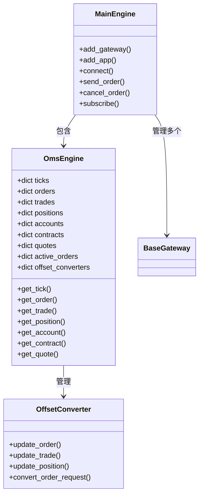

**图表来源**
- [vnpy/trader/engine.py](file://vnpy/trader/engine.py#L300-L400)

### 跨市场套利策略

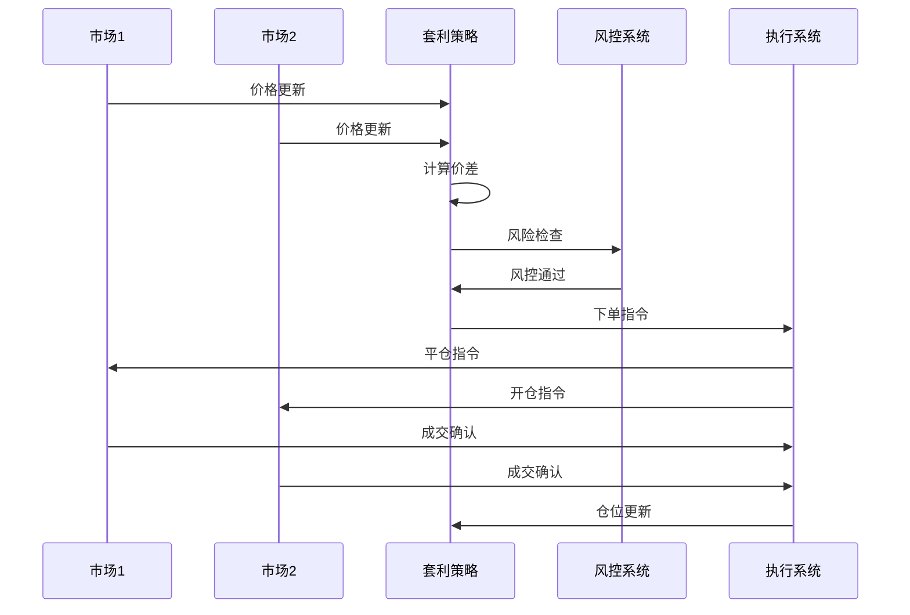

### 实时监控与报警

系统提供实时监控界面，支持多维度的数据展示：

```python
# 图表组件架构
class ChartWidget:
    def __init__(self):
        self._manager = BarManager()
        self._plots = {}
        self._items = {}
        self._cursor = None
        
    def add_plot(self, plot_name: str, minimum_height: int = 80):
        # 创建图表区域
        plot = pg.PlotItem()
        self._plots[plot_name] = plot
        
    def add_item(self, item_class, item_name: str, plot_name: str):
        # 添加图表项
        item = item_class(self._manager)
        self._items[item_name] = item
```

**章节来源**
- [vnpy/trader/engine.py](file://vnpy/trader/engine.py#L300-L500)
- [vnpy/chart/widget.py](file://vnpy/chart/widget.py#L1-L100)

## 算法交易复杂场景实现

### 高频交易优化

针对高频交易场景，系统提供了专门的优化机制：

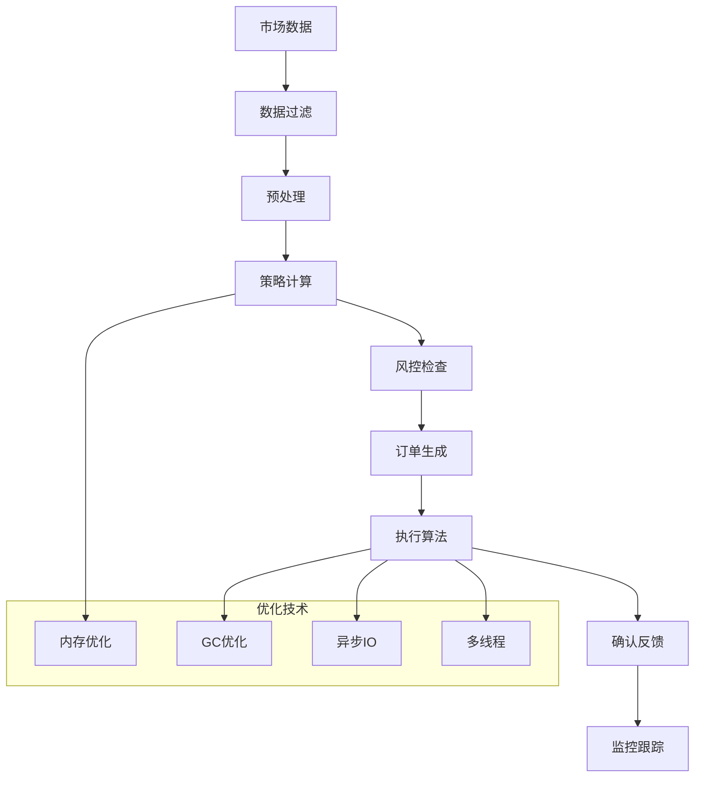

### 自适应算法框架

系统支持自适应参数调整和动态策略切换：

```python
# 参数优化设置
class OptimizationSetting:
    def __init__(self):
        self.params = {}
        self.target_name = ""
    
    def add_parameter(self, name: str, start: float, end: float = None, step: float = None):
        # 支持范围参数和固定参数
        if end is None or step is None:
            self.params[name] = [start]
        else:
            # 生成参数序列
            value = start
            while value <= end:
                self.params[name].append(value)
                value += step
```

### 并发控制机制

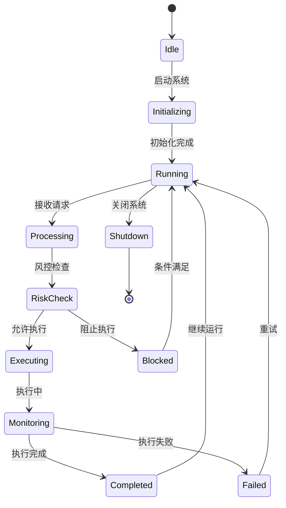

**章节来源**
- [vnpy/trader/optimize.py](file://vnpy/trader/optimize.py#L20-L80)

## 系统性能调优技巧

### 内存管理优化

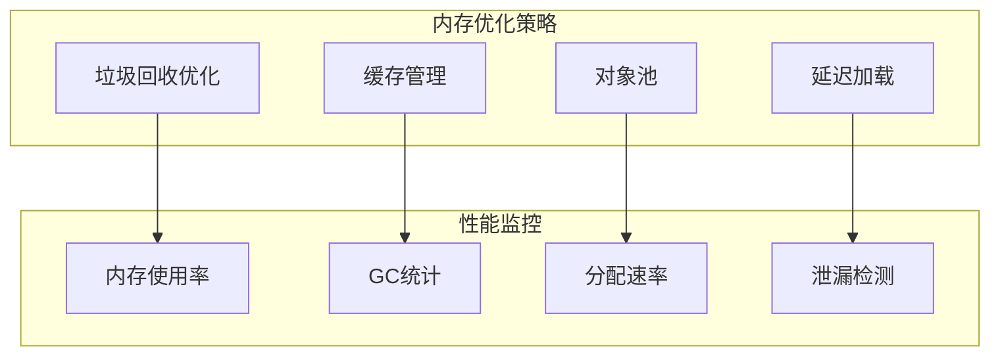

### 异步IO处理

系统采用事件驱动架构，通过ZeroMQ实现高效的异步通信：

```python
# 异步处理流程
class RpcServer:
    def run(self):
        while self._active:
            # 1秒轮询响应套接字
            n = self._socket_rep.poll(1000)
            self.check_heartbeat()
            
            if not n:
                continue
                
            # 接收请求数据
            req = self._socket_rep.recv_pyobj()
            name, args, kwargs = req
            
            # 执行函数并返回结果
            try:
                func = self._functions[name]
                result = func(*args, **kwargs)
                response = [True, result]
            except Exception as e:
                response = [False, traceback.format_exc()]
                
            self._socket_rep.send_pyobj(response)
```

### 系统资源监控

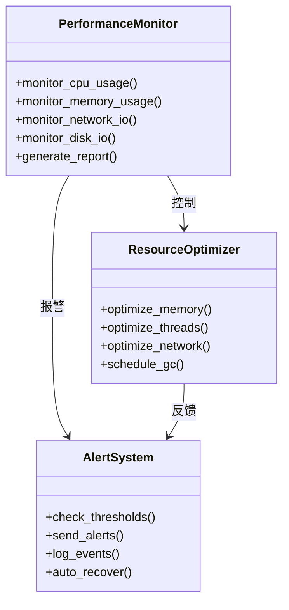

**章节来源**
- [vnpy/rpc/server.py](file://vnpy/rpc/server.py#L70-L120)

## 机构级交易系统构建

### 高可用架构设计

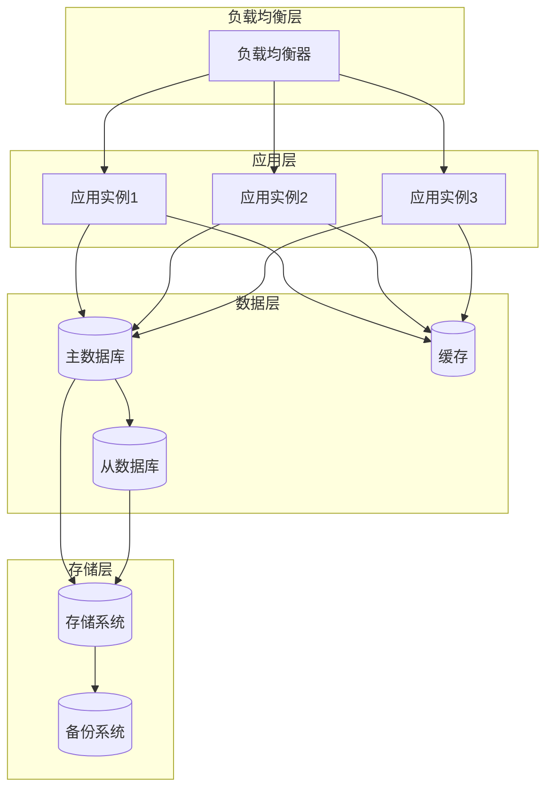

### 生产环境部署

系统支持容器化部署和集群管理，满足企业级需求：

```python
# 主引擎初始化
class MainEngine:
    def __init__(self, event_engine=None):
        if event_engine:
            self.event_engine = event_engine
        else:
            self.event_engine = EventEngine()
        self.event_engine.start()
        
        self.gateways = {}
        self.engines = {}
        self.apps = {}
        self.exchanges = []
        
        # 初始化所有引擎
        self.init_engines()
```

### 监控与运维

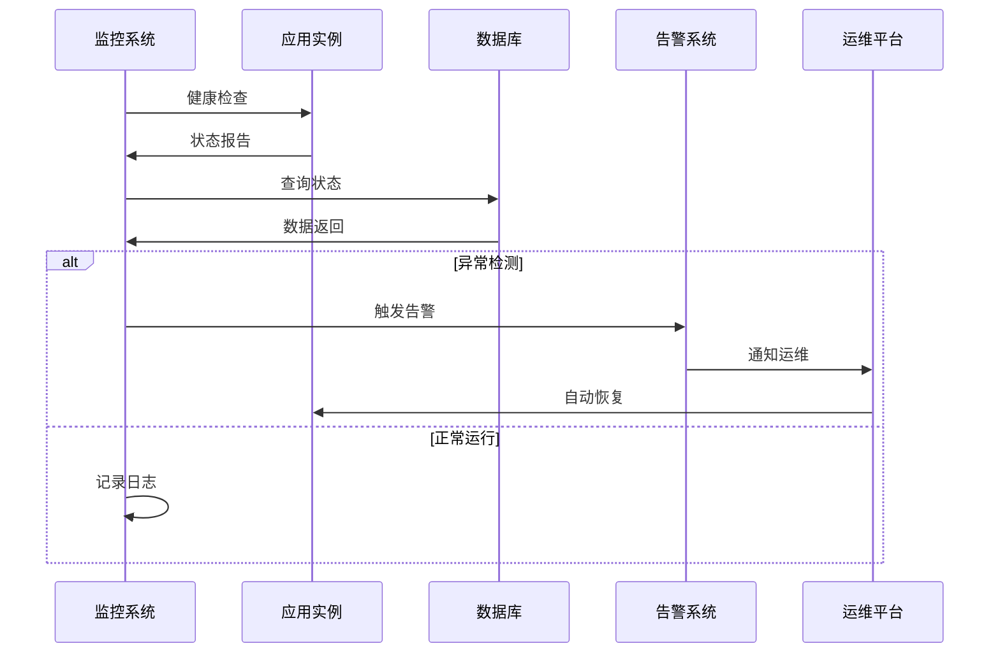

**章节来源**
- [vnpy/trader/engine.py](file://vnpy/trader/engine.py#L50-L150)

## 总结

vnpy作为一个成熟的量化交易平台，在高级功能方面提供了全面的技术支持：

1. **分布式架构**：通过RPC服务实现客户端-服务器协同，支持高可用性和负载均衡
2. **价差交易**：提供完整的价差合约建模和回测框架，支持复杂的套利策略
3. **多账户管理**：统一的订单管理系统，支持跨市场套利和多品种交易
4. **算法优化**：内置多种优化算法，支持参数调优和策略验证
5. **性能调优**：专业的内存管理和异步IO处理，满足高频交易需求
6. **企业级部署**：完整的监控体系和运维支持，适合机构级应用

通过合理运用这些高级功能，用户可以构建出高性能、高可靠性的量化交易系统，满足现代金融市场对交易系统的严格要求。