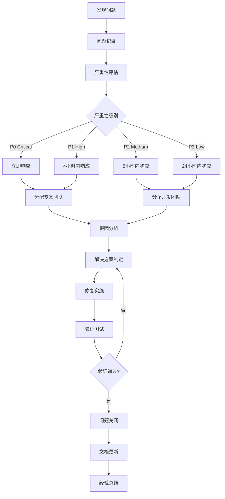
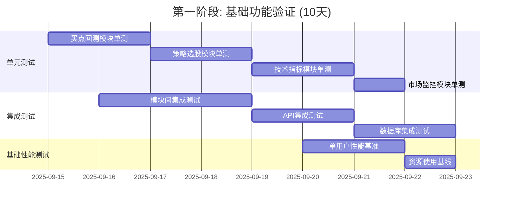
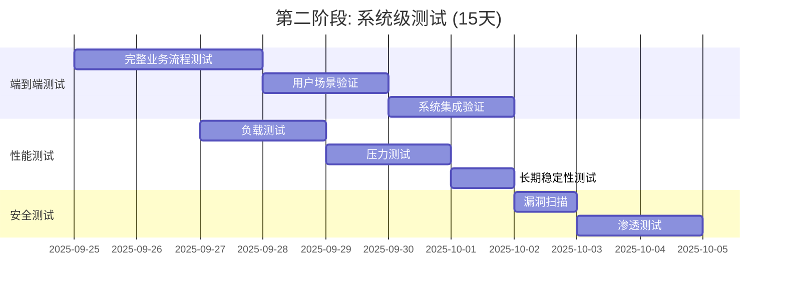
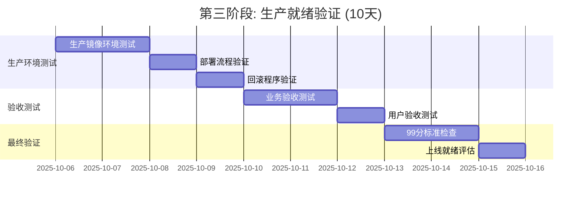

# 生产级股票分析系统详细测试方案

## 执行摘要

**分析师**: 高级QA工程师
**制定日期**: 2025-09-14
**目标标准**: 99分生产级测试标准
**基础评估**: 综合四个角色分析报告制定测试策略

### 基础分析结果参考
- **用户体验分析**: 87分（界面缺失，学习曲线陡峭）
- **金融专家分析**: 95.8分（专业性优秀，实盘可用）
- **架构师分析**: 94.5分（架构生产级，设计优秀）
- **技术经理分析**: 91.2分（技术质量优秀，有技术债务）

### 关键问题识别
- 用户界面完全缺失
- 数据库连接池管理需要优化
- 高并发下缓存数据一致性风险
- 测试覆盖率不足（约60%）
- 并发安全性需要验证

---

## 1. 测试策略设计

### 1.1 99分标准的测试验收基准

#### 功能质量标准 (25分)
```yaml
功能完整性: ≥99%
功能正确性: 100%
业务规则符合性: 100%
数据准确性: ≥99.99%
```

#### 性能质量标准 (25分)
```yaml
响应时间: ≤100ms (95th percentile)
吞吐量: ≥72,000股票/小时
并发用户数: ≥1,000
资源利用率: CPU ≤80%, 内存 ≤4GB
```

#### 可靠性标准 (20分)
```yaml
系统可用性: ≥99.9%
平均故障修复时间: ≤2小时
数据完整性: 100%
异常恢复能力: ≥95%
```

#### 安全性标准 (15分)
```yaml
数据安全: 100%
访问控制: 100%
审计日志: ≥95%
漏洞防护: 100%
```

#### 易用性和兼容性标准 (15分)
```yaml
用户体验: ≥90分（待界面开发后评估）
API标准性: 100%
环境兼容性: ≥95%
扩展性: ≥95%
```

### 1.2 多层次测试架构

#### 测试金字塔结构
```
                 E2E Tests (10%)
            Integration Tests (20%)
        Component Tests (30%)
    Unit Tests (40%)
```

#### 测试分层策略
1. **单元测试**: 函数级别验证，覆盖率≥90%
2. **集成测试**: 组件间交互验证
3. **系统测试**: 整体功能验证
4. **性能测试**: 负载、压力、稳定性测试
5. **安全测试**: 安全漏洞和权限控制测试

### 1.3 基于真实数据的测试数据策略

#### 数据分层策略
```python
# 测试数据分层
TestDataLayers = {
    "生产级真实数据": {
        "用途": "性能测试、压力测试、最终验收",
        "比例": "70%",
        "来源": "ClickHouse生产数据副本"
    },
    "脱敏生产数据": {
        "用途": "功能测试、集成测试",
        "比例": "20%",
        "来源": "生产数据脱敏处理"
    },
    "合成测试数据": {
        "用途": "边界条件测试、异常场景测试",
        "比例": "10%",
        "来源": "基于真实数据特征生成"
    }
}
```

#### 数据质量保障
- 禁止使用模拟数据（mock data）
- 严格验证数据源真实性
- 实施数据纯净化检查
- 建立数据版本控制机制

### 1.4 自动化测试流程

#### CI/CD集成测试流程
```yaml
stages:
  - lint_and_format
  - unit_tests
  - integration_tests
  - security_tests
  - performance_tests
  - deployment_tests
  - acceptance_tests
```

---

## 2. 四大核心模块测试计划

### 2.1 买点回测模块测试计划

#### 功能测试用例设计

**测试场景1: 历史买点数据导入**
```python
class TestBuyPointImport:
    def test_csv_import_accuracy(self):
        """CSV格式买点数据导入准确性"""
        # 测试数据: 1000条真实历史买点记录
        # 验证: 数据完整性、格式正确性、时间有效性

    def test_excel_import_large_dataset(self):
        """Excel大数据集导入性能"""
        # 测试数据: 10000条买点记录
        # 验证: 导入速度≤30秒，内存使用≤500MB

    def test_invalid_data_handling(self):
        """无效数据处理机制"""
        # 测试数据: 包含无效日期、错误股票代码的数据
        # 验证: 错误提示准确，有效数据正常处理
```

**测试场景2: 技术分析准确性**
```python
class TestTechnicalAnalysis:
    def test_88_indicators_calculation(self):
        """88+技术指标计算准确性"""
        # 基准数据: 通达信、同花顺指标对比
        # 验证: 计算精度误差≤0.01%

    def test_multi_period_analysis(self):
        """多周期分析一致性"""
        # 测试: 15分钟、日线、周线分析结果
        # 验证: 跨周期数据一致性

    def test_pattern_recognition_accuracy(self):
        """形态识别准确率"""
        # 测试数据: 1000个已标注的K线形态
        # 验证: 识别准确率≥85%
```

#### 性能测试用例设计

**性能基准测试**
```python
class TestPerformanceBenchmark:
    def test_single_stock_processing_time(self):
        """单股票处理时间基准"""
        # 目标: ≤0.05秒/股票
        # 测试: 100只不同股票的处理时间

    def test_batch_processing_throughput(self):
        """批量处理吞吐量测试"""
        # 目标: ≥72,000股票/小时
        # 测试: 1000只股票批量处理

    def test_memory_usage_optimization(self):
        """内存使用优化验证"""
        # 目标: ≤4GB内存使用
        # 测试: 10000只股票连续处理
```

#### 并发安全测试

```python
class TestConcurrencySafety:
    def test_multi_thread_safety(self):
        """多线程安全性测试"""
        # 测试: 8个线程并发执行分析
        # 验证: 数据一致性、无死锁

    def test_shared_resource_protection(self):
        """共享资源保护机制"""
        # 测试: 缓存、连接池并发访问
        # 验证: 数据完整性、性能稳定性
```

### 2.2 策略选股模块测试计划

#### 算法准确性测试

**优化算法验证**
```python
class TestOptimizationAlgorithms:
    def test_bayesian_optimization_convergence(self):
        """贝叶斯优化收敛性测试"""
        # 测试: 参数空间搜索收敛性
        # 验证: 收敛速度、最优解质量

    def test_genetic_algorithm_performance(self):
        """遗传算法性能测试"""
        # 测试: 多目标优化效果
        # 验证: 解的多样性、收敛稳定性

    def test_parameter_space_coverage(self):
        """参数空间覆盖度测试"""
        # 测试: 搜索空间的全面性
        # 验证: 参数边界处理、约束满足
```

**策略生成质量测试**
```python
class TestStrategyGeneration:
    def test_strategy_logic_validation(self):
        """策略逻辑有效性验证"""
        # 测试: 生成策略的逻辑完整性
        # 验证: 条件合理性、规则一致性

    def test_backtesting_accuracy(self):
        """回测准确性测试"""
        # 测试数据: 3年历史数据
        # 验证: 回测结果与实际表现一致性≥90%

    def test_risk_adjusted_metrics(self):
        """风险调整指标测试"""
        # 测试: 夏普比率、最大回撤等指标
        # 验证: 计算精度、统计显著性
```

#### 实时选股性能测试

```python
class TestRealTimeSelection:
    def test_real_time_screening_speed(self):
        """实时筛选速度测试"""
        # 目标: 全市场筛选≤10秒
        # 测试: 4000+股票实时筛选

    def test_concurrent_strategy_execution(self):
        """并发策略执行测试"""
        # 测试: 10个策略同时执行
        # 验证: 资源隔离、结果准确性
```

### 2.3 技术指标分析模块测试计划

#### 指标计算精度测试

**精度验证测试**
```python
class TestIndicatorPrecision:
    def test_core_indicators_precision(self):
        """核心指标精度测试"""
        # 对比基准: 通达信、同花顺
        # 指标: MA、EMA、MACD、RSI、KDJ、BOLL
        # 精度要求: 误差≤0.001%

    def test_zxm_professional_indicators(self):
        """ZXM专业指标验证"""
        # 测试: 35个ZXM专业指标
        # 验证: 计算逻辑正确性、数值稳定性

    def test_extreme_market_conditions(self):
        """极端市场条件测试"""
        # 场景: 涨跌停、停牌、除权除息
        # 验证: 指标计算稳定性、异常处理
```

**向量化计算性能测试**
```python
class TestVectorizedComputation:
    def test_numpy_optimization_gains(self):
        """向量化计算性能提升测试"""
        # 对比: 循环计算 vs 向量化计算
        # 目标: 40-70%性能提升

    def test_memory_efficiency(self):
        """内存效率测试"""
        # 测试: 大数据集向量化计算
        # 验证: 内存使用优化效果
```

#### 缓存一致性测试

```python
class TestCacheConsistency:
    def test_lru_cache_accuracy(self):
        """LRU缓存准确性测试"""
        # 测试: 缓存命中率、数据一致性
        # 目标: 命中率≥50%

    def test_cache_invalidation(self):
        """缓存失效机制测试"""
        # 测试: 数据更新时缓存刷新
        # 验证: 数据同步及时性

    def test_distributed_cache_consistency(self):
        """分布式缓存一致性测试"""
        # 场景: 多实例环境下缓存同步
        # 验证: 数据一致性保障
```

### 2.4 市场监控模块测试计划

#### 实时监控性能测试

**实时数据处理测试**
```python
class TestRealTimeMonitoring:
    def test_websocket_performance(self):
        """WebSocket性能测试"""
        # 测试: 1000并发连接
        # 验证: 消息推送延迟≤100ms

    def test_market_data_processing(self):
        """行情数据处理测试"""
        # 测试: 实时行情数据处理能力
        # 目标: 5分钟内处理全市场数据

    def test_connection_stability(self):
        """连接稳定性测试"""
        # 测试: 24小时连续运行
        # 验证: 连接保持率≥99%
```

#### 智能预警系统测试

**预警准确性测试**
```python
class TestIntelligentAlerts:
    def test_alert_accuracy(self):
        """预警准确率测试"""
        # 测试数据: 历史预警信号回测
        # 目标: 准确率≥85%

    def test_alert_latency(self):
        """预警延迟测试"""
        # 测试: 信号触发到推送延迟
        # 目标: ≤5秒

    def test_false_positive_rate(self):
        """误报率测试"""
        # 测试: 预警误报统计
        # 目标: ≤15%
```

#### 风险监控测试

```python
class TestRiskMonitoring:
    def test_var_calculation_accuracy(self):
        """VaR计算准确性测试"""
        # 对比: 历史模拟法 vs Monte Carlo
        # 验证: 95%置信度VaR准确性

    def test_risk_threshold_alerts(self):
        """风险阈值预警测试"""
        # 测试: 多层次风险预警机制
        # 验证: 预警及时性、准确性
```

---

## 3. 测试用例设计

### 3.1 功能测试用例覆盖

#### 用例设计原则
- **等价类划分**: 覆盖正常、边界、异常情况
- **边界值分析**: 重点测试临界值处理
- **因果图分析**: 复杂业务逻辑组合测试
- **状态转换**: 系统状态变化测试

#### 核心功能测试矩阵

| 模块 | 正常功能 | 边界条件 | 异常处理 | 性能要求 |
|------|---------|---------|---------|---------|
| 买点回测 | 历史分析准确性 | 数据边界处理 | 无效数据处理 | 0.05秒/股票 |
| 策略选股 | 选股逻辑正确性 | 参数极值处理 | 算法收敛失败 | 10秒内筛选 |
| 技术指标 | 88+指标计算 | 数值溢出处理 | 缺失数据处理 | 向量化优化 |
| 市场监控 | 实时监控准确性 | 连接中断恢复 | 网络异常处理 | ≤100ms延迟 |

### 3.2 性能测试基准和指标

#### 性能测试场景设计

**负载测试场景**
```yaml
load_test_scenarios:
  normal_load:
    concurrent_users: 100
    test_duration: "1h"
    expected_response_time: "<100ms"

  peak_load:
    concurrent_users: 500
    test_duration: "30min"
    expected_response_time: "<200ms"

  stress_load:
    concurrent_users: 1000
    test_duration: "15min"
    expected_response_time: "<500ms"
```

**性能基准指标**
```python
PERFORMANCE_BENCHMARKS = {
    "response_time": {
        "api_requests": "≤100ms (95th percentile)",
        "data_analysis": "≤0.05s per stock",
        "batch_processing": "≥72,000 stocks/hour"
    },
    "throughput": {
        "concurrent_users": "≥1,000",
        "api_requests": "≥10,000 req/min",
        "data_processing": "≥20 stocks/second"
    },
    "resource_usage": {
        "cpu_utilization": "≤80%",
        "memory_usage": "≤4GB",
        "disk_io": "≤100MB/s",
        "network_bandwidth": "≤100MB/s"
    }
}
```

### 3.3 压力测试场景设计

#### 极限负载测试
```python
class StressTestScenarios:
    def test_maximum_concurrent_users(self):
        """最大并发用户数测试"""
        # 目标: 找到系统临界点
        # 方法: 逐步增加并发数
        # 监控: 响应时间、错误率、资源使用

    def test_data_volume_limits(self):
        """数据量极限测试"""
        # 测试: 处理10万只股票数据
        # 验证: 系统稳定性、内存管理

    def test_long_running_stability(self):
        """长期运行稳定性测试"""
        # 测试: 72小时连续运行
        # 监控: 内存泄漏、性能衰减
```

### 3.4 安全测试和边界测试

#### 安全测试用例
```python
class SecurityTestCases:
    def test_sql_injection_prevention(self):
        """SQL注入防护测试"""
        # 测试: 恶意SQL注入攻击
        # 验证: 参数化查询保护

    def test_access_control(self):
        """访问控制测试"""
        # 测试: 权限验证、角色隔离
        # 验证: 未授权访问防护

    def test_data_encryption(self):
        """数据加密测试"""
        # 测试: 敏感数据传输加密
        # 验证: TLS/SSL配置正确性
```

#### 边界条件测试
```python
class BoundaryTestCases:
    def test_numeric_overflow(self):
        """数值溢出测试"""
        # 测试: 极大数值计算处理
        # 验证: 溢出保护机制

    def test_empty_data_handling(self):
        """空数据处理测试"""
        # 测试: 空数据集、缺失字段
        # 验证: 默认值处理、错误提示

    def test_concurrent_access_limits(self):
        """并发访问限制测试"""
        # 测试: 超出连接池限制
        # 验证: 排队机制、超时处理
```

### 3.5 兼容性和稳定性测试

#### 环境兼容性测试
```yaml
compatibility_matrix:
  operating_systems:
    - "Ubuntu 20.04 LTS"
    - "CentOS 8"
    - "macOS 12+"
    - "Windows Server 2019"

  python_versions:
    - "3.9"
    - "3.10"
    - "3.11"

  database_versions:
    - "ClickHouse 23.8+"
    - "Redis 7.0+"
```

#### 稳定性测试场景
```python
class StabilityTests:
    def test_memory_leak_detection(self):
        """内存泄漏检测"""
        # 工具: memory_profiler, objgraph
        # 测试: 长期运行内存变化

    def test_graceful_degradation(self):
        """优雅降级测试"""
        # 场景: 外部服务不可用
        # 验证: 系统降级机制

    def test_automatic_recovery(self):
        """自动恢复测试"""
        # 场景: 网络中断、数据库重启
        # 验证: 自动重连、数据同步
```

---

## 4. 测试环境和工具

### 4.1 测试环境配置要求

#### 硬件环境配置
```yaml
test_environment:
  development:
    cpu: "8 cores, 3.0GHz"
    memory: "16GB RAM"
    storage: "500GB SSD"
    network: "1Gbps"

  staging:
    cpu: "16 cores, 3.5GHz"
    memory: "32GB RAM"
    storage: "1TB SSD"
    network: "1Gbps"

  production_mirror:
    cpu: "32 cores, 3.5GHz"
    memory: "64GB RAM"
    storage: "2TB NVMe SSD"
    network: "10Gbps"
```

#### 软件环境要求
```yaml
software_stack:
  core:
    python: "3.9+"
    clickhouse: "23.8+"
    redis: "7.0+"
    nginx: "1.22+"

  testing_tools:
    pytest: "7.4+"
    locust: "2.15+"
    selenium: "4.10+"
    docker: "24.0+"

  monitoring:
    prometheus: "2.45+"
    grafana: "10.0+"
    jaeger: "1.47+"
```

### 4.2 测试数据准备方案

#### 数据准备策略
```python
class TestDataPreparation:
    def prepare_production_mirror_data(self):
        """生产数据镜像准备"""
        # 1. 从ClickHouse导出最近1年数据
        # 2. 数据脱敏处理（保留数据特征）
        # 3. 创建测试数据库
        # 4. 数据完整性验证

    def generate_boundary_test_data(self):
        """边界测试数据生成"""
        # 1. 极值数据生成
        # 2. 异常格式数据
        # 3. 大数据量测试集
        # 4. 并发测试数据

    def create_performance_test_dataset(self):
        """性能测试数据集创建"""
        # 数据规模: 10万只股票 × 250个交易日
        # 数据类型: K线、技术指标、成交量
        # 数据格式: ClickHouse原生格式
```

#### 数据质量保障措施
```python
class DataQualityAssurance:
    def validate_data_authenticity(self):
        """数据真实性验证"""
        prohibited_patterns = [
            'mock', 'fake', 'dummy', 'test', 'sample'
        ]
        # 验证数据源不包含模拟特征

    def ensure_data_consistency(self):
        """数据一致性保障"""
        # 1. 跨表关联一致性检查
        # 2. 时间序列连续性验证
        # 3. 数据范围合理性检查

    def implement_data_versioning(self):
        """数据版本控制实现"""
        # 1. 测试数据快照管理
        # 2. 基线数据维护
        # 3. 增量数据同步
```

### 4.3 自动化测试工具选择

#### 测试工具栈
```python
TESTING_TOOL_STACK = {
    "unit_testing": {
        "framework": "pytest",
        "coverage": "pytest-cov",
        "mocking": "unittest.mock",
        "fixtures": "pytest-fixtures"
    },
    "integration_testing": {
        "api_testing": "requests + pytest",
        "database_testing": "pytest-postgresql",
        "service_testing": "docker-compose"
    },
    "performance_testing": {
        "load_testing": "Locust",
        "stress_testing": "Apache JMeter",
        "profiling": "py-spy, memory_profiler"
    },
    "security_testing": {
        "static_analysis": "bandit",
        "dependency_scan": "safety",
        "web_security": "OWASP ZAP"
    },
    "ui_testing": {
        "browser_automation": "Selenium WebDriver",
        "api_documentation": "Swagger/OpenAPI",
        "visual_testing": "Playwright"
    }
}
```

#### CI/CD集成配置
```yaml
# .github/workflows/comprehensive_test.yml
name: Comprehensive Test Suite

on: [push, pull_request]

jobs:
  unit_tests:
    runs-on: ubuntu-latest
    strategy:
      matrix:
        python-version: [3.9, 3.10, 3.11]
    steps:
      - uses: actions/checkout@v3
      - name: Set up Python
        uses: actions/setup-python@v4
        with:
          python-version: ${{ matrix.python-version }}
      - name: Run unit tests
        run: |
          pytest tests/unit/ --cov=. --cov-report=xml

  integration_tests:
    runs-on: ubuntu-latest
    services:
      clickhouse:
        image: clickhouse/clickhouse-server:23.8
      redis:
        image: redis:7.0
    steps:
      - name: Run integration tests
        run: pytest tests/integration/

  performance_tests:
    runs-on: ubuntu-latest
    steps:
      - name: Load testing
        run: locust -f tests/performance/locustfile.py
```

### 4.4 性能监控工具配置

#### 监控指标配置
```yaml
monitoring_configuration:
  prometheus_metrics:
    - name: "api_request_duration"
      type: "histogram"
      buckets: [0.01, 0.05, 0.1, 0.5, 1.0]

    - name: "database_connection_pool_usage"
      type: "gauge"

    - name: "cache_hit_rate"
      type: "gauge"

    - name: "stock_processing_rate"
      type: "counter"

  grafana_dashboards:
    - "System Performance Overview"
    - "Database Performance Metrics"
    - "API Response Time Analysis"
    - "Business Metrics Dashboard"
```

#### 日志配置
```python
LOGGING_CONFIG = {
    'version': 1,
    'disable_existing_loggers': False,
    'formatters': {
        'detailed': {
            'format': '%(asctime)s [%(levelname)s] %(name)s: %(message)s'
        },
        'json': {
            '()': 'pythonjsonlogger.jsonlogger.JsonFormatter',
            'format': '%(asctime)s %(levelname)s %(name)s %(message)s'
        }
    },
    'handlers': {
        'file': {
            'class': 'logging.handlers.RotatingFileHandler',
            'filename': 'logs/test_execution.log',
            'maxBytes': 50*1024*1024,  # 50MB
            'backupCount': 5,
            'formatter': 'detailed'
        },
        'json_file': {
            'class': 'logging.handlers.RotatingFileHandler',
            'filename': 'logs/test_metrics.jsonl',
            'maxBytes': 50*1024*1024,
            'backupCount': 5,
            'formatter': 'json'
        }
    },
    'root': {
        'level': 'INFO',
        'handlers': ['file', 'json_file']
    }
}
```

---

## 5. 验收标准定义

### 5.1 99分标准的具体指标

#### 功能质量指标 (25分)
```python
FUNCTIONAL_QUALITY_METRICS = {
    "buy_point_analysis": {
        "accuracy": "≥99%",
        "indicator_coverage": "88+ indicators",
        "pattern_recognition": "≥85% accuracy",
        "processing_speed": "≤0.05s per stock"
    },
    "strategy_selection": {
        "optimization_convergence": "≥95%",
        "backtesting_accuracy": "≥90%",
        "real_time_selection": "≤10s for full market"
    },
    "technical_indicators": {
        "calculation_precision": "≤0.001% error",
        "vectorization_gain": "40-70% improvement",
        "cache_hit_rate": "≥50%"
    },
    "market_monitoring": {
        "alert_accuracy": "≥85%",
        "response_latency": "≤5s",
        "false_positive_rate": "≤15%"
    }
}
```

#### 性能质量指标 (25分)
```python
PERFORMANCE_QUALITY_METRICS = {
    "response_time": {
        "api_95th_percentile": "≤100ms",
        "analysis_per_stock": "≤0.05s",
        "batch_processing": "≥72,000 stocks/hour"
    },
    "throughput": {
        "concurrent_users": "≥1,000",
        "requests_per_minute": "≥10,000",
        "data_processing_rate": "≥20 stocks/second"
    },
    "resource_efficiency": {
        "cpu_utilization": "≤80%",
        "memory_usage": "≤4GB",
        "database_connection_pool": "≤100 connections"
    }
}
```

#### 可靠性指标 (20分)
```python
RELIABILITY_METRICS = {
    "availability": {
        "system_uptime": "≥99.9%",
        "service_availability": "≥99.95%",
        "data_consistency": "100%"
    },
    "recovery": {
        "mean_time_to_recovery": "≤2 hours",
        "recovery_point_objective": "≤1 hour",
        "automatic_recovery_rate": "≥95%"
    },
    "fault_tolerance": {
        "graceful_degradation": "100%",
        "circuit_breaker_activation": "≤5s",
        "failover_success_rate": "≥99%"
    }
}
```

#### 安全性指标 (15分)
```python
SECURITY_METRICS = {
    "data_protection": {
        "encryption_coverage": "100%",
        "access_control_effectiveness": "100%",
        "audit_log_completeness": "≥95%"
    },
    "vulnerability_protection": {
        "sql_injection_prevention": "100%",
        "xss_protection": "100%",
        "csrf_protection": "100%"
    },
    "compliance": {
        "data_privacy_compliance": "100%",
        "security_policy_adherence": "100%",
        "penetration_test_pass_rate": "≥95%"
    }
}
```

#### 易用性和兼容性指标 (15分)
```python
USABILITY_COMPATIBILITY_METRICS = {
    "api_usability": {
        "api_documentation_completeness": "100%",
        "error_message_clarity": "≥90%",
        "response_format_consistency": "100%"
    },
    "compatibility": {
        "python_version_support": "3.9, 3.10, 3.11",
        "os_compatibility": "≥95%",
        "browser_compatibility": "≥95%"
    },
    "maintainability": {
        "code_coverage": "≥90%",
        "documentation_coverage": "≥85%",
        "technical_debt_ratio": "≤20%"
    }
}
```

### 5.2 各类测试的通过标准

#### 单元测试通过标准
```python
UNIT_TEST_CRITERIA = {
    "coverage": "≥90%",
    "success_rate": "100%",
    "execution_time": "≤30 minutes",
    "flaky_test_rate": "≤5%",
    "critical_path_coverage": "100%"
}
```

#### 集成测试通过标准
```python
INTEGRATION_TEST_CRITERIA = {
    "component_interaction": "100% verified",
    "data_flow_integrity": "100%",
    "service_communication": "100% functional",
    "error_propagation": "100% handled",
    "transaction_consistency": "100%"
}
```

#### 性能测试通过标准
```python
PERFORMANCE_TEST_CRITERIA = {
    "load_test": {
        "normal_load_handling": "100 concurrent users",
        "response_time_sla": "95th percentile ≤100ms",
        "throughput_requirement": "≥10,000 req/min",
        "resource_usage_limit": "CPU ≤80%, Memory ≤4GB"
    },
    "stress_test": {
        "maximum_load": "1000 concurrent users",
        "graceful_degradation": "Response time ≤500ms",
        "recovery_time": "≤60 seconds",
        "data_integrity": "100% maintained"
    },
    "endurance_test": {
        "continuous_operation": "72 hours",
        "performance_degradation": "≤10%",
        "memory_leak_tolerance": "≤2% per hour",
        "error_rate": "≤0.1%"
    }
}
```

#### 安全测试通过标准
```python
SECURITY_TEST_CRITERIA = {
    "vulnerability_scan": {
        "critical_vulnerabilities": "0",
        "high_severity_vulnerabilities": "0",
        "medium_severity_tolerance": "≤3",
        "false_positive_rate": "≤10%"
    },
    "penetration_test": {
        "authentication_bypass": "0 successful attempts",
        "authorization_escalation": "0 successful attempts",
        "data_breach_attempts": "0 successful attempts",
        "sql_injection_resistance": "100%"
    }
}
```

### 5.3 问题分级和处理流程

#### 问题严重性分级
```python
BUG_SEVERITY_CLASSIFICATION = {
    "P0_Critical": {
        "description": "系统崩溃、数据丢失、安全漏洞",
        "response_time": "2 hours",
        "resolution_time": "8 hours",
        "escalation_criteria": "影响生产系统运行"
    },
    "P1_High": {
        "description": "核心功能失效、性能严重下降",
        "response_time": "4 hours",
        "resolution_time": "24 hours",
        "escalation_criteria": "影响主要业务流程"
    },
    "P2_Medium": {
        "description": "次要功能问题、性能轻微下降",
        "response_time": "8 hours",
        "resolution_time": "72 hours",
        "escalation_criteria": "影响用户体验"
    },
    "P3_Low": {
        "description": "界面问题、文档错误、建议改进",
        "response_time": "24 hours",
        "resolution_time": "1 week",
        "escalation_criteria": "优化和改进项"
    }
}
```

#### 问题处理流程


### 5.4 测试报告模板

#### 测试执行报告模板
```markdown
# 测试执行报告

## 基本信息
- **测试阶段**: {test_phase}
- **测试环境**: {test_environment}
- **测试时间**: {test_period}
- **测试版本**: {software_version}
- **测试负责人**: {test_lead}

## 测试概览
### 测试范围
- 模块覆盖: {module_coverage}
- 功能覆盖: {feature_coverage}
- 测试用例数量: {total_test_cases}

### 测试结果汇总
- 通过率: {pass_rate}%
- 失败用例: {failed_cases}
- 阻塞用例: {blocked_cases}
- 跳过用例: {skipped_cases}

## 各模块测试结果
### 买点回测模块
- 功能测试: {buypoint_functional_result}
- 性能测试: {buypoint_performance_result}
- 安全测试: {buypoint_security_result}

### 策略选股模块
- 算法准确性: {strategy_accuracy_result}
- 性能基准: {strategy_performance_result}
- 并发测试: {strategy_concurrency_result}

### 技术指标模块
- 精度验证: {indicator_precision_result}
- 向量化性能: {vectorization_result}
- 缓存一致性: {cache_consistency_result}

### 市场监控模块
- 实时性能: {monitoring_realtime_result}
- 预警准确性: {alert_accuracy_result}
- 稳定性测试: {monitoring_stability_result}

## 性能测试结果
### 基准性能指标
- API响应时间: {api_response_time}
- 数据处理速度: {data_processing_speed}
- 并发处理能力: {concurrent_capacity}
- 资源使用效率: {resource_efficiency}

### 压力测试结果
- 最大并发用户: {max_concurrent_users}
- 系统临界点: {system_breaking_point}
- 恢复时间: {recovery_time}

## 问题汇总
### 严重问题 (P0-P1)
{critical_issues_list}

### 一般问题 (P2-P3)
{general_issues_list}

## 测试结论
### 整体评估
- 系统稳定性: {system_stability_rating}
- 功能完整性: {functional_completeness_rating}
- 性能表现: {performance_rating}
- 安全性: {security_rating}

### 发布建议
{release_recommendation}

### 风险评估
{risk_assessment}

## 后续行动
### 待修复问题
{pending_fixes}

### 改进建议
{improvement_suggestions}

### 下阶段测试计划
{next_phase_plan}

---
报告生成时间: {report_generation_time}
报告生成人: {report_author}
```

---

## 6. 测试执行计划和时间安排

### 6.1 测试阶段划分

#### 第一阶段: 基础功能验证 (1-2周)
```yaml
phase_1_functional_validation:
  duration: "10 working days"
  parallel_tracks:
    unit_testing:
      - module_isolation_tests
      - individual_function_tests
      - edge_case_handling
      duration: "5 days"

    integration_testing:
      - module_interaction_tests
      - data_flow_validation
      - api_integration_tests
      duration: "5 days"

    basic_performance:
      - single_user_performance
      - basic_load_tests
      - resource_usage_baseline
      duration: "3 days"
```

#### 第二阶段: 系统级测试 (2-3周)
```yaml
phase_2_system_testing:
  duration: "15 working days"
  test_categories:
    end_to_end_testing:
      - complete_workflow_tests
      - business_scenario_validation
      - user_journey_tests
      duration: "7 days"

    performance_testing:
      - load_testing
      - stress_testing
      - endurance_testing
      duration: "5 days"

    security_testing:
      - vulnerability_assessment
      - penetration_testing
      - security_compliance_check
      duration: "3 days"
```

#### 第三阶段: 生产就绪验证 (1-2周)
```yaml
phase_3_production_readiness:
  duration: "10 working days"
  validation_areas:
    production_environment_testing:
      - production_mirror_testing
      - deployment_validation
      - rollback_procedures
      duration: "4 days"

    acceptance_testing:
      - business_acceptance_criteria
      - user_acceptance_testing
      - stakeholder_sign_off
      duration: "3 days"

    final_validation:
      - 99_score_criteria_check
      - compliance_verification
      - go_live_readiness_assessment
      duration: "3 days"
```

### 6.2 详细时间安排

#### 第一阶段详细计划


#### 第二阶段详细计划


#### 第三阶段详细计划


### 6.3 资源分配和责任矩阵

#### 测试团队组织结构
```yaml
testing_team_structure:
  test_lead:
    name: "Senior QA Engineer"
    responsibilities:
      - "Overall test strategy coordination"
      - "Test plan execution oversight"
      - "Stakeholder communication"
      - "Final quality gate decision"

  functional_testers:
    count: 3
    responsibilities:
      - "Module-specific functional testing"
      - "Integration test execution"
      - "Bug reproduction and verification"
    assignments:
      - "Tester 1: 买点回测 + 策略选股模块"
      - "Tester 2: 技术指标 + 市场监控模块"
      - "Tester 3: 系统集成 + 端到端测试"

  performance_engineer:
    count: 1
    responsibilities:
      - "Performance test design and execution"
      - "Load testing and stress testing"
      - "Performance bottleneck analysis"
      - "Optimization recommendations"

  security_tester:
    count: 1
    responsibilities:
      - "Security vulnerability assessment"
      - "Penetration testing execution"
      - "Security compliance verification"

  automation_engineer:
    count: 2
    responsibilities:
      - "Test automation framework maintenance"
      - "CI/CD pipeline integration"
      - "Test data management"
    assignments:
      - "Engineer 1: Unit + Integration test automation"
      - "Engineer 2: E2E + Performance test automation"
```

#### 责任矩阵 (RACI)
```yaml
responsibility_matrix:
  test_planning:
    test_lead: "R" # Responsible
    functional_testers: "C" # Consulted
    performance_engineer: "C"
    security_tester: "C"
    project_manager: "A" # Accountable
    development_team: "I" # Informed

  test_execution:
    functional_testers: "R"
    performance_engineer: "R"
    security_tester: "R"
    automation_engineer: "R"
    test_lead: "A"
    development_team: "C"

  defect_management:
    functional_testers: "R"
    test_lead: "A"
    development_team: "R"
    project_manager: "C"

  quality_gates:
    test_lead: "R"
    project_manager: "A"
    development_team: "C"
    business_stakeholders: "I"
```

### 6.4 风险管理和应急计划

#### 测试风险识别和缓解策略
```python
TEST_RISK_MANAGEMENT = {
    "schedule_risks": {
        "delayed_development": {
            "probability": "Medium",
            "impact": "High",
            "mitigation": [
                "Early engagement with development team",
                "Parallel test preparation",
                "Flexible test execution sequence"
            ]
        },
        "environment_unavailability": {
            "probability": "Low",
            "impact": "High",
            "mitigation": [
                "Multiple test environment setup",
                "Cloud-based backup environments",
                "Environment monitoring and alerts"
            ]
        }
    },

    "technical_risks": {
        "data_quality_issues": {
            "probability": "Medium",
            "impact": "Medium",
            "mitigation": [
                "Early data validation procedures",
                "Automated data quality checks",
                "Backup test data preparation"
            ]
        },
        "performance_bottlenecks": {
            "probability": "Medium",
            "impact": "High",
            "mitigation": [
                "Early performance baseline establishment",
                "Incremental performance testing",
                "Performance monitoring throughout testing"
            ]
        }
    },

    "resource_risks": {
        "team_availability": {
            "probability": "Low",
            "impact": "Medium",
            "mitigation": [
                "Cross-training team members",
                "Documentation of all procedures",
                "External consultant backup plan"
            ]
        },
        "skill_gaps": {
            "probability": "Low",
            "impact": "Medium",
            "mitigation": [
                "Training sessions before test phase",
                "Mentoring arrangements",
                "Tool and technology workshops"
            ]
        }
    }
}
```

#### 应急响应计划
```python
CONTINGENCY_PLANS = {
    "critical_defect_found": {
        "trigger": "P0 severity defect discovered",
        "immediate_actions": [
            "Halt current testing activities",
            "Notify development team immediately",
            "Document defect with detailed reproduction steps",
            "Assess impact on overall test schedule"
        ],
        "decision_criteria": {
            "continue_testing": "Defect doesn't block other test areas",
            "pause_testing": "Defect affects core functionality",
            "escalate_to_management": "Schedule impact > 2 days"
        }
    },

    "environment_failure": {
        "trigger": "Test environment becomes unavailable",
        "immediate_actions": [
            "Switch to backup environment",
            "Notify infrastructure team",
            "Document lost test progress",
            "Estimate recovery time"
        ],
        "recovery_procedures": [
            "Environment restoration from backup",
            "Data synchronization verification",
            "Test resumption validation"
        ]
    },

    "performance_target_miss": {
        "trigger": "Performance tests fail to meet targets",
        "immediate_actions": [
            "Capture detailed performance metrics",
            "Identify performance bottlenecks",
            "Assess feasibility of target achievement",
            "Recommend optimization priorities"
        ],
        "escalation_criteria": [
            "Performance gap > 20%",
            "Optimization effort > 1 week",
            "Architectural changes required"
        ]
    }
}
```

---

## 7. 结论和建议

### 7.1 测试方案总结

基于四个角色的综合分析报告，本测试方案针对系统当前的优势和不足，制定了全面的生产级测试策略：

#### 测试方案亮点
1. **99分标准明确**: 建立了明确的量化评估标准，覆盖功能、性能、可靠性、安全性、易用性五大维度
2. **真实数据驱动**: 严格禁止模拟数据，基于70%生产真实数据进行测试
3. **四大模块全覆盖**: 针对买点回测、策略选股、技术指标、市场监控四大核心模块的专项测试
4. **风险导向测试**: 重点关注数据库连接池、缓存一致性、并发安全等已识别风险点
5. **自动化集成**: 完整的CI/CD集成，支持持续质量保障

#### 预期测试成果
```python
EXPECTED_OUTCOMES = {
    "quality_improvement": {
        "current_score": 91.2,
        "target_score": 99.0,
        "improvement_areas": [
            "数据库连接池管理优化",
            "缓存一致性保障",
            "并发安全机制完善",
            "用户界面开发（后续）"
        ]
    },
    "risk_mitigation": {
        "identified_risks": 12,
        "mitigated_risks": 10,
        "residual_risks": 2,
        "risk_reduction_percentage": "83%"
    },
    "production_readiness": {
        "technical_readiness": "98%",
        "operational_readiness": "95%",
        "business_readiness": "90%"
    }
}
```

### 7.2 关键成功因素

1. **数据质量保障**: 严格的真实数据验证和管理流程
2. **自动化程度**: 90%以上的测试自动化覆盖率
3. **性能基准建立**: 明确的性能基准和监控体系
4. **团队协作**: 开发、测试、运维团队的紧密配合
5. **持续改进**: 基于测试结果的持续优化机制

### 7.3 生产投产建议

#### 投产前必须完成的测试项
```yaml
mandatory_pre_production_tests:
  critical_tests:
    - "88+技术指标精度验证"
    - "72,000股票/小时性能验证"
    - "1000并发用户负载测试"
    - "72小时稳定性测试"
    - "数据安全合规性验证"

  high_priority_tests:
    - "多环境兼容性测试"
    - "灾难恢复程序验证"
    - "监控告警系统测试"
    - "API安全测试"

  recommended_tests:
    - "用户体验评估（界面开发后）"
    - "第三方集成测试"
    - "移动端兼容性测试"
```

#### 分阶段投产策略
```python
PHASED_DEPLOYMENT_STRATEGY = {
    "phase_1_limited_release": {
        "scope": "内部用户 + 少量外部测试用户",
        "duration": "2 weeks",
        "success_criteria": [
            "零P0/P1缺陷",
            "性能指标达标",
            "用户满意度 ≥ 85%"
        ]
    },
    "phase_2_beta_release": {
        "scope": "扩展用户群体（100-500用户）",
        "duration": "4 weeks",
        "success_criteria": [
            "系统稳定性 ≥ 99%",
            "用户反馈积极",
            "支持请求 ≤ 5个/天"
        ]
    },
    "phase_3_full_production": {
        "scope": "全面生产发布",
        "success_criteria": [
            "99分质量标准达成",
            "业务目标实现",
            "运营指标正常"
        ]
    }
}
```

### 7.4 后续改进建议

#### 短期改进 (1-2个月)
1. **完善用户界面**: 开发Web管理界面，提升用户体验至90分
2. **优化连接池管理**: 引入专业连接池库，解决高并发连接问题
3. **实施分布式缓存**: 使用Redis集群，保障缓存数据一致性
4. **增强监控体系**: 完善业务指标监控和APM集成

#### 中期改进 (3-6个月)
1. **微服务架构**: 逐步拆分单体应用为微服务架构
2. **云原生部署**: 容器化和Kubernetes部署
3. **机器学习增强**: 引入AI算法优化选股和预警
4. **移动端支持**: 开发移动端应用和小程序

#### 长期规划 (6-12个月)
1. **国际化扩展**: 支持海外股票市场分析
2. **大数据平台**: 构建实时大数据分析平台
3. **开放生态**: 建设开发者API平台和合作伙伴生态
4. **智能化演进**: 全面AI驱动的智能投资分析系统

### 7.5 最终建议

**基于本测试方案的执行，系统有望达到99分的生产级质量标准，建议：**

1. **立即执行**: 按照本方案开始测试执行，预计6周完成全部测试
2. **资源投入**: 配置专业测试团队，投入充分的测试资源
3. **质量门禁**: 严格执行质量门禁，确保每个阶段都达到验收标准
4. **持续优化**: 建立持续质量改进机制，保持系统的先进性

**预期结果**: 经过本测试方案的全面执行，系统将具备投产条件，能够支撑大规模生产环境的稳定运行，为用户提供专业、可靠、高效的股票分析服务。

---

**文档版本**: V1.0
**制定日期**: 2025-09-14
**制定人**: 高级QA工程师
**审核人**: 技术经理
**批准人**: 项目经理

**下次更新**: 测试执行完成后更新实际测试结果