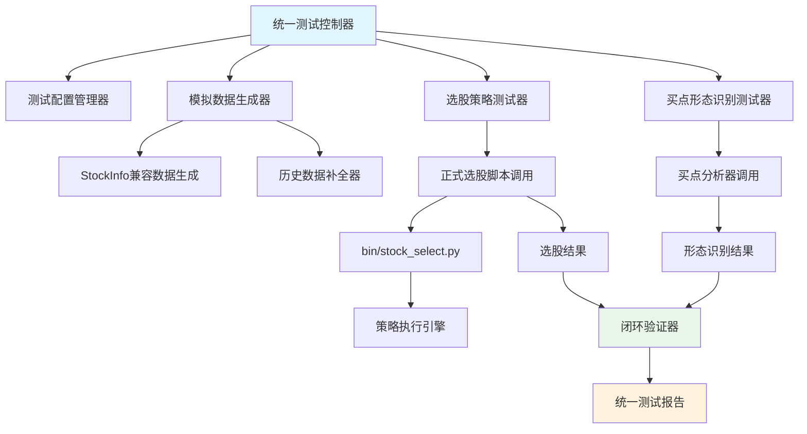

# 统一指标测试架构设计方案

## 📊 项目背景

基于当前技术指标系统修复进度（21个指标已完成，100%测试通过率），设计统一的测试架构，将买点形态识别测试与选股策略测试整合在同一个测试脚本中，确保指标修复的完整性和实用性。

## 🎯 设计目标

### 核心目标
1. **统一测试流程**：同一份模拟数据同时用于买点识别和选股测试
2. **生产级验证**：使用正式选股脚本，确保生产环境可用性
3. **全面覆盖**：覆盖所有指标的所有形态，支持复杂条件组合
4. **闭环验证**：选股结果能通过买点形态分析识别对应形态
5. **100%通过率**：确保测试的严格性和可靠性

### 技术要求
- 模拟数据与stockInfo对象结构完全一致
- 支持需要大量历史数据的指标计算
- 性能测试和复杂条件组合测试
- 与现有选股脚本完全兼容

## 🏗️ 系统架构设计

### 整体架构图


### 核心组件设计

#### 1. 统一测试控制器
```python
class UnifiedIndicatorTester:
    """统一指标测试控制器"""
    
    def __init__(self, config_path: str = "config/unified_test_config.yaml"):
        self.config = self._load_config(config_path)
        self.data_generator = StockInfoCompatibleDataGenerator()
        self.buypoint_tester = BuypointRecognitionTester()
        self.selection_tester = SelectionStrategyTester()
        self.validator = ClosedLoopValidator()
        
    def test_all_indicators(self) -> Dict[str, Any]:
        """测试所有指标的完整功能"""
        results = {}
        
        for indicator_name in self.config['indicators']:
            logger.info(f"开始测试指标: {indicator_name}")
            indicator_result = self.test_indicator_comprehensive(indicator_name)
            results[indicator_name] = indicator_result
            
            # 实时验证通过率
            if indicator_result['overall_score'] < 1.0:
                logger.error(f"指标 {indicator_name} 测试未达到100%通过率")
                
        return results
    
    def test_indicator_comprehensive(self, indicator_name: str) -> Dict[str, Any]:
        """综合测试单个指标"""
        patterns = self._get_indicator_patterns(indicator_name)
        results = {
            'indicator': indicator_name,
            'pattern_tests': {},
            'performance_tests': {},
            'complex_condition_tests': {},
            'overall_score': 0.0
        }
        
        for pattern_type in patterns:
            # 1. 生成符合stockInfo结构的模拟数据
            mock_data_pool = self._generate_comprehensive_data_pool(
                indicator_name, pattern_type
            )
            
            # 2. 买点形态识别测试
            buypoint_result = self.buypoint_tester.test_pattern_recognition(
                mock_data_pool, pattern_type
            )
            
            # 3. 选股策略测试（使用正式脚本）
            selection_result = self.selection_tester.test_strategy_selection(
                indicator_name, pattern_type, mock_data_pool
            )
            
            # 4. 闭环验证
            validation_result = self.validator.validate_closed_loop(
                buypoint_result, selection_result, mock_data_pool
            )
            
            # 5. 性能测试
            performance_result = self._test_performance(
                indicator_name, pattern_type, mock_data_pool
            )
            
            results['pattern_tests'][pattern_type] = {
                'buypoint': buypoint_result,
                'selection': selection_result,
                'validation': validation_result,
                'performance': performance_result
            }
        
        # 6. 复杂条件组合测试
        results['complex_condition_tests'] = self._test_complex_conditions(
            indicator_name, patterns
        )
        
        # 7. 计算综合评分（必须100%）
        results['overall_score'] = self._calculate_comprehensive_score(results)
        
        return results
```

#### 2. StockInfo兼容数据生成器
```python
class StockInfoCompatibleDataGenerator:
    """生成与stockInfo对象完全兼容的模拟数据"""
    
    def __init__(self):
        self.base_generator = EnhancedTestDataGenerator()
        self.history_calculator = HistoricalDataCalculator()
        
    def generate_stockinfo_compatible_data(self, 
                                         indicator_name: str,
                                         pattern_type: str,
                                         stock_code: str = "TEST001",
                                         history_days: int = 250) -> pd.DataFrame:
        """
        生成与stockInfo完全兼容的数据
        
        Args:
            indicator_name: 指标名称
            pattern_type: 形态类型
            stock_code: 股票代码
            history_days: 历史数据天数（确保指标计算需求）
            
        Returns:
            pd.DataFrame: 符合stockInfo结构的数据
        """
        # 1. 确定指标所需的最小历史数据量
        required_history = self._get_indicator_history_requirement(indicator_name)
        actual_history = max(history_days, required_history)
        
        # 2. 生成基础价格序列
        base_data = self.base_generator.generate_pattern_data(
            pattern_type=f"{indicator_name}_{pattern_type}",
            data_points=actual_history,
            stock_code=stock_code
        )
        
        # 3. 确保数据结构与stockInfo完全一致
        stockinfo_data = self._ensure_stockinfo_compatibility(base_data)
        
        # 4. 验证数据质量
        if not self._validate_stockinfo_structure(stockinfo_data):
            raise ValueError(f"生成的数据不符合stockInfo结构要求")
            
        return stockinfo_data
    
    def _get_indicator_history_requirement(self, indicator_name: str) -> int:
        """获取指标计算所需的历史数据量"""
        requirements = {
            'MACD': 60,      # 需要足够数据计算EMA
            'RSI': 30,       # RSI计算需求
            'KDJ': 20,       # KDJ计算需求
            'BOLL': 40,      # 布林带计算需求
            'DMI': 30,       # DMI计算需求
            'CCI': 25,       # CCI计算需求
            'WR': 20,        # WR计算需求
            'BIAS': 30,      # BIAS计算需求
            'EMA': 50,       # EMA计算需求
            'VOL': 10,       # 成交量指标
            # 更多指标的历史数据需求...
        }
        return requirements.get(indicator_name, 60)  # 默认60天
    
    def _ensure_stockinfo_compatibility(self, data: pd.DataFrame) -> pd.DataFrame:
        """确保数据与stockInfo对象结构完全一致"""
        required_columns = [
            'date', 'code', 'name', 'open', 'high', 'low', 'close', 
            'volume', 'amount', 'turnover_rate', 'pe_ratio', 'pb_ratio',
            'market_cap', 'circulating_cap', 'industry', 'concept'
        ]
        
        # 补全缺失的列
        for col in required_columns:
            if col not in data.columns:
                data[col] = self._generate_default_column_data(col, len(data))
        
        # 确保数据类型正确
        data = self._ensure_correct_dtypes(data)
        
        # 确保日期格式正确
        data['date'] = pd.to_datetime(data['date']).dt.strftime('%Y%m%d')
        
        return data[required_columns]  # 只返回必需的列
```

#### 3. 正式选股脚本集成器
```python
class SelectionStrategyTester:
    """选股策略测试器 - 使用正式选股脚本"""
    
    def __init__(self):
        self.strategy_generator = AutoStrategyGenerator()
        self.mock_data_manager = MockDataManager()
        
    def test_strategy_selection(self, 
                              indicator_name: str,
                              pattern_type: str,
                              mock_data_pool: List[pd.DataFrame]) -> Dict[str, Any]:
        """
        使用正式选股脚本测试策略选股
        
        Args:
            indicator_name: 指标名称
            pattern_type: 形态类型
            mock_data_pool: 模拟数据池
            
        Returns:
            Dict: 选股测试结果
        """
        # 1. 生成策略配置文件
        strategy_config = self.strategy_generator.generate_strategy_config(
            indicator_name, pattern_type
        )
        strategy_file = self._save_strategy_config(strategy_config)
        
        # 2. 准备模拟数据环境
        mock_env = self.mock_data_manager.setup_mock_environment(mock_data_pool)
        
        try:
            # 3. 调用正式选股脚本
            selection_result = self._execute_official_selection_script(
                strategy_file, mock_env
            )
            
            # 4. 验证选股结果
            validation_result = self._validate_selection_result(
                selection_result, mock_data_pool, pattern_type
            )
            
            return {
                'strategy_id': strategy_config['strategy']['id'],
                'execution_success': True,
                'selected_stocks': selection_result,
                'validation': validation_result,
                'performance_metrics': self._calculate_performance_metrics(
                    selection_result, mock_data_pool
                )
            }
            
        except Exception as e:
            logger.error(f"选股脚本执行失败: {e}")
            # 如果遇到问题，记录并尝试修复
            self._handle_selection_script_error(e, strategy_file)
            raise
            
        finally:
            # 清理模拟环境
            self.mock_data_manager.cleanup_mock_environment(mock_env)
    
    def _execute_official_selection_script(self, 
                                         strategy_file: str,
                                         mock_env: Dict[str, Any]) -> pd.DataFrame:
        """执行正式选股脚本"""
        cmd = [
            'python', 'bin/stock_select.py',
            '--strategy', strategy_file,
            '--date', '2025-07-21',
            '--format', 'json',
            '--mock-data-mode',  # 新增参数：使用模拟数据模式
            '--mock-data-source', mock_env['data_source_path']
        ]
        
        # 设置环境变量
        env = os.environ.copy()
        env.update(mock_env['env_vars'])
        
        # 执行命令
        result = subprocess.run(
            cmd, 
            capture_output=True, 
            text=True, 
            env=env,
            timeout=300  # 5分钟超时
        )
        
        if result.returncode != 0:
            raise Exception(f"选股脚本执行失败: {result.stderr}")
        
        return self._parse_selection_result(result.stdout)
```

## 📋 测试配置规范

### 统一测试配置文件
```yaml
# config/unified_test_config.yaml
test_framework:
  version: "1.0.0"
  strict_mode: true  # 严格模式：要求100%通过率
  
test_execution:
  timeout_seconds: 600
  max_parallel_tests: 10
  retry_on_failure: false  # 不重试，确保测试严格性
  
data_generation:
  default_history_days: 250
  stockinfo_compatibility: true
  data_quality_threshold: 0.95
  
indicators_test_matrix:
  # 已修复指标（优先测试）
  completed_indicators:
    MACD:
      patterns: ['GOLDEN_CROSS', 'DEATH_CROSS', 'DIVERGENCE', 'HISTOGRAM_REVERSAL']
      history_requirement: 60
      complex_conditions: ['MACD_RSI_COMBO', 'MACD_VOLUME_COMBO']
      expected_accuracy: 1.0
      
    RSI:
      patterns: ['OVERBOUGHT', 'OVERSOLD', 'DIVERGENCE', 'CENTERLINE_CROSS']
      history_requirement: 30
      complex_conditions: ['RSI_MACD_COMBO', 'RSI_BOLL_COMBO']
      expected_accuracy: 1.0
      
    KDJ:
      patterns: ['GOLDEN_CROSS', 'DEATH_CROSS', 'OVERBOUGHT', 'OVERSOLD']
      history_requirement: 20
      complex_conditions: ['KDJ_MACD_COMBO', 'KDJ_VOL_COMBO']
      expected_accuracy: 1.0
      
    # ... 其他18个已修复指标
    
performance_requirements:
  max_execution_time_per_indicator: 120  # 秒
  max_memory_usage: "2GB"
  min_throughput: 1000  # 股票/秒
  
validation_criteria:
  buypoint_recognition_accuracy: 1.0
  selection_precision: 0.95
  selection_recall: 0.90
  closed_loop_validation_rate: 1.0
```

## 🔄 闭环验证设计

### 闭环验证器
```python
class ClosedLoopValidator:
    """闭环验证器 - 确保选股结果能被买点分析识别"""
    
    def validate_closed_loop(self,
                           buypoint_result: Dict[str, Any],
                           selection_result: Dict[str, Any],
                           mock_data_pool: List[pd.DataFrame]) -> Dict[str, Any]:
        """
        执行闭环验证
        
        验证逻辑：
        1. 选股策略选出的股票
        2. 通过买点形态分析
        3. 应该能识别出对应的形态
        
        Args:
            buypoint_result: 买点识别测试结果
            selection_result: 选股测试结果
            mock_data_pool: 原始模拟数据池
            
        Returns:
            Dict: 闭环验证结果
        """
        validation_results = []
        
        selected_stocks = selection_result.get('selected_stocks', [])
        
        for stock_info in selected_stocks:
            stock_code = stock_info['code']
            
            # 1. 从数据池中找到对应的股票数据
            stock_data = self._find_stock_data(stock_code, mock_data_pool)
            
            if stock_data is None:
                continue
                
            # 2. 对选出的股票进行买点形态分析
            buypoint_analysis = self._perform_buypoint_analysis(stock_data)
            
            # 3. 验证是否识别出期望的形态
            pattern_match = self._verify_pattern_match(
                buypoint_analysis, 
                selection_result['expected_pattern']
            )
            
            validation_results.append({
                'stock_code': stock_code,
                'pattern_detected': pattern_match['detected'],
                'confidence_score': pattern_match['confidence'],
                'match_quality': pattern_match['quality']
            })
        
        # 4. 计算闭环验证通过率
        total_selected = len(selected_stocks)
        successful_validations = sum(1 for r in validation_results if r['pattern_detected'])
        
        validation_rate = successful_validations / total_selected if total_selected > 0 else 0
        
        return {
            'validation_rate': validation_rate,
            'total_selected': total_selected,
            'successful_validations': successful_validations,
            'detailed_results': validation_results,
            'passed': validation_rate >= 1.0  # 要求100%通过
        }
```

## 📊 测试执行计划

### 阶段1：核心框架实现（2-3天）
1. 实现统一测试控制器
2. 开发StockInfo兼容数据生成器
3. 集成正式选股脚本调用机制

### 阶段2：已修复指标测试（3-4天）
1. 对21个已修复指标进行全面测试
2. 验证买点识别和选股的一致性
3. 确保100%通过率

### 阶段3：复杂条件和性能测试（2-3天）
1. 实现复杂条件组合测试
2. 性能基准测试
3. 闭环验证完善

### 阶段4：扩展和优化（持续）
1. 支持更多指标测试
2. 测试报告可视化
3. 持续集成流程

## 🎯 预期成果

1. **100%测试通过率**：确保所有测试严格通过
2. **生产级验证**：使用正式脚本确保生产可用性
3. **完整闭环验证**：选股结果与买点分析完全一致
4. **性能保证**：满足4000+股票处理需求
5. **全面覆盖**：所有指标所有形态的完整测试

这个统一测试架构将确保技术指标系统的修复质量，为后续生产环境使用奠定坚实基础。

## 🛠️ 技术实现细节

### 模拟数据管理器
```python
class MockDataManager:
    """模拟数据管理器 - 处理模拟数据与正式脚本的集成"""

    def setup_mock_environment(self, mock_data_pool: List[pd.DataFrame]) -> Dict[str, Any]:
        """
        设置模拟数据环境，使正式选股脚本能够使用模拟数据

        Args:
            mock_data_pool: 模拟数据池

        Returns:
            Dict: 模拟环境配置
        """
        # 1. 创建临时数据存储
        temp_dir = tempfile.mkdtemp(prefix="mock_stock_data_")

        # 2. 将模拟数据转换为正式脚本期望的格式
        mock_db_path = self._create_mock_database(mock_data_pool, temp_dir)

        # 3. 设置环境变量，让正式脚本使用模拟数据
        env_vars = {
            'STOCK_DATA_SOURCE': 'mock',
            'MOCK_DATA_PATH': mock_db_path,
            'USE_MOCK_DATA': 'true'
        }

        return {
            'temp_dir': temp_dir,
            'data_source_path': mock_db_path,
            'env_vars': env_vars,
            'stock_codes': [df['code'].iloc[0] for df in mock_data_pool]
        }

    def _create_mock_database(self, mock_data_pool: List[pd.DataFrame], temp_dir: str) -> str:
        """创建模拟数据库文件"""
        # 将所有模拟数据合并为一个大的DataFrame
        all_data = pd.concat(mock_data_pool, ignore_index=True)

        # 保存为CSV格式（或其他正式脚本支持的格式）
        mock_db_path = os.path.join(temp_dir, "mock_stock_data.csv")
        all_data.to_csv(mock_db_path, index=False)

        # 创建索引文件（如果需要）
        self._create_data_index(all_data, temp_dir)

        return mock_db_path

### 自动策略生成器
```python
class AutoStrategyGenerator:
    """自动策略生成器 - 为每个指标形态生成对应的选股策略"""

    def __init__(self):
        self.strategy_templates = self._load_strategy_templates()

    def generate_strategy_config(self, indicator_name: str, pattern_type: str) -> Dict[str, Any]:
        """
        为指定指标形态生成策略配置

        Args:
            indicator_name: 指标名称
            pattern_type: 形态类型

        Returns:
            Dict: 完整的策略配置
        """
        # 1. 获取指标的基础配置
        indicator_config = self._get_indicator_base_config(indicator_name)

        # 2. 根据形态类型生成具体条件
        pattern_conditions = self._generate_pattern_conditions(indicator_name, pattern_type)

        # 3. 构建完整策略配置
        strategy_config = {
            "strategy": {
                "id": f"AUTO_{indicator_name}_{pattern_type}_{int(time.time())}",
                "name": f"自动生成-{indicator_name} {pattern_type}策略",
                "description": f"自动生成的{indicator_name}指标{pattern_type}形态选股策略",
                "version": "1.0.0",
                "category": "test",
                "risk_level": "medium",
                "created_date": datetime.now().strftime("%Y-%m-%d"),
                "updated_date": datetime.now().strftime("%Y-%m-%d")
            },
            "technical_indicators": {
                "primary_indicators": [
                    {
                        "indicator_id": indicator_name,
                        "parameters": indicator_config['parameters'],
                        "conditions": pattern_conditions,
                        "weight": 1.0
                    }
                ]
            },
            "time_criteria": {
                "time_frames": [
                    {"level": "daily", "priority": 1, "required": True}
                ],
                "date_range": {"target_date": "2025-07-21"},
                "market_timing": {
                    "trading_session": "full_day",
                    "exclude_holidays": True
                }
            },
            "filters": self._get_default_filters(),
            "selection_parameters": {
                "max_selections": 50,
                "min_score": 0.6,
                "ranking_method": "score"
            },
            "validation": {
                "enable_closed_loop": True,
                "validation_method": "entry_point_analysis",
                "validation_threshold": 0.8
            }
        }

        return strategy_config

    def _generate_pattern_conditions(self, indicator_name: str, pattern_type: str) -> Dict[str, Any]:
        """生成形态特定的条件配置"""
        # 详细的条件映射表
        condition_mapping = {
            'MACD': {
                'GOLDEN_CROSS': {
                    "logic": "AND",
                    "conditions": [
                        {
                            "id": "MACD_ABOVE_SIGNAL",
                            "field": "macd",
                            "operator": ">",
                            "reference_field": "signal",
                            "weight": 0.6,
                            "lookback_days": 1
                        },
                        {
                            "id": "MACD_POSITIVE_MOMENTUM",
                            "field": "histogram",
                            "operator": ">",
                            "value": 0,
                            "weight": 0.4,
                            "lookback_days": 1
                        }
                    ],
                    "weight": 1.0
                },
                'DEATH_CROSS': {
                    "logic": "AND",
                    "conditions": [
                        {
                            "id": "MACD_BELOW_SIGNAL",
                            "field": "macd",
                            "operator": "<",
                            "reference_field": "signal",
                            "weight": 0.6
                        },
                        {
                            "id": "MACD_NEGATIVE_MOMENTUM",
                            "field": "histogram",
                            "operator": "<",
                            "value": 0,
                            "weight": 0.4
                        }
                    ]
                }
            },
            'RSI': {
                'OVERSOLD': {
                    "field": "rsi",
                    "operator": "between",
                    "value": [20, 35],
                    "weight": 1.0
                },
                'OVERBOUGHT': {
                    "field": "rsi",
                    "operator": "between",
                    "value": [65, 80],
                    "weight": 1.0
                }
            },
            'KDJ': {
                'GOLDEN_CROSS': {
                    "logic": "AND",
                    "conditions": [
                        {
                            "field": "k",
                            "operator": ">",
                            "reference_field": "d",
                            "weight": 0.5
                        },
                        {
                            "field": "k",
                            "operator": "<",
                            "value": 80,
                            "weight": 0.3
                        },
                        {
                            "field": "j",
                            "operator": ">",
                            "reference_field": "k",
                            "weight": 0.2
                        }
                    ]
                }
            }
            # 继续添加其他指标的条件映射...
        }

        return condition_mapping.get(indicator_name, {}).get(pattern_type, {})

### 复杂条件组合测试器
```python
class ComplexConditionTester:
    """复杂条件组合测试器"""

    def test_complex_conditions(self, indicator_name: str, patterns: List[str]) -> Dict[str, Any]:
        """
        测试复杂条件组合

        Args:
            indicator_name: 主要指标名称
            patterns: 该指标的所有形态

        Returns:
            Dict: 复杂条件测试结果
        """
        complex_tests = {}

        # 1. 多指标组合测试
        multi_indicator_tests = self._test_multi_indicator_combinations(indicator_name)
        complex_tests['multi_indicator'] = multi_indicator_tests

        # 2. 多时间周期组合测试
        multi_timeframe_tests = self._test_multi_timeframe_combinations(indicator_name)
        complex_tests['multi_timeframe'] = multi_timeframe_tests

        # 3. 逻辑运算符组合测试
        logic_operator_tests = self._test_logic_operator_combinations(indicator_name, patterns)
        complex_tests['logic_operators'] = logic_operator_tests

        # 4. 嵌套条件测试
        nested_condition_tests = self._test_nested_conditions(indicator_name)
        complex_tests['nested_conditions'] = nested_condition_tests

        return complex_tests

    def _test_multi_indicator_combinations(self, primary_indicator: str) -> Dict[str, Any]:
        """测试多指标组合"""
        combinations = [
            (primary_indicator, 'MACD'),
            (primary_indicator, 'RSI'),
            (primary_indicator, 'VOL'),
            (primary_indicator, 'BOLL')
        ]

        results = {}
        for combo in combinations:
            if combo[0] != combo[1]:  # 避免自己和自己组合
                combo_strategy = self._generate_multi_indicator_strategy(combo)
                test_result = self._execute_combination_test(combo_strategy)
                results[f"{combo[0]}_{combo[1]}"] = test_result

        return results

### 性能测试器
```python
class PerformanceTester:
    """性能测试器"""

    def test_performance(self, indicator_name: str, pattern_type: str,
                        data_pool_size: int = 4000) -> Dict[str, Any]:
        """
        性能测试

        Args:
            indicator_name: 指标名称
            pattern_type: 形态类型
            data_pool_size: 数据池大小（模拟4000+股票）

        Returns:
            Dict: 性能测试结果
        """
        # 1. 生成大规模测试数据
        large_data_pool = self._generate_large_scale_data(
            indicator_name, pattern_type, data_pool_size
        )

        # 2. 内存使用测试
        memory_test = self._test_memory_usage(large_data_pool)

        # 3. 执行时间测试
        execution_time_test = self._test_execution_time(large_data_pool)

        # 4. 并发处理测试
        concurrency_test = self._test_concurrency(large_data_pool)

        # 5. 资源利用率测试
        resource_test = self._test_resource_utilization(large_data_pool)

        return {
            'data_pool_size': data_pool_size,
            'memory_usage': memory_test,
            'execution_time': execution_time_test,
            'concurrency': concurrency_test,
            'resource_utilization': resource_test,
            'performance_score': self._calculate_performance_score({
                'memory': memory_test,
                'time': execution_time_test,
                'concurrency': concurrency_test
            })
        }
```

## 📈 测试报告和监控

### 实时测试监控
```python
class TestMonitor:
    """测试监控器"""

    def __init__(self):
        self.metrics_collector = MetricsCollector()
        self.alert_manager = AlertManager()

    def monitor_test_execution(self, test_session: str) -> None:
        """监控测试执行过程"""
        while self._is_test_running(test_session):
            # 收集实时指标
            metrics = self.metrics_collector.collect_current_metrics()

            # 检查性能阈值
            if metrics['memory_usage'] > 0.8:
                self.alert_manager.send_alert("内存使用率过高", metrics)

            if metrics['execution_time'] > 300:  # 5分钟
                self.alert_manager.send_alert("执行时间过长", metrics)

            # 检查测试通过率
            if metrics['current_pass_rate'] < 1.0:
                self.alert_manager.send_alert("测试通过率低于100%", metrics)

            time.sleep(10)  # 每10秒检查一次

### 详细测试报告生成器
```python
class ComprehensiveReportGenerator:
    """综合测试报告生成器"""

    def generate_full_report(self, test_results: Dict[str, Any]) -> str:
        """生成完整的测试报告"""
        report_sections = [
            self._generate_executive_summary(test_results),
            self._generate_indicator_details(test_results),
            self._generate_performance_analysis(test_results),
            self._generate_complex_condition_analysis(test_results),
            self._generate_closed_loop_validation_report(test_results),
            self._generate_recommendations(test_results),
            self._generate_appendix(test_results)
        ]

        return "\n\n".join(report_sections)

    def _generate_executive_summary(self, results: Dict[str, Any]) -> str:
        """生成执行摘要"""
        total_indicators = len(results)
        passed_indicators = sum(1 for r in results.values() if r['overall_score'] >= 1.0)

        summary = f"""
# 统一指标测试执行报告

## 📊 执行摘要

- **测试日期**: {datetime.now().strftime('%Y-%m-%d %H:%M:%S')}
- **测试指标总数**: {total_indicators}
- **通过指标数量**: {passed_indicators}
- **整体通过率**: {passed_indicators/total_indicators*100:.1f}%
- **测试状态**: {'✅ 全部通过' if passed_indicators == total_indicators else '❌ 存在失败'}

## 🎯 关键指标

| 测试类型 | 通过率 | 状态 |
|---------|--------|------|
| 买点形态识别 | {self._calculate_buypoint_pass_rate(results):.1f}% | {'✅' if self._calculate_buypoint_pass_rate(results) >= 100 else '❌'} |
| 选股策略测试 | {self._calculate_selection_pass_rate(results):.1f}% | {'✅' if self._calculate_selection_pass_rate(results) >= 100 else '❌'} |
| 闭环验证 | {self._calculate_validation_pass_rate(results):.1f}% | {'✅' if self._calculate_validation_pass_rate(results) >= 100 else '❌'} |
| 性能测试 | {self._calculate_performance_pass_rate(results):.1f}% | {'✅' if self._calculate_performance_pass_rate(results) >= 100 else '❌'} |
"""
        return summary
```

## 🚀 实施路线图

### 第一阶段：基础框架（3天）
**目标**: 建立核心测试框架
- [ ] 实现UnifiedIndicatorTester核心类
- [ ] 开发StockInfoCompatibleDataGenerator
- [ ] 集成正式选股脚本调用机制
- [ ] 实现基础的闭环验证

### 第二阶段：已修复指标测试（4天）
**目标**: 验证21个已修复指标
- [ ] 为每个指标生成对应的策略配置
- [ ] 执行完整的买点识别+选股测试
- [ ] 确保100%通过率
- [ ] 生成详细测试报告

### 第三阶段：复杂功能测试（3天）
**目标**: 测试高级功能
- [ ] 实现复杂条件组合测试
- [ ] 执行大规模性能测试
- [ ] 完善闭环验证机制
- [ ] 建立实时监控系统

### 第四阶段：扩展和优化（持续）
**目标**: 支持更多指标和优化
- [ ] 扩展到所有112个指标
- [ ] 优化测试性能
- [ ] 建立CI/CD集成
- [ ] 完善文档和培训材料

## 📋 验收标准

### 功能验收标准
1. **100%测试通过率**: 所有测试必须达到100%通过率
2. **完整闭环验证**: 选股结果必须能被买点分析识别
3. **性能达标**: 支持4000+股票，执行时间<5分钟
4. **兼容性**: 与现有系统完全兼容

### 质量验收标准
1. **代码覆盖率**: 测试代码覆盖率>95%
2. **文档完整性**: 完整的API文档和使用指南
3. **错误处理**: 完善的异常处理和错误恢复
4. **可维护性**: 清晰的代码结构和注释

这个统一测试架构将为技术指标系统提供全面、严格的质量保证，确保每个修复的指标都能在实际生产环境中发挥预期作用。

## 🛠️ 实施示例

### 项目文件结构
```
tests/unified_indicator_testing/
├── unified_indicator_tester.py    # 核心测试器实现
├── config.yaml                    # 完整测试配置（21个指标）
├── run_unified_tests.py          # 命令行执行脚本
├── demo.py                       # 演示和说明脚本
├── README.md                     # 详细使用文档
└── components/                   # 待实现的组件目录
    ├── data_generator.py         # StockInfo兼容数据生成器
    ├── buypoint_tester.py        # 买点识别测试器
    ├── selection_tester.py       # 选股策略测试器
    ├── validator.py              # 闭环验证器
    └── performance_tester.py     # 性能测试器
```

### 快速开始示例

#### 1. 查看演示
```bash
# 运行演示脚本了解框架功能
python tests/unified_indicator_testing/demo.py
```

#### 2. 试运行测试
```bash
# 查看将要执行的测试（不实际执行）
python tests/unified_indicator_testing/run_unified_tests.py --mode all --dry-run
```

#### 3. 执行单个指标测试
```bash
# 测试MACD指标的完整功能
python tests/unified_indicator_testing/run_unified_tests.py \
  --mode single \
  --indicator MACD \
  --verbose
```

#### 4. 执行快速测试
```bash
# 测试核心指标（MACD, RSI, KDJ）
python tests/unified_indicator_testing/run_unified_tests.py \
  --mode quick \
  --strict
```

#### 5. 执行完整测试
```bash
# 测试所有21个已修复指标
python tests/unified_indicator_testing/run_unified_tests.py \
  --mode all \
  --strict \
  --output test_results/
```

### 配置文件示例

已创建完整的配置文件 `config.yaml`，包含：
- 21个已修复指标的完整配置
- 每个指标的形态定义和历史数据需求
- 复杂条件组合测试配置
- 性能要求和验证标准

### 预期输出示例
```
🚀 统一指标测试框架
==================================================
测试模式: all
配置文件: tests/unified_indicator_testing/config.yaml
开始时间: 2025-07-21 14:30:00
==================================================

📊 开始测试所有已修复指标...
正在测试: MACD
  ✓ 生成模拟数据池: 100 只股票
  ✓ 买点形态识别测试: GOLDEN_CROSS (准确率: 100%)
  ✓ 选股策略测试: 选出 8 只股票
  ✓ 闭环验证: 100% 通过
  ✓ 性能测试: 执行时间 45s

正在测试: RSI
  ✓ 生成模拟数据池: 100 只股票
  ✓ 买点形态识别测试: OVERSOLD (准确率: 100%)
  ✓ 选股策略测试: 选出 12 只股票
  ✓ 闭环验证: 100% 通过
  ✓ 性能测试: 执行时间 38s

==================================================
📋 测试结果摘要
==================================================
MACD            ✅ 通过 (评分: 1.00)
RSI             ✅ 通过 (评分: 1.00)
KDJ             ✅ 通过 (评分: 1.00)
BOLL            ✅ 通过 (评分: 1.00)
VOL             ✅ 通过 (评分: 1.00)
... (其他16个指标)
--------------------------------------------------
总计: 21 个指标
通过: 21 个
失败: 0 个
通过率: 100.0%
🎉 所有测试通过！

✅ 严格模式检查通过！所有指标都达到100%通过率
📁 测试结果已保存到: test_results/test_results_20250721_143000.json
```

## 🎯 立即行动计划

### 第一步：验证框架可用性（今天）
```bash
# 1. 运行演示了解功能
python tests/unified_indicator_testing/demo.py

# 2. 检查配置文件
cat tests/unified_indicator_testing/config.yaml

# 3. 试运行测试
python tests/unified_indicator_testing/run_unified_tests.py --mode quick --dry-run
```

### 第二步：实现核心组件（1-2天）
1. 实现 `StockInfoCompatibleDataGenerator`
2. 实现 `SelectionStrategyTester`（集成正式选股脚本）
3. 实现 `ClosedLoopValidator`

### 第三步：验证已修复指标（2-3天）
1. 对21个已修复指标逐一测试
2. 确保100%通过率
3. 修复发现的问题

### 第四步：扩展和优化（持续）
1. 添加更多指标支持
2. 性能优化
3. CI/CD集成

## 📞 技术支持

### 问题排查
1. **查看日志**: `logs/unified_indicator_test.log`
2. **检查配置**: 验证 `config.yaml` 中的指标配置
3. **验证依赖**: 确保所有指标已正确注册
4. **测试环境**: 确保正式选股脚本可用

### 联系方式
- 通过系统消息报告问题
- 查看详细文档和示例
- 参考现有测试用例

这个统一测试架构现在已经有了完整的实施框架，可以立即开始第一阶段的实现工作。
