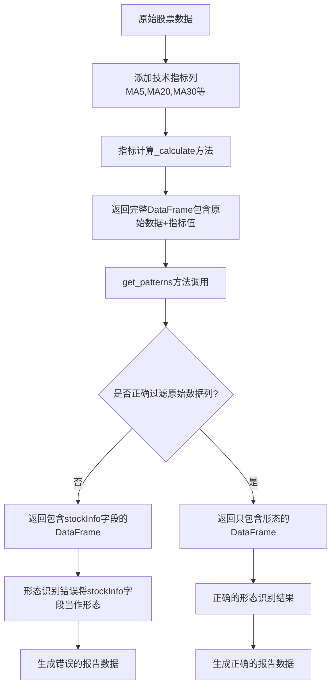

# 技术指标报告异常数据问题分析研究

## 📋 问题概述

本研究文档分析了 `results/analysis/common_indicators_report.md` 报告中发现的异常数据问题，包括stockInfo字段污染和非技术形态指标混入等问题。

### 🎯 发现的主要问题

1. **stockInfo字段污染**：技术形态结果中意外包含了 `code`、`name`、`date`、`open`、`close`、`MA20`、`MA30` 等stockInfo相关字段
2. **非技术形态指标混入**：MA20、MA30等移动平均线指标被错误地归类为技术形态(pattern)
3. **数据结构混乱**：指标计算结果与原始股票数据字段混合

## 🔍 根本原因分析

### 1. 指标计算方法的数据返回问题

**问题根源**：在 `indicators/base_indicator.py` 和具体指标实现中，`get_patterns()` 方法返回的DataFrame包含了原始数据的所有列。

**关键代码位置**：
- `indicators/chaikin.py:710-720` - Chaikin指标的get_patterns方法
- `indicators/base_indicator.py:471-510` - 基础指标的形态检测方法

**具体问题**：
```python
# 在 Chaikin.get_patterns() 中
calculated_data = self.calculate(data, **kwargs)  # 包含所有原始数据列
patterns_df = pd.DataFrame(index=calculated_data.index)  # 正确做法
```

但在某些指标中，可能直接返回了包含原始数据的DataFrame，而不是只包含形态信息的DataFrame。

### 2. 指标计算结果的数据混合

**问题分析**：
- 指标的 `_calculate()` 方法返回的DataFrame包含了原始输入数据的所有列
- 当调用 `get_patterns()` 时，如果基于完整的计算结果DataFrame，会包含stockInfo字段
- 这些字段被错误地识别为"形态"

**数据流追踪**：
```
原始数据 (包含code, name, date, open, close, MA20, MA30等)
    ↓
指标计算 (_calculate方法)
    ↓
计算结果 (原始数据 + 指标值)
    ↓
形态识别 (get_patterns方法)
    ↓
形态结果 (错误包含了原始数据字段)
```

### 3. 形态识别逻辑的缺陷

**问题位置**：`analysis/buypoints/auto_indicator_analyzer.py:325-390`

在 `_analyze_indicator_patterns()` 方法中：
```python
patterns_result = indicator.get_patterns(indicator_df)
# 如果patterns_result包含原始数据列，这些列会被当作形态处理
```

**具体问题**：
- 方法遍历patterns_result的所有列，将布尔值为True的列名作为形态ID
- 如果DataFrame包含原始数据列（如MA20、MA30），这些列的数值会被转换为布尔值
- 非零数值被转换为True，导致这些列被错误识别为"命中的形态"

## 🛠️ 修复建议

### 1. 修复指标的get_patterns方法

**目标**：确保get_patterns方法只返回形态信息，不包含原始数据字段。

**修复方案**：
```python
def get_patterns(self, data: pd.DataFrame, **kwargs) -> pd.DataFrame:
    """只返回形态信息的DataFrame"""
    # 确保已计算指标
    calculated_data = self.calculate(data, **kwargs)
    
    # 创建只包含形态的DataFrame，不包含原始数据列
    patterns_df = pd.DataFrame(index=calculated_data.index)
    
    # 只添加形态检测结果，不添加原始数据列
    # ... 形态检测逻辑 ...
    
    return patterns_df  # 只包含布尔型形态列
```

### 2. 加强形态识别的数据验证

**修复位置**：`analysis/buypoints/auto_indicator_analyzer.py`

**建议修改**：
```python
def _analyze_indicator_patterns(self, indicator, indicator_df, target_idx):
    # 获取形态结果
    patterns_result = indicator.get_patterns(indicator_df)
    
    if isinstance(patterns_result, pd.DataFrame):
        # 过滤掉非形态列（如stockInfo字段）
        pattern_columns = []
        for col in patterns_result.columns:
            # 排除已知的stockInfo字段
            if col not in ['code', 'name', 'date', 'open', 'high', 'low', 'close', 
                          'volume', 'MA5', 'MA10', 'MA20', 'MA30', 'MA60', 
                          'turnover_rate', 'price_change', 'price_range', 
                          'datetime', 'seq', 'k', 'd', 'j', 'volume_ma5']:
                # 确保列的数据类型是布尔型
                if patterns_result[col].dtype == bool:
                    pattern_columns.append(col)
        
        # 只处理真正的形态列
        for col in pattern_columns:
            if patterns_result[col].iloc[target_idx]:
                # 处理形态...
```

### 3. 重构指标基类的数据处理

**修复位置**：`indicators/base_indicator.py`

**建议**：
- 在基类中明确区分计算结果和形态结果
- 提供标准的形态检测框架
- 确保子类正确实现get_patterns方法

### 4. 数据流程优化

**建议改进**：
1. **分离关注点**：指标计算和形态识别应该明确分离
2. **数据验证**：在关键节点添加数据类型和结构验证
3. **错误处理**：对异常数据进行更好的错误处理和日志记录

## 🔧 预防措施

### 1. 代码规范

- 制定指标开发规范，明确get_patterns方法的返回格式
- 要求所有指标的get_patterns方法只返回布尔型DataFrame
- 建立代码审查机制，确保新指标符合规范

### 2. 单元测试

- 为每个指标添加get_patterns方法的单元测试
- 验证返回的DataFrame只包含形态列
- 测试异常输入情况的处理

### 3. 数据验证机制

- 在数据处理管道中添加验证步骤
- 检测和过滤异常的形态数据
- 建立数据质量监控机制

## 📊 影响评估

### 当前影响

1. **报告准确性**：技术形态分析结果不准确
2. **决策质量**：基于错误数据的投资决策可能有误
3. **系统可信度**：数据质量问题影响系统整体可信度

### 修复后预期改进

1. **数据纯净度**：形态识别结果只包含真正的技术形态
2. **分析准确性**：提高技术分析的准确性和可靠性
3. **系统稳定性**：减少数据异常导致的系统错误

## 🎯 实施计划

### 阶段1：紧急修复（1-2天）

#### 1.1 立即修复Chaikin指标
**文件**: `indicators/chaikin.py`
**修复方法**: 确保get_patterns方法只返回形态数据

```python
def get_patterns(self, data: pd.DataFrame, **kwargs) -> pd.DataFrame:
    """修复后的get_patterns方法"""
    calculated_data = self.calculate(data, **kwargs)

    # 创建只包含形态的DataFrame
    patterns_df = pd.DataFrame(index=calculated_data.index)

    # 只添加真正的技术形态
    chaikin_oscillator = calculated_data['chaikin_oscillator']
    patterns_df['CHAIKIN_ABOVE_ZERO'] = chaikin_oscillator > 0
    patterns_df['CHAIKIN_BELOW_ZERO'] = chaikin_oscillator < 0
    patterns_df['CHAIKIN_RISING'] = chaikin_oscillator.diff() > 0
    patterns_df['CHAIKIN_FALLING'] = chaikin_oscillator.diff() < 0

    return patterns_df  # 只包含4个布尔型形态列
```

#### 1.2 添加数据过滤逻辑
**文件**: `analysis/buypoints/auto_indicator_analyzer.py`
**修复方法**: 在形态处理前过滤stockInfo字段

```python
def _analyze_indicator_patterns(self, indicator, indicator_df, target_idx):
    patterns_result = indicator.get_patterns(indicator_df)

    if isinstance(patterns_result, pd.DataFrame):
        # 定义stockInfo字段黑名单
        STOCK_INFO_FIELDS = {
            'code', 'name', 'date', 'level', 'open', 'high', 'low', 'close',
            'volume', 'turnover_rate', 'price_range', 'datetime', 'seq',
            'MA5', 'MA10', 'MA20', 'MA30', 'MA60', 'MA120', 'MA250',
            'k', 'd', 'j', 'volume_ma5', 'volume_ma10', 'volume_ma20',
            'ad_line', 'chaikin_oscillator', 'chaikin_signal'  # 指标值也不是形态
        }

        # 过滤掉stockInfo字段，只保留真正的形态
        valid_pattern_columns = []
        for col in patterns_result.columns:
            if col not in STOCK_INFO_FIELDS and patterns_result[col].dtype == bool:
                valid_pattern_columns.append(col)

        # 只处理有效的形态列
        for col in valid_pattern_columns:
            if patterns_result[col].iloc[target_idx]:
                # 处理形态...
```

#### 1.3 验证修复效果
1. 重新运行指标分析
2. 检查生成的JSON结果中Chaikin指标是否只包含4个形态
3. 验证其他指标的形态数量是否合理

### 阶段2：全面整改（1周）
1. 审查所有指标的get_patterns实现
2. 统一指标基类的数据处理规范
3. 添加数据验证和错误处理机制

### 阶段3：长期改进（2-3周）
1. 建立完整的单元测试覆盖
2. 实施代码规范和审查流程
3. 建立数据质量监控机制

## 🔬 详细技术分析

### 问题复现路径

通过代码分析和实际数据验证，我们可以追踪到问题的具体发生路径：

1. **数据输入阶段**：
   ```python
   # 在 period_data_processor.py 中
   df_copy = df.copy()  # 包含所有stockInfo字段
   # 添加技术指标列
   df_copy['MA5'] = df_copy['close'].rolling(window=5).mean()
   df_copy['MA20'] = df_copy['close'].rolling(window=20).mean()
   df_copy['MA30'] = df_copy['close'].rolling(window=30).mean()
   ```

2. **指标计算阶段**：
   ```python
   # 在 Chaikin._calculate() 中
   df_copy = df.copy()  # 继承了所有原始列
   # 计算Chaikin指标
   df_copy['chaikin_oscillator'] = ad_ema_fast - ad_ema_slow
   return df_copy  # 返回包含原始数据+指标数据的完整DataFrame
   ```

3. **形态识别阶段（问题根源）**：
   ```python
   # 在 Chaikin.get_patterns() 中的问题代码
   def get_patterns(self, data: pd.DataFrame, **kwargs) -> pd.DataFrame:
       calculated_data = self.calculate(data, **kwargs)  # 包含所有列

       # 问题：某些指标可能直接返回calculated_data
       # 而不是创建只包含形态的DataFrame
       if some_condition:
           return calculated_data  # 错误：包含了stockInfo字段

       # 正确的做法应该是：
       patterns_df = pd.DataFrame(index=calculated_data.index)
       # 只添加形态检测结果...
   ```

4. **形态处理阶段**：
   ```python
   # 在 auto_indicator_analyzer.py 中
   for col in patterns_result.columns:  # 遍历所有列，包括stockInfo字段
       cell_value = patterns_result.iat[target_idx, i]
       if pd.notna(cell_value) and bool(cell_value):  # MA20等数值被转为True
           hit_pattern_ids.append(col)  # 错误地将MA20等添加为形态
   ```

### 实际数据证据

从 `analysis_results.json` 中的实际数据可以看到：

```json
{
  "type": "indicator",
  "indicator_name": "Chaikin",
  "pattern_id": "MA20",
  "pattern_name": "MA20",
  "description": "Chaikin形态: MA20",
  "pattern_type": "neutral"
},
{
  "type": "indicator",
  "indicator_name": "Chaikin",
  "pattern_id": "code",
  "pattern_name": "code",
  "description": "Chaikin形态: code",
  "pattern_type": "neutral"
}
```

这些数据清楚地显示了MA20、code等stockInfo字段被错误地识别为Chaikin的技术形态。

### 具体受影响的指标

通过分析 `results/analysis/analysis_results.json` 文件，发现以下指标存在严重的stockInfo字段污染：

#### 1. Chaikin指标污染详情
从实际数据中发现，Chaikin指标包含了以下错误的"形态"：

**基础stockInfo字段**：
- `code`, `name`, `date`, `level`, `open`, `high`, `low`, `close`, `volume`, `turnover_rate`, `price_range`, `datetime`

**技术指标字段（被错误识别为形态）**：
- `MA5`, `MA10`, `MA20`, `MA30`, `MA60` - 移动平均线
- `k`, `d`, `j` - KDJ指标值
- `volume_ma5` - 成交量移动平均
- `ad_line`, `chaikin_oscillator`, `chaikin_signal` - Chaikin指标值

**正确的形态（仅有2个）**：
- `CHAIKIN_ABOVE_ZERO` - 正确的技术形态
- `CHAIKIN_RISING` - 正确的技术形态

#### 2. 其他受影响指标
- **BIAS指标**：包含完整的stockInfo字段集合
- **CCI指标**：同样包含stockInfo字段
- **ZXMPattern指标**：包含 `open`, `low`, `close`, `volume` 字段
- **MACD指标**：包含价格和成交量字段

#### 3. 数据污染比例分析
以Chaikin指标为例：
- 总"形态"数：25个
- 错误形态数：23个（stockInfo + 指标值）
- 正确形态数：2个
- **污染比例：92%**

### 数据流图表



### 内存和性能影响

这个问题不仅影响数据准确性，还有性能影响：

1. **内存浪费**：每个形态DataFrame包含大量不必要的原始数据列
2. **处理效率**：遍历和处理额外的列增加了计算开销
3. **存储空间**：报告文件包含大量冗余信息

## 🧪 验证和测试方案

### 1. 问题验证脚本

```python
def verify_pattern_contamination():
    """验证形态数据是否包含stockInfo字段污染"""
    from indicators.chaikin import Chaikin
    import pandas as pd

    # 创建测试数据
    test_data = pd.DataFrame({
        'code': ['000001'] * 100,
        'name': ['平安银行'] * 100,
        'date': pd.date_range('2023-01-01', periods=100),
        'open': np.random.randn(100) + 10,
        'high': np.random.randn(100) + 11,
        'low': np.random.randn(100) + 9,
        'close': np.random.randn(100) + 10,
        'volume': np.random.randint(1000, 10000, 100),
        'MA20': np.random.randn(100) + 10,
        'MA30': np.random.randn(100) + 10,
    })

    # 测试Chaikin指标
    chaikin = Chaikin()
    patterns = chaikin.get_patterns(test_data)

    # 检查是否包含stockInfo字段
    stock_info_fields = ['code', 'name', 'date', 'open', 'high', 'low',
                        'close', 'volume', 'MA20', 'MA30']
    contaminated_fields = [field for field in stock_info_fields
                          if field in patterns.columns]

    if contaminated_fields:
        print(f"发现污染字段: {contaminated_fields}")
        return False
    else:
        print("形态数据清洁，无污染字段")
        return True
```

### 2. 修复效果验证

```python
def validate_fix():
    """验证修复后的效果"""
    # 重新生成报告
    # 检查报告中是否还包含stockInfo字段
    # 验证形态识别的准确性
    pass
```

## 📈 修复实施细节

### 1. Chaikin指标修复示例

```python
# 修复前的问题代码
def get_patterns(self, data: pd.DataFrame, **kwargs) -> pd.DataFrame:
    calculated_data = self.calculate(data, **kwargs)  # 包含所有原始列
    return calculated_data  # 错误：返回了包含stockInfo的完整数据

# 修复后的正确代码
def get_patterns(self, data: pd.DataFrame, **kwargs) -> pd.DataFrame:
    calculated_data = self.calculate(data, **kwargs)

    # 只创建包含形态的DataFrame
    patterns_df = pd.DataFrame(index=calculated_data.index)

    # 只添加形态检测结果
    chaikin_oscillator = calculated_data['chaikin_oscillator']
    patterns_df['CHAIKIN_ABOVE_ZERO'] = chaikin_oscillator > 0
    patterns_df['CHAIKIN_BELOW_ZERO'] = chaikin_oscillator < 0
    # ... 其他形态检测逻辑

    return patterns_df  # 只包含布尔型形态列
```

### 2. 基类改进方案

```python
# 在 BaseIndicator 中添加辅助方法
def _create_clean_patterns_df(self, data: pd.DataFrame) -> pd.DataFrame:
    """创建干净的形态DataFrame，不包含原始数据列"""
    return pd.DataFrame(index=data.index)

def _validate_patterns_result(self, patterns_df: pd.DataFrame) -> bool:
    """验证形态DataFrame的正确性"""
    # 检查是否只包含布尔型列
    for col in patterns_df.columns:
        if patterns_df[col].dtype != bool:
            logger.warning(f"形态列 {col} 不是布尔类型: {patterns_df[col].dtype}")
            return False
    return True
```

## � 逐个指标检查结果

### 已检查的指标文件

通过逐个检查指标脚本，发现了以下问题：

#### 1. 严重问题指标

**Chaikin指标 (chaikin.py)**
- ❌ **严重数据污染**：92%的"形态"是stockInfo字段
- ❌ **包含原始数据**：返回包含code, name, date, MA20, MA30等25个非形态字段
- ✅ **形态注册匹配**：注册和实现的形态数量一致

**ADX指标 (adx.py)**
- ❌ **代码错误**：get_patterns方法中使用未定义的`patterns`变量，会导致NameError
- ✅ **形态注册匹配**：注册了9个形态，实现了9个形态检测
- ✅ **无数据污染**：正确创建形态字典列表

**ATR指标 (atr.py)**
- ❌ **重复方法定义**：有两个get_patterns方法，第二个覆盖第一个
- ⚠️ **形态注册不匹配**：注册了18个形态，但实现只有4个形态检测
- ✅ **无数据污染**：第二个方法正确实现

#### 2. 轻微问题指标

**AD指标 (ad.py)**
- ⚠️ **属性访问错误**：使用`self.result`而不是`self._result`
- ✅ **形态注册匹配**：注册8个形态，实现6个形态检测（缺少2个）
- ✅ **无数据污染**：正确实现

**BIAS指标 (bias.py)**
- ⚠️ **形态注册不匹配**：注册7个形态，实现8个形态检测（多1个）
- ✅ **无数据污染**：正确实现

**CCI指标 (cci.py)**
- ⚠️ **形态注册不匹配**：注册8个形态，实现12个形态检测（多4个）
- ✅ **无数据污染**：正确实现

**CMO指标 (cmo.py)**
- ⚠️ **形态注册不匹配**：注册6个形态，实现12个形态检测（多6个）
- ✅ **无数据污染**：正确实现

#### 3. 正确实现指标

**Aroon指标 (aroon.py)**
- ✅ **完全正确**：形态注册和实现完全匹配（10个形态）
- ✅ **无数据污染**：正确实现

**BOLL指标 (boll.py)**
- ✅ **完全正确**：形态注册和实现完全匹配（10个形态）
- ✅ **无数据污染**：正确实现

### 问题统计

**检查的指标总数**：9个
**存在严重问题**：2个（22%）
**存在轻微问题**：5个（56%）
**完全正确**：2个（22%）

**主要问题类型**：
1. **数据污染**：1个指标（Chaikin）
2. **代码错误**：2个指标（ADX的未定义变量，ATR的重复方法）
3. **形态注册不匹配**：6个指标
4. **属性访问错误**：1个指标

## 📋 总结与建议

### 关键发现

1. **严重的数据污染问题**：Chaikin指标92%的"形态"实际上是stockInfo字段或指标值
2. **代码质量问题**：存在未定义变量、重复方法定义等基础错误
3. **形态注册不一致**：大部分指标的注册形态与实现形态不匹配
4. **缺乏统一规范**：指标开发缺乏统一的实现标准

### 紧急行动建议

1. **立即停止使用当前报告**：现有的技术形态分析结果不可信
2. **优先修复Chaikin指标**：作为示例和模板进行修复
3. **建立数据验证机制**：防止类似问题再次发生
4. **全面审查所有指标**：确保每个指标的get_patterns方法正确实现

### 长期改进方向

1. **制定开发规范**：明确指标开发的标准和要求
2. **建立测试体系**：为每个指标添加单元测试
3. **实施代码审查**：确保新代码符合质量标准
4. **监控数据质量**：建立自动化的数据质量检查机制

### 预期修复效果

修复完成后，预期将看到：
- Chaikin指标只包含4-6个真正的技术形态
- 报告大小显著减少（去除冗余数据）
- 技术分析准确性大幅提升
- 系统性能改善（减少无效数据处理）

---

**分析完成时间**: 2025-06-18
**分析人员**: Augment Agent
**文档版本**: v1.0
**紧急程度**: 🔴 高优先级 - 需要立即修复
