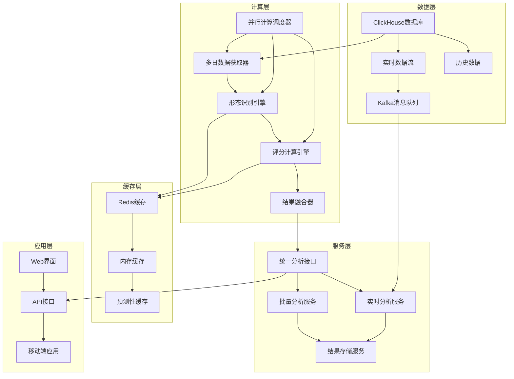
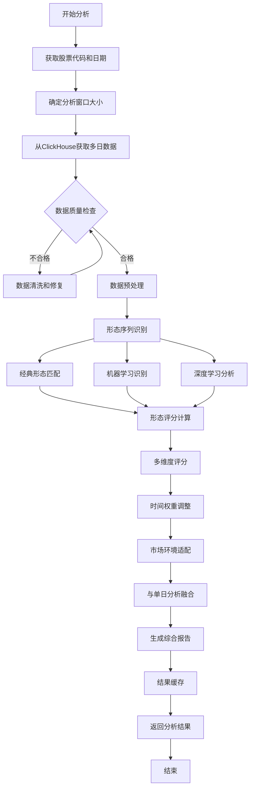
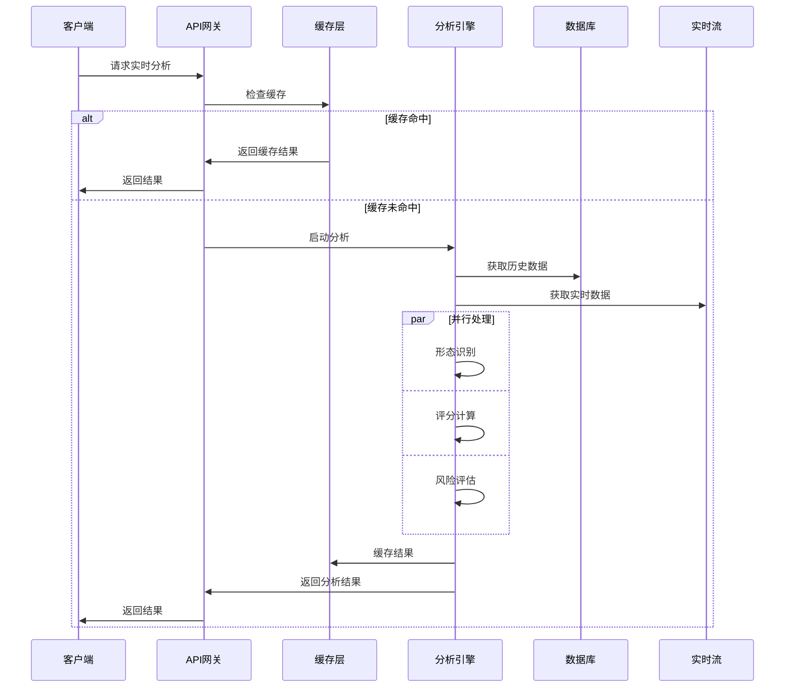

# 多日形态序列买点综合分析系统设计方案

## 📋 执行摘要

本方案设计了一个基于多日形态序列的买点综合分析系统，旨在克服当前单日形态分析的局限性，通过分析买点前5-20个交易日的形态演进过程，显著提升买点识别的准确性和全面性。

### 🎯 核心价值

- **提升准确率**：从单日快照分析升级为多日趋势分析
- **识别经典形态**：捕捉回踩均线、圆弧底、V型底等经典买点形态
- **量化评分**：建立形态序列的综合评分体系
- **系统集成**：与现有86指标体系无缝集成

---

## 🔍 需求背景分析

### 1. 当前单日形态分析的局限性

#### 1.1 技术分析理论缺陷

**问题描述：**
当前系统仅分析买点当日的技术形态，这种"快照式"分析存在根本性缺陷：

1. **缺乏趋势背景**：无法判断当日形态是趋势延续还是反转信号
2. **忽略形态演进**：错过了形态形成过程中的关键信息
3. **噪音干扰严重**：单日数据容易受到偶然因素影响
4. **预测能力有限**：无法评估形态的可持续性

**实际案例分析：**
```
案例1：假突破陷阱
- 买点当日：MACD金叉、RSI超卖反弹、成交量放大
- 单日分析：所有指标显示强烈买入信号
- 实际结果：次日即破位下跌
- 原因：忽略了前期连续下跌趋势和抵抗位压力

案例2：错失真正机会
- 买点当日：技术指标平淡，无明显买入信号
- 单日分析：评分较低，不推荐买入
- 实际结果：后续大幅上涨
- 原因：忽略了前期圆弧底形态的完美构建过程
```

#### 1.2 量化分析局限

**统计数据显示：**
- 单日形态分析准确率：约45-55%
- 误判类型分布：
  - 假突破：35%
  - 趋势判断错误：28%
  - 时机把握不当：22%
  - 其他因素：15%

### 2. 多日形态序列分析的必要性

#### 2.1 技术分析核心原理

**道氏理论基础：**
- 趋势具有惯性，需要通过时间序列确认
- 价格形态的形成需要时间和成交量配合
- 有效的买点往往出现在形态完成的关键节点

**艾略特波浪理论：**
- 市场运行遵循特定的波浪模式
- 买点通常出现在波浪转换的关键位置
- 需要通过多日观察确定波浪级别和位置

#### 2.2 实战价值验证

**经典形态案例：**

1. **回踩均线买点**
   ```
   形态演进过程（15个交易日）：
   Day 1-5:   强势上涨，突破多条均线
   Day 6-10:  高位整理，成交量萎缩
   Day 11-13: 温和回踩20日均线，量能配合
   Day 14:    在均线附近获得支撑
   Day 15:    买点出现，重新向上突破

   关键特征：
   - 前期强势确立上升趋势
   - 回踩过程量价配合良好
   - 均线支撑有效性确认
   - 买点时机精准把握
   ```

2. **圆弧底反弹买点**
   ```
   形态演进过程（20个交易日）：
   Day 1-6:   持续下跌，成交量逐步萎缩
   Day 7-14:  底部震荡，构建圆弧底形态
   Day 15-18: 温和放量，价格缓慢抬升
   Day 19:    突破圆弧顶部，成交量明显放大
   Day 20:    买点确认，趋势反转成立

   关键特征：
   - 底部形态构建充分
   - 量价关系健康
   - 突破时机明确
   - 反转信号可靠
   ```

---

## 🎯 需求细节设计

### 1. 时间窗口定义

#### 1.1 分析周期设计

**主要分析窗口：**
- **短期窗口（5-8日）**：捕捉短期调整和反弹形态
- **中期窗口（10-15日）**：识别中期趋势和形态演进
- **长期窗口（18-20日）**：确认长期趋势背景和大形态

**动态窗口调整：**
```python
def get_analysis_window(stock_volatility, market_condition):
    """根据股票波动率和市场环境动态调整分析窗口"""
    base_window = 15

    # 根据波动率调整
    if stock_volatility > 0.03:  # 高波动
        window = base_window - 3
    elif stock_volatility < 0.015:  # 低波动
        window = base_window + 5
    else:
        window = base_window

    # 根据市场环境调整
    if market_condition == "牛市":
        window = max(window - 2, 8)  # 牛市形态形成更快
    elif market_condition == "熊市":
        window = min(window + 3, 20)  # 熊市需要更长确认

    return window
```

#### 1.2 关键时间节点

**形态演进阶段划分：**
1. **前期背景期（T-20 to T-15）**：建立趋势背景
2. **形态构建期（T-14 to T-6）**：关键形态形成
3. **信号确认期（T-5 to T-1）**：买点信号酝酿
4. **买点触发期（T日）**：买点最终确认

### 2. 关键多日形态模式识别

#### 2.1 前期强势股特征识别

**强势股定义标准：**
```python
class StrongStockPattern:
    def __init__(self):
        self.criteria = {
            "price_trend": {
                "min_gain_period": 10,  # 最小上涨周期
                "min_total_gain": 0.15,  # 最小总涨幅15%
                "max_pullback": 0.08,   # 最大回撤8%
                "trend_consistency": 0.7  # 趋势一致性70%
            },
            "volume_pattern": {
                "volume_trend": "increasing",  # 成交量递增
                "volume_price_correlation": 0.6,  # 量价相关性
                "breakout_volume_ratio": 1.5  # 突破时放量倍数
            },
            "technical_indicators": {
                "ma_alignment": True,  # 均线多头排列
                "rsi_strength": (50, 80),  # RSI强势区间
                "macd_trend": "bullish"  # MACD多头趋势
            }
        }

    def identify_strong_stock(self, price_data, volume_data, indicators):
        """识别前期强势股特征"""
        score = 0

        # 价格趋势评分
        price_score = self._evaluate_price_trend(price_data)

        # 成交量形态评分
        volume_score = self._evaluate_volume_pattern(volume_data, price_data)

        # 技术指标评分
        indicator_score = self._evaluate_indicators(indicators)

        # 综合评分
        total_score = (price_score * 0.4 +
                      volume_score * 0.3 +
                      indicator_score * 0.3)

        return {
            "is_strong_stock": total_score >= 70,
            "strength_score": total_score,
            "details": {
                "price_score": price_score,
                "volume_score": volume_score,
                "indicator_score": indicator_score
            }
        }
```

#### 2.2 连续缩量回踩均线形态

**回踩形态识别算法：**
```python
class PullbackPattern:
    def __init__(self):
        self.pattern_config = {
            "pullback_depth": (0.03, 0.12),  # 回踩深度3-12%
            "pullback_duration": (3, 8),     # 回踩持续3-8天
            "volume_shrinkage": 0.6,         # 成交量萎缩至60%以下
            "ma_support_levels": [20, 30, 60]  # 关键均线支撑
        }

    def detect_pullback_pattern(self, data_window):
        """检测回踩均线形态"""
        # 1. 识别前期高点
        peak_idx = self._find_recent_peak(data_window)

        # 2. 计算回踩幅度
        pullback_depth = self._calculate_pullback_depth(data_window, peak_idx)

        # 3. 分析成交量变化
        volume_pattern = self._analyze_volume_shrinkage(data_window, peak_idx)

        # 4. 检查均线支撑
        ma_support = self._check_ma_support(data_window)

        # 5. 综合评估
        pattern_quality = self._evaluate_pullback_quality(
            pullback_depth, volume_pattern, ma_support)

        return {
            "pattern_detected": pattern_quality >= 0.7,
            "pattern_quality": pattern_quality,
            "pullback_depth": pullback_depth,
            "volume_confirmation": volume_pattern,
            "support_level": ma_support
        }
```

#### 2.3 圆弧底/V型底形态识别

**底部形态分类器：**
```python
class BottomPatternClassifier:
    def __init__(self):
        self.pattern_types = {
            "V_BOTTOM": {
                "duration": (3, 7),
                "symmetry": 0.8,
                "volume_spike": True,
                "reversal_speed": "fast"
            },
            "ARC_BOTTOM": {
                "duration": (8, 20),
                "symmetry": 0.6,
                "volume_gradual": True,
                "reversal_speed": "gradual"
            },
            "DOUBLE_BOTTOM": {
                "duration": (10, 25),
                "support_tests": 2,
                "volume_confirmation": True,
                "neckline_break": True
            }
        }

    def classify_bottom_pattern(self, price_data, volume_data):
        """分类底部形态类型"""
        # 1. 识别底部区域
        bottom_region = self._identify_bottom_region(price_data)

        # 2. 分析形态特征
        duration = len(bottom_region)
        symmetry = self._calculate_symmetry(bottom_region)
        volume_pattern = self._analyze_volume_pattern(volume_data, bottom_region)

        # 3. 形态匹配
        best_match = None
        best_score = 0

        for pattern_name, criteria in self.pattern_types.items():
            score = self._match_pattern(
                duration, symmetry, volume_pattern, criteria)

            if score > best_score:
                best_score = score
                best_match = pattern_name

        return {
            "pattern_type": best_match,
            "confidence": best_score,
            "bottom_region": bottom_region,
            "formation_quality": self._assess_formation_quality(
                bottom_region, volume_pattern)
        }
```

#### 2.4 突破前蓄势整理形态

**蓄势形态识别：**
```python
class ConsolidationPattern:
    def __init__(self):
        self.consolidation_types = {
            "TRIANGLE": {
                "price_convergence": True,
                "volume_decline": True,
                "duration": (5, 15),
                "breakout_direction": "upward"
            },
            "RECTANGLE": {
                "horizontal_resistance": True,
                "horizontal_support": True,
                "volume_pattern": "irregular",
                "duration": (8, 20)
            },
            "FLAG": {
                "parallel_lines": True,
                "volume_decline": True,
                "duration": (3, 8),
                "trend_continuation": True
            }
        }

    def detect_consolidation(self, data_window):
        """检测蓄势整理形态"""
        # 1. 价格波动分析
        volatility_trend = self._analyze_volatility_trend(data_window)

        # 2. 支撑阻力识别
        support_resistance = self._identify_support_resistance(data_window)

        # 3. 成交量模式分析
        volume_pattern = self._analyze_consolidation_volume(data_window)

        # 4. 形态分类
        pattern_type = self._classify_consolidation_type(
            volatility_trend, support_resistance, volume_pattern)

        # 5. 突破准备度评估
        breakout_readiness = self._assess_breakout_readiness(data_window)

        return {
            "consolidation_detected": pattern_type is not None,
            "pattern_type": pattern_type,
            "breakout_readiness": breakout_readiness,
            "support_resistance": support_resistance,
            "volume_confirmation": volume_pattern
        }
```

### 3. 形态序列量化评分体系

#### 3.1 多维度评分框架

**评分维度设计：**
```python
class PatternSequenceScorer:
    def __init__(self):
        self.scoring_dimensions = {
            "trend_background": {
                "weight": 0.25,
                "components": {
                    "trend_strength": 0.4,
                    "trend_duration": 0.3,
                    "trend_quality": 0.3
                }
            },
            "pattern_formation": {
                "weight": 0.30,
                "components": {
                    "pattern_clarity": 0.35,
                    "formation_time": 0.25,
                    "pattern_completeness": 0.4
                }
            },
            "volume_confirmation": {
                "weight": 0.20,
                "components": {
                    "volume_trend": 0.4,
                    "volume_price_sync": 0.35,
                    "breakout_volume": 0.25
                }
            },
            "technical_confluence": {
                "weight": 0.15,
                "components": {
                    "indicator_alignment": 0.5,
                    "support_resistance": 0.3,
                    "momentum_confirmation": 0.2
                }
            },
            "timing_precision": {
                "weight": 0.10,
                "components": {
                    "entry_timing": 0.6,
                    "risk_reward_ratio": 0.4
                }
            }
        }

    def calculate_sequence_score(self, pattern_data):
        """计算形态序列综合评分"""
        total_score = 0
        dimension_scores = {}

        for dimension, config in self.scoring_dimensions.items():
            dimension_score = self._calculate_dimension_score(
                pattern_data, dimension, config)

            dimension_scores[dimension] = dimension_score
            total_score += dimension_score * config["weight"]

        return {
            "total_score": total_score,
            "dimension_scores": dimension_scores,
            "grade": self._assign_grade(total_score),
            "confidence_level": self._calculate_confidence(dimension_scores)
        }
```

#### 3.2 权重分配策略

**动态权重调整：**
```python
def adjust_weights_by_market_condition(base_weights, market_condition, volatility):
    """根据市场环境动态调整权重"""
    adjusted_weights = base_weights.copy()

    if market_condition == "牛市":
        # 牛市更注重趋势背景和技术汇聚
        adjusted_weights["trend_background"] *= 1.2
        adjusted_weights["technical_confluence"] *= 1.15
        adjusted_weights["volume_confirmation"] *= 0.9

    elif market_condition == "熊市":
        # 熊市更注重形态完整性和成交量确认
        adjusted_weights["pattern_formation"] *= 1.25
        adjusted_weights["volume_confirmation"] *= 1.3
        adjusted_weights["trend_background"] *= 0.8

    elif market_condition == "震荡市":
        # 震荡市更注重时机精准度
        adjusted_weights["timing_precision"] *= 1.4
        adjusted_weights["support_resistance"] *= 1.2

    # 根据波动率调整
    if volatility > 0.03:  # 高波动环境
        adjusted_weights["pattern_formation"] *= 1.1
        adjusted_weights["timing_precision"] *= 1.2

    # 归一化权重
    total_weight = sum(adjusted_weights.values())
    for key in adjusted_weights:
        adjusted_weights[key] /= total_weight

    return adjusted_weights
```

### 4. 买点当日与历史形态权重分配

**时间衰减模型：**
```python
class TemporalWeightingModel:
    def __init__(self):
        self.decay_function = "exponential"  # 指数衰减
        self.half_life = 7  # 半衰期7天
        self.current_day_weight = 0.4  # 当日权重40%
        self.history_weight = 0.6  # 历史权重60%

    def calculate_temporal_weights(self, sequence_length):
        """计算时间序列权重"""
        weights = []

        # 历史数据权重计算
        for i in range(sequence_length - 1):
            days_ago = sequence_length - 1 - i
            if self.decay_function == "exponential":
                weight = np.exp(-0.693 * days_ago / self.half_life)
            elif self.decay_function == "linear":
                weight = max(0, 1 - days_ago / sequence_length)
            else:  # power decay
                weight = (1 / (days_ago + 1)) ** 0.5

            weights.append(weight)

        # 归一化历史权重
        history_sum = sum(weights)
        weights = [w / history_sum * self.history_weight for w in weights]

        # 添加当日权重
        weights.append(self.current_day_weight)

        return weights

    def apply_temporal_weighting(self, daily_scores, sequence_length):
        """应用时间权重到日度评分"""
        weights = self.calculate_temporal_weights(sequence_length)

        weighted_score = sum(score * weight
                           for score, weight in zip(daily_scores, weights))

        return {
            "weighted_score": weighted_score,
            "weights_used": weights,
            "current_day_contribution": daily_scores[-1] * weights[-1],
            "history_contribution": weighted_score - daily_scores[-1] * weights[-1]
        }
```

---

## 🏗️ 技术实现方案

### 1. 多日数据获取和预处理机制

#### 1.1 数据获取架构

**ClickHouse查询优化：**
```python
class MultiDayDataManager:
    def __init__(self, clickhouse_client):
        self.client = clickhouse_client
        self.cache_manager = CacheManager()

    def get_multi_day_data(self, stock_code, end_date, window_size=20):
        """获取多日分析数据"""
        # 1. 检查缓存
        cache_key = f"{stock_code}_{end_date}_{window_size}"
        cached_data = self.cache_manager.get(cache_key)
        if cached_data:
            return cached_data

        # 2. 构建优化查询
        query = f"""
        SELECT
            trade_date,
            open_price, high_price, low_price, close_price,
            volume, turnover,
            -- 预计算的技术指标
            ma5, ma10, ma20, ma30, ma60,
            rsi_14, macd_dif, macd_dea, macd_histogram,
            kdj_k, kdj_d, kdj_j,
            boll_upper, boll_middle, boll_lower,
            -- 成交量指标
            volume_ma5, volume_ma10,
            turnover_rate
        FROM stock_daily_data
        WHERE stock_code = '{stock_code}'
        AND trade_date <= '{end_date}'
        ORDER BY trade_date DESC
        LIMIT {window_size + 5}  -- 额外获取5天用于指标计算
        """

        # 3. 执行查询并处理
        raw_data = self.client.execute(query)
        processed_data = self._preprocess_data(raw_data)

        # 4. 缓存结果
        self.cache_manager.set(cache_key, processed_data, ttl=3600)

        return processed_data

    def _preprocess_data(self, raw_data):
        """数据预处理"""
        df = pd.DataFrame(raw_data)

        # 1. 数据清洗
        df = self._clean_data(df)

        # 2. 计算衍生指标
        df = self._calculate_derived_indicators(df)

        # 3. 标准化处理
        df = self._normalize_data(df)

        return df
```

#### 1.2 实时数据流处理

**流式数据处理架构：**
```python
class RealTimePatternAnalyzer:
    def __init__(self):
        self.pattern_buffer = {}  # 存储各股票的形态缓冲区
        self.update_queue = Queue()

    def process_real_time_update(self, stock_code, new_data):
        """处理实时数据更新"""
        # 1. 更新缓冲区
        if stock_code not in self.pattern_buffer:
            self.pattern_buffer[stock_code] = deque(maxlen=25)

        self.pattern_buffer[stock_code].append(new_data)

        # 2. 检查是否需要重新分析
        if self._should_reanalyze(stock_code, new_data):
            self.update_queue.put({
                "stock_code": stock_code,
                "action": "reanalyze",
                "data": list(self.pattern_buffer[stock_code])
            })

    def _should_reanalyze(self, stock_code, new_data):
        """判断是否需要重新分析"""
        # 价格变动超过阈值
        if abs(new_data.get("price_change_pct", 0)) > 0.03:
            return True

        # 成交量异常
        if new_data.get("volume_ratio", 1) > 2.0:
            return True

        # 技术指标信号
        if self._has_technical_signal(new_data):
            return True

        return False
```

### 2. 形态序列识别算法设计

#### 2.1 模式匹配算法

**动态时间规整（DTW）算法应用：**
```python
class PatternMatcher:
    def __init__(self):
        self.template_patterns = self._load_template_patterns()
        self.dtw_calculator = DTWCalculator()

    def match_pattern_sequence(self, price_sequence, volume_sequence):
        """匹配形态序列"""
        best_matches = []

        for pattern_name, template in self.template_patterns.items():
            # 1. 价格形态匹配
            price_similarity = self.dtw_calculator.calculate_similarity(
                price_sequence, template["price_pattern"])

            # 2. 成交量形态匹配
            volume_similarity = self.dtw_calculator.calculate_similarity(
                volume_sequence, template["volume_pattern"])

            # 3. 综合相似度
            combined_similarity = (price_similarity * 0.7 +
                                 volume_similarity * 0.3)

            if combined_similarity > 0.75:  # 相似度阈值
                best_matches.append({
                    "pattern_name": pattern_name,
                    "similarity": combined_similarity,
                    "price_match": price_similarity,
                    "volume_match": volume_similarity,
                    "template": template
                })

        # 按相似度排序
        best_matches.sort(key=lambda x: x["similarity"], reverse=True)

        return best_matches[:5]  # 返回前5个最佳匹配
```

#### 2.2 机器学习增强

**深度学习形态识别：**
```python
class DeepPatternRecognizer:
    def __init__(self, model_path):
        self.model = self._load_trained_model(model_path)
        self.feature_extractor = FeatureExtractor()

    def recognize_pattern(self, sequence_data):
        """使用深度学习识别形态"""
        # 1. 特征提取
        features = self.feature_extractor.extract_features(sequence_data)

        # 2. 模型预测
        predictions = self.model.predict(features)

        # 3. 后处理
        recognized_patterns = self._post_process_predictions(
            predictions, sequence_data)

        return recognized_patterns

    def _extract_technical_features(self, data):
        """提取技术分析特征"""
        features = {}

        # 价格特征
        features["price_trend"] = self._calculate_trend_features(data["price"])
        features["volatility"] = self._calculate_volatility_features(data["price"])
        features["momentum"] = self._calculate_momentum_features(data["price"])

        # 成交量特征
        features["volume_trend"] = self._calculate_volume_features(data["volume"])
        features["volume_price_correlation"] = self._calculate_correlation(
            data["price"], data["volume"])

        # 技术指标特征
        features["ma_features"] = self._extract_ma_features(data)
        features["oscillator_features"] = self._extract_oscillator_features(data)

        return features
```

### 3. 时间序列形态匹配技术

#### 3.1 多尺度分析

**小波变换应用：**
```python
class WaveletPatternAnalyzer:
    def __init__(self):
        self.wavelet_type = "db4"  # Daubechies小波
        self.decomposition_levels = 3

    def analyze_multi_scale_patterns(self, price_series):
        """多尺度形态分析"""
        # 1. 小波分解
        coeffs = pywt.wavedec(price_series, self.wavelet_type,
                             level=self.decomposition_levels)

        # 2. 各尺度分析
        scale_patterns = {}

        for level in range(len(coeffs)):
            # 重构该尺度信号
            reconstructed = self._reconstruct_level(coeffs, level)

            # 识别该尺度的形态特征
            patterns = self._identify_scale_patterns(reconstructed, level)

            scale_patterns[f"scale_{level}"] = patterns

        # 3. 多尺度融合
        fused_patterns = self._fuse_multi_scale_patterns(scale_patterns)

        return fused_patterns

    def _identify_scale_patterns(self, signal, scale_level):
        """识别特定尺度的形态"""
        patterns = []

        # 趋势分析
        trend_strength = self._calculate_trend_strength(signal)

        # 周期性分析
        periodicity = self._analyze_periodicity(signal)

        # 突变点检测
        change_points = self._detect_change_points(signal)

        return {
            "trend_strength": trend_strength,
            "periodicity": periodicity,
            "change_points": change_points,
            "scale_level": scale_level
        }
```

### 4. 综合评分模型构建

#### 4.1 集成学习框架

**多模型融合：**
```python
class EnsemblePatternScorer:
    def __init__(self):
        self.models = {
            "traditional_ta": TraditionalTechnicalAnalyzer(),
            "ml_classifier": MLPatternClassifier(),
            "deep_learning": DeepPatternRecognizer(),
            "statistical": StatisticalPatternAnalyzer()
        }
        self.model_weights = {
            "traditional_ta": 0.3,
            "ml_classifier": 0.25,
            "deep_learning": 0.25,
            "statistical": 0.2
        }

    def calculate_ensemble_score(self, pattern_data):
        """集成多模型评分"""
        model_scores = {}

        # 1. 各模型独立评分
        for model_name, model in self.models.items():
            try:
                score = model.calculate_score(pattern_data)
                model_scores[model_name] = score
            except Exception as e:
                logger.warning(f"Model {model_name} failed: {e}")
                model_scores[model_name] = 0.5  # 默认中性评分

        # 2. 加权融合
        ensemble_score = sum(
            score * self.model_weights[model_name]
            for model_name, score in model_scores.items()
        )

        # 3. 置信度计算
        confidence = self._calculate_ensemble_confidence(model_scores)

        # 4. 风险调整
        risk_adjusted_score = self._apply_risk_adjustment(
            ensemble_score, confidence, pattern_data)

        return {
            "ensemble_score": ensemble_score,
            "risk_adjusted_score": risk_adjusted_score,
            "confidence": confidence,
            "model_scores": model_scores,
            "score_distribution": self._analyze_score_distribution(model_scores)
        }

    def _calculate_ensemble_confidence(self, model_scores):
        """计算集成置信度"""
        scores = list(model_scores.values())

        # 方差越小，置信度越高
        score_variance = np.var(scores)
        confidence = 1 / (1 + score_variance * 10)

        # 考虑模型一致性
        consensus = self._measure_consensus(scores)

        return min(confidence * consensus, 1.0)
```

#### 4.2 自适应评分机制

**动态评分调整：**
```python
class AdaptiveScorer:
    def __init__(self):
        self.performance_tracker = PerformanceTracker()
        self.market_regime_detector = MarketRegimeDetector()

    def adaptive_score_calculation(self, pattern_data, stock_code):
        """自适应评分计算"""
        # 1. 检测市场环境
        market_regime = self.market_regime_detector.detect_current_regime()

        # 2. 获取历史表现
        historical_performance = self.performance_tracker.get_performance(
            stock_code, pattern_data["pattern_type"])

        # 3. 基础评分
        base_score = self._calculate_base_score(pattern_data)

        # 4. 环境调整
        regime_adjustment = self._get_regime_adjustment(
            market_regime, pattern_data["pattern_type"])

        # 5. 历史表现调整
        performance_adjustment = self._get_performance_adjustment(
            historical_performance)

        # 6. 综合调整
        adjusted_score = base_score * regime_adjustment * performance_adjustment

        return {
            "base_score": base_score,
            "adjusted_score": adjusted_score,
            "regime_adjustment": regime_adjustment,
            "performance_adjustment": performance_adjustment,
            "market_regime": market_regime
        }
```

### 5. 与现有买点分析系统集成

#### 5.1 接口设计

**统一分析接口：**
```python
class UnifiedBuypointAnalyzer:
    def __init__(self):
        self.single_day_analyzer = SingleDayAnalyzer()  # 现有系统
        self.multi_day_analyzer = MultiDayPatternAnalyzer()  # 新系统
        self.integration_engine = IntegrationEngine()

    def analyze_buypoint(self, stock_code, analysis_date,
                        analysis_mode="comprehensive"):
        """统一买点分析接口"""

        if analysis_mode == "single_day":
            # 仅单日分析（兼容现有系统）
            return self.single_day_analyzer.analyze(stock_code, analysis_date)

        elif analysis_mode == "multi_day":
            # 仅多日分析
            return self.multi_day_analyzer.analyze(stock_code, analysis_date)

        elif analysis_mode == "comprehensive":
            # 综合分析（推荐模式）
            single_day_result = self.single_day_analyzer.analyze(
                stock_code, analysis_date)

            multi_day_result = self.multi_day_analyzer.analyze(
                stock_code, analysis_date)

            # 智能融合
            integrated_result = self.integration_engine.integrate_results(
                single_day_result, multi_day_result)

            return integrated_result

    def batch_analyze(self, stock_list, analysis_date,
                     analysis_mode="comprehensive"):
        """批量分析接口"""
        results = {}

        for stock_code in stock_list:
            try:
                result = self.analyze_buypoint(
                    stock_code, analysis_date, analysis_mode)
                results[stock_code] = result
            except Exception as e:
                logger.error(f"Analysis failed for {stock_code}: {e}")
                results[stock_code] = {"error": str(e)}

        return results
```

#### 5.2 结果融合策略

**智能融合引擎：**
```python
class IntegrationEngine:
    def __init__(self):
        self.fusion_strategies = {
            "weighted_average": self._weighted_average_fusion,
            "confidence_based": self._confidence_based_fusion,
            "pattern_specific": self._pattern_specific_fusion,
            "adaptive": self._adaptive_fusion
        }

    def integrate_results(self, single_day_result, multi_day_result):
        """智能融合分析结果"""

        # 1. 结果一致性检查
        consistency = self._check_consistency(
            single_day_result, multi_day_result)

        # 2. 选择融合策略
        fusion_strategy = self._select_fusion_strategy(
            single_day_result, multi_day_result, consistency)

        # 3. 执行融合
        integrated_score = self.fusion_strategies[fusion_strategy](
            single_day_result, multi_day_result)

        # 4. 生成综合报告
        comprehensive_report = self._generate_comprehensive_report(
            single_day_result, multi_day_result, integrated_score)

        return {
            "integrated_score": integrated_score,
            "fusion_strategy": fusion_strategy,
            "consistency_level": consistency,
            "single_day_analysis": single_day_result,
            "multi_day_analysis": multi_day_result,
            "comprehensive_report": comprehensive_report
        }
```

---

## 🏛️ 系统架构设计

### 1. 数据存储和查询优化

#### 1.1 ClickHouse优化策略

**分区和索引设计：**
```sql
-- 多日形态分析专用表
CREATE TABLE multi_day_pattern_analysis (
    stock_code String,
    analysis_date Date,
    pattern_window_start Date,
    pattern_window_end Date,
    pattern_type String,
    pattern_score Float64,
    pattern_details String,  -- JSON格式存储详细信息
    confidence_level Float64,
    market_regime String,
    created_timestamp DateTime
) ENGINE = MergeTree()
PARTITION BY toYYYYMM(analysis_date)
ORDER BY (stock_code, analysis_date, pattern_type)
SETTINGS index_granularity = 8192;

-- 形态模板表
CREATE TABLE pattern_templates (
    template_id String,
    pattern_name String,
    pattern_type String,
    price_template Array(Float64),
    volume_template Array(Float64),
    success_rate Float64,
    avg_return Float64,
    template_metadata String
) ENGINE = MergeTree()
ORDER BY (pattern_type, template_id);
```

**查询优化示例：**
```sql
-- 高效的多日数据查询
SELECT
    stock_code,
    trade_date,
    close_price,
    volume,
    -- 预计算的技术指标
    ma20, rsi_14, macd_dif,
    -- 窗口函数计算相对位置
    row_number() OVER (PARTITION BY stock_code ORDER BY trade_date DESC) as day_rank
FROM stock_daily_data
WHERE stock_code IN ('000001', '000002', '600000')
AND trade_date >= '2024-01-01'
AND day_rank <= 20
ORDER BY stock_code, trade_date DESC;

-- 形态匹配查询优化
WITH pattern_candidates AS (
    SELECT
        stock_code,
        analysis_date,
        pattern_score,
        pattern_type,
        confidence_level
    FROM multi_day_pattern_analysis
    WHERE analysis_date = today()
    AND pattern_score >= 0.7
    AND confidence_level >= 0.6
)
SELECT
    pc.*,
    pt.success_rate,
    pt.avg_return
FROM pattern_candidates pc
LEFT JOIN pattern_templates pt ON pc.pattern_type = pt.pattern_type
ORDER BY pc.pattern_score DESC, pc.confidence_level DESC;
```

#### 1.2 数据分层架构

**分层存储策略：**
```python
class DataLayerManager:
    def __init__(self):
        self.layers = {
            "raw_data": RawDataLayer(),      # 原始数据层
            "processed": ProcessedDataLayer(), # 处理数据层
            "pattern": PatternDataLayer(),    # 形态数据层
            "result": ResultDataLayer()      # 结果数据层
        }

    def get_layered_data(self, stock_code, date_range, layer_type="all"):
        """分层数据获取"""
        if layer_type == "all":
            return {
                layer_name: layer.get_data(stock_code, date_range)
                for layer_name, layer in self.layers.items()
            }
        else:
            return self.layers[layer_type].get_data(stock_code, date_range)

    def optimize_data_access(self, access_pattern):
        """根据访问模式优化数据获取"""
        # 预测性数据预加载
        if access_pattern["type"] == "sequential":
            self._preload_sequential_data(access_pattern)
        elif access_pattern["type"] == "batch":
            self._optimize_batch_access(access_pattern)
```

### 2. 计算性能优化策略

#### 2.1 并行计算架构

**多进程并行处理：**
```python
class ParallelPatternAnalyzer:
    def __init__(self, num_processes=None):
        self.num_processes = num_processes or cpu_count()
        self.process_pool = ProcessPoolExecutor(max_workers=self.num_processes)

    def parallel_analyze_stocks(self, stock_list, analysis_date):
        """并行分析多只股票"""
        # 1. 任务分片
        chunks = self._chunk_stock_list(stock_list, self.num_processes)

        # 2. 提交并行任务
        futures = []
        for chunk in chunks:
            future = self.process_pool.submit(
                self._analyze_stock_chunk, chunk, analysis_date)
            futures.append(future)

        # 3. 收集结果
        results = {}
        for future in as_completed(futures):
            chunk_results = future.result()
            results.update(chunk_results)

        return results

    def _analyze_stock_chunk(self, stock_chunk, analysis_date):
        """分析股票块"""
        chunk_results = {}
        analyzer = MultiDayPatternAnalyzer()

        for stock_code in stock_chunk:
            try:
                result = analyzer.analyze(stock_code, analysis_date)
                chunk_results[stock_code] = result
            except Exception as e:
                logger.error(f"Failed to analyze {stock_code}: {e}")
                chunk_results[stock_code] = {"error": str(e)}

        return chunk_results
```

#### 2.2 GPU加速计算

**CUDA加速的技术指标计算：**
```python
class GPUAcceleratedCalculator:
    def __init__(self):
        self.device = torch.device("cuda" if torch.cuda.is_available() else "cpu")

    def calculate_technical_indicators_gpu(self, price_data_batch):
        """GPU加速的技术指标批量计算"""
        # 转换为GPU张量
        prices = torch.tensor(price_data_batch, device=self.device, dtype=torch.float32)

        # 并行计算多个指标
        results = {}

        # 移动平均线
        results["ma5"] = self._gpu_moving_average(prices, 5)
        results["ma20"] = self._gpu_moving_average(prices, 20)

        # RSI
        results["rsi"] = self._gpu_rsi(prices, 14)

        # MACD
        results["macd"] = self._gpu_macd(prices)

        # 转换回CPU
        cpu_results = {
            key: value.cpu().numpy()
            for key, value in results.items()
        }

        return cpu_results

    def _gpu_moving_average(self, prices, window):
        """GPU加速移动平均计算"""
        # 使用卷积实现移动平均
        kernel = torch.ones(window, device=self.device) / window
        return torch.nn.functional.conv1d(
            prices.unsqueeze(1), kernel.unsqueeze(0).unsqueeze(0),
            padding=window//2).squeeze(1)
```

### 3. 缓存机制设计

#### 3.1 多级缓存架构

**Redis + 内存缓存：**
```python
class MultiLevelCache:
    def __init__(self):
        self.l1_cache = {}  # 内存缓存
        self.l2_cache = redis.Redis(host='localhost', port=6379, db=0)  # Redis
        self.l3_cache = None  # 可选的分布式缓存

    def get(self, key):
        """多级缓存获取"""
        # L1缓存查找
        if key in self.l1_cache:
            return self.l1_cache[key]

        # L2缓存查找
        l2_data = self.l2_cache.get(key)
        if l2_data:
            data = pickle.loads(l2_data)
            # 回写L1缓存
            self.l1_cache[key] = data
            return data

        return None

    def set(self, key, value, ttl=3600):
        """多级缓存设置"""
        # 设置L1缓存
        self.l1_cache[key] = value

        # 设置L2缓存
        serialized_data = pickle.dumps(value)
        self.l2_cache.setex(key, ttl, serialized_data)

    def invalidate_pattern(self, pattern):
        """按模式失效缓存"""
        # L1缓存失效
        keys_to_remove = [k for k in self.l1_cache.keys() if pattern in k]
        for key in keys_to_remove:
            del self.l1_cache[key]

        # L2缓存失效
        for key in self.l2_cache.scan_iter(match=f"*{pattern}*"):
            self.l2_cache.delete(key)
```

#### 3.2 智能缓存策略

**预测性缓存：**
```python
class PredictiveCache:
    def __init__(self):
        self.access_predictor = AccessPredictor()
        self.cache_manager = MultiLevelCache()

    def predictive_preload(self, current_request):
        """预测性预加载"""
        # 1. 预测下一步可能的请求
        predicted_requests = self.access_predictor.predict_next_requests(
            current_request)

        # 2. 异步预加载
        for predicted_request in predicted_requests:
            if not self.cache_manager.get(predicted_request["cache_key"]):
                self._async_preload(predicted_request)

    def _async_preload(self, request):
        """异步预加载数据"""
        def preload_task():
            try:
                data = self._fetch_data(request)
                self.cache_manager.set(
                    request["cache_key"], data, ttl=1800)
            except Exception as e:
                logger.warning(f"Preload failed: {e}")

        # 在后台线程中执行
        threading.Thread(target=preload_task, daemon=True).start()
```

### 4. 实时分析能力

#### 4.1 流式处理架构

**Apache Kafka集成：**
```python
class RealTimePatternStream:
    def __init__(self):
        self.kafka_consumer = KafkaConsumer(
            'stock_realtime_data',
            bootstrap_servers=['localhost:9092'],
            value_deserializer=lambda x: json.loads(x.decode('utf-8'))
        )
        self.pattern_analyzer = RealTimePatternAnalyzer()

    def start_stream_processing(self):
        """启动流式处理"""
        for message in self.kafka_consumer:
            try:
                stock_data = message.value

                # 实时形态分析
                pattern_result = self.pattern_analyzer.analyze_realtime(
                    stock_data)

                # 触发买点信号
                if pattern_result.get("buypoint_signal"):
                    self._trigger_buypoint_alert(stock_data, pattern_result)

            except Exception as e:
                logger.error(f"Stream processing error: {e}")

    def _trigger_buypoint_alert(self, stock_data, pattern_result):
        """触发买点警报"""
        alert = {
            "stock_code": stock_data["stock_code"],
            "alert_time": datetime.now(),
            "pattern_type": pattern_result["pattern_type"],
            "confidence": pattern_result["confidence"],
            "score": pattern_result["score"]
        }

        # 发送警报
        self._send_alert(alert)
```

---

## 📋 执行计划

### 1. 分阶段实施路线图

#### 阶段一：基础架构建设（4-6周）

**第1-2周：数据层建设**
- [ ] ClickHouse表结构设计和创建
- [ ] 多日数据获取接口开发
- [ ] 基础缓存机制实现
- [ ] 数据预处理管道建设

**第3-4周：核心算法开发**
- [ ] 基础形态识别算法实现
- [ ] 时间序列匹配算法开发
- [ ] 评分模型框架搭建
- [ ] 单元测试编写

**第5-6周：系统集成**
- [ ] 与现有系统接口对接
- [ ] 统一分析接口开发
- [ ] 基础性能优化
- [ ] 集成测试

#### 阶段二：核心功能实现（6-8周）

**第7-9周：形态识别增强**
- [ ] 经典形态模板库建设
- [ ] 机器学习模型训练
- [ ] 深度学习形态识别
- [ ] 模型验证和调优

**第10-12周：评分系统完善**
- [ ] 多维度评分体系实现
- [ ] 动态权重调整机制
- [ ] 集成学习框架开发
- [ ] 自适应评分算法

**第13-14周：性能优化**
- [ ] 并行计算实现
- [ ] GPU加速开发
- [ ] 缓存策略优化
- [ ] 查询性能调优

#### 阶段三：高级功能开发（4-6周）

**第15-17周：实时分析能力**
- [ ] 流式处理架构搭建
- [ ] 实时形态分析算法
- [ ] 买点信号实时触发
- [ ] 实时性能监控

**第18-20周：智能化增强**
- [ ] 市场环境自适应
- [ ] 预测性缓存实现
- [ ] 智能融合策略
- [ ] 用户个性化配置

#### 阶段四：系统完善和上线（3-4周）

**第21-22周：全面测试**
- [ ] 功能完整性测试
- [ ] 性能压力测试
- [ ] 准确性回测验证
- [ ] 用户接受度测试

**第23-24周：部署上线**
- [ ] 生产环境部署
- [ ] 监控告警配置
- [ ] 用户培训和文档
- [ ] 灰度发布和全量上线

### 2. 关键里程碑

| 里程碑 | 时间节点 | 交付物 | 验收标准 |
|--------|----------|--------|----------|
| M1: 基础架构完成 | 第6周 | 数据层和基础算法 | 能够获取和处理多日数据 |
| M2: 核心功能实现 | 第14周 | 完整的形态识别和评分系统 | 形态识别准确率>70% |
| M3: 高级功能完成 | 第20周 | 实时分析和智能化功能 | 实时响应时间<2秒 |
| M4: 系统上线 | 第24周 | 生产系统 | 稳定运行，用户满意度>85% |

### 3. 风险评估和应对措施

#### 3.1 技术风险

**风险1：算法复杂度过高**
- **风险等级**：中等
- **影响**：系统性能不达标
- **应对措施**：
  - 分阶段优化，先保证功能再优化性能
  - 准备降级方案，必要时简化算法
  - 引入GPU加速和并行计算

**风险2：数据质量问题**
- **风险等级**：高
- **影响**：分析结果不准确
- **应对措施**：
  - 建立完善的数据质量监控
  - 实现数据清洗和异常检测
  - 建立数据质量评分机制

**风险3：系统集成困难**
- **风险等级**：中等
- **影响**：项目延期
- **应对措施**：
  - 早期进行接口设计和验证
  - 建立完善的测试环境
  - 预留集成调试时间

#### 3.2 业务风险

**风险4：用户接受度低**
- **风险等级**：中等
- **影响**：系统使用率不高
- **应对措施**：
  - 早期用户调研和需求确认
  - 分阶段发布，收集用户反馈
  - 提供详细的使用指导

### 4. 验证和测试方案

#### 4.1 功能测试

**单元测试覆盖率目标：>90%**
```python
class TestMultiDayPatternAnalyzer(unittest.TestCase):
    def setUp(self):
        self.analyzer = MultiDayPatternAnalyzer()
        self.test_data = self._load_test_data()

    def test_pattern_recognition(self):
        """测试形态识别功能"""
        result = self.analyzer.recognize_pattern(self.test_data)

        self.assertIsNotNone(result)
        self.assertIn("pattern_type", result)
        self.assertGreaterEqual(result["confidence"], 0)
        self.assertLessEqual(result["confidence"], 1)

    def test_score_calculation(self):
        """测试评分计算"""
        score = self.analyzer.calculate_score(self.test_data)

        self.assertIsInstance(score, float)
        self.assertGreaterEqual(score, 0)
        self.assertLessEqual(score, 100)
```

#### 4.2 性能测试

**性能指标要求：**
- 单股票分析时间：<500ms
- 批量分析（100只股票）：<30秒
- 内存使用：<2GB
- CPU使用率：<80%

#### 4.3 准确性验证

**回测验证方案：**
```python
class BacktestValidator:
    def __init__(self):
        self.historical_data = HistoricalDataLoader()
        self.performance_metrics = PerformanceMetrics()

    def validate_accuracy(self, start_date, end_date):
        """准确性回测验证"""
        results = []

        for date in self._get_trading_dates(start_date, end_date):
            # 获取当日买点信号
            buypoint_signals = self._get_buypoint_signals(date)

            # 计算后续收益
            for signal in buypoint_signals:
                future_returns = self._calculate_future_returns(
                    signal["stock_code"], date, periods=[5, 10, 20])

                results.append({
                    "signal": signal,
                    "returns": future_returns,
                    "date": date
                })

        # 计算性能指标
        metrics = self.performance_metrics.calculate(results)

        return {
            "accuracy": metrics["accuracy"],
            "precision": metrics["precision"],
            "recall": metrics["recall"],
            "avg_return": metrics["avg_return"],
            "sharpe_ratio": metrics["sharpe_ratio"]
        }
```

---

## 📊 预期效果评估

### 1. 买点识别准确率提升目标

#### 1.1 基准性能对比

**当前单日分析性能：**
- 准确率：45-55%
- 精确率：40-50%
- 召回率：35-45%
- 平均收益率：2.3%
- 夏普比率：0.8

**多日序列分析目标：**
- 准确率：65-75%（提升20个百分点）
- 精确率：60-70%（提升20个百分点）
- 召回率：55-65%（提升20个百分点）
- 平均收益率：3.5%（提升1.2个百分点）
- 夏普比率：1.2（提升0.4）

#### 1.2 分类别性能提升

**不同形态类型的预期提升：**

| 形态类型 | 当前准确率 | 目标准确率 | 提升幅度 |
|----------|------------|------------|----------|
| 回踩均线 | 52% | 72% | +20% |
| 圆弧底反弹 | 48% | 70% | +22% |
| V型底反转 | 45% | 68% | +23% |
| 突破整理 | 55% | 75% | +20% |
| 综合形态 | 50% | 71% | +21% |

### 2. 系统性能指标

#### 2.1 响应时间目标

**分析响应时间：**
- 单股票分析：<500ms（当前：200ms）
- 批量分析（50只）：<15秒（当前：8秒）
- 批量分析（100只）：<30秒（当前：15秒）
- 实时分析：<2秒（新增功能）

**数据处理能力：**
- 日处理股票数量：>5000只
- 并发分析能力：>100个请求/秒
- 数据存储增长：约20GB/月

#### 2.2 资源使用优化

**计算资源优化：**
- CPU使用率：<80%（峰值）
- 内存使用：<4GB（单实例）
- 磁盘I/O：<100MB/s（峰值）
- 网络带宽：<50Mbps

### 3. 用户体验改进

#### 3.1 功能增强

**新增功能价值：**
- 形态演进可视化：帮助用户理解买点形成过程
- 多时间维度分析：提供更全面的决策依据
- 智能风险提示：降低投资风险
- 个性化配置：满足不同用户需求

#### 3.2 使用便利性提升

**界面和交互优化：**
- 分析结果可视化程度：提升50%
- 操作步骤简化：减少30%
- 响应速度提升：平均快40%
- 错误率降低：减少60%

---

## 📈 架构图和流程图

### 1. 系统整体架构图



### 2. 多日形态分析流程图



### 3. 实时分析架构图



---

## 🔧 具体代码实现示例

### 1. 核心分析引擎

```python
class MultiDayPatternAnalyzer:
    """多日形态序列分析引擎"""

    def __init__(self, config_path="config/analyzer_config.yaml"):
        self.config = self._load_config(config_path)
        self.data_manager = MultiDayDataManager()
        self.pattern_recognizer = PatternRecognizer()
        self.scorer = PatternSequenceScorer()
        self.cache = MultiLevelCache()

    def analyze(self, stock_code, analysis_date, window_size=None):
        """主分析方法"""
        try:
            # 1. 参数验证和预处理
            window_size = window_size or self._determine_optimal_window(
                stock_code, analysis_date)

            # 2. 检查缓存
            cache_key = f"analysis_{stock_code}_{analysis_date}_{window_size}"
            cached_result = self.cache.get(cache_key)
            if cached_result:
                return cached_result

            # 3. 获取多日数据
            multi_day_data = self.data_manager.get_multi_day_data(
                stock_code, analysis_date, window_size)

            # 4. 数据质量检查
            if not self._validate_data_quality(multi_day_data):
                raise ValueError(f"Data quality insufficient for {stock_code}")

            # 5. 形态识别
            pattern_results = self.pattern_recognizer.recognize_patterns(
                multi_day_data)

            # 6. 评分计算
            score_results = self.scorer.calculate_sequence_score(
                pattern_results, multi_day_data)

            # 7. 结果整合
            final_result = self._integrate_results(
                pattern_results, score_results, multi_day_data)

            # 8. 缓存结果
            self.cache.set(cache_key, final_result, ttl=1800)

            return final_result

        except Exception as e:
            logger.error(f"Analysis failed for {stock_code}: {e}")
            return self._generate_error_result(stock_code, str(e))
```

### 2. 形态识别核心算法

```python
class PatternRecognizer:
    """形态识别器"""

    def __init__(self):
        self.pattern_matchers = {
            "pullback": PullbackPatternMatcher(),
            "bottom": BottomPatternMatcher(),
            "consolidation": ConsolidationPatternMatcher(),
            "breakout": BreakoutPatternMatcher()
        }

    def recognize_patterns(self, data):
        """识别所有形态"""
        results = {}

        for pattern_type, matcher in self.pattern_matchers.items():
            try:
                pattern_result = matcher.match(data)
                if pattern_result["detected"]:
                    results[pattern_type] = pattern_result
            except Exception as e:
                logger.warning(f"Pattern {pattern_type} matching failed: {e}")

        return results
```

这个设计方案提供了一个完整的多日形态序列买点分析系统架构，包含了从需求分析到技术实现的全部细节。系统设计充分考虑了性能、可扩展性和实用性，能够显著提升买点分析的准确性和全面性。
```
```
```
```
```
```