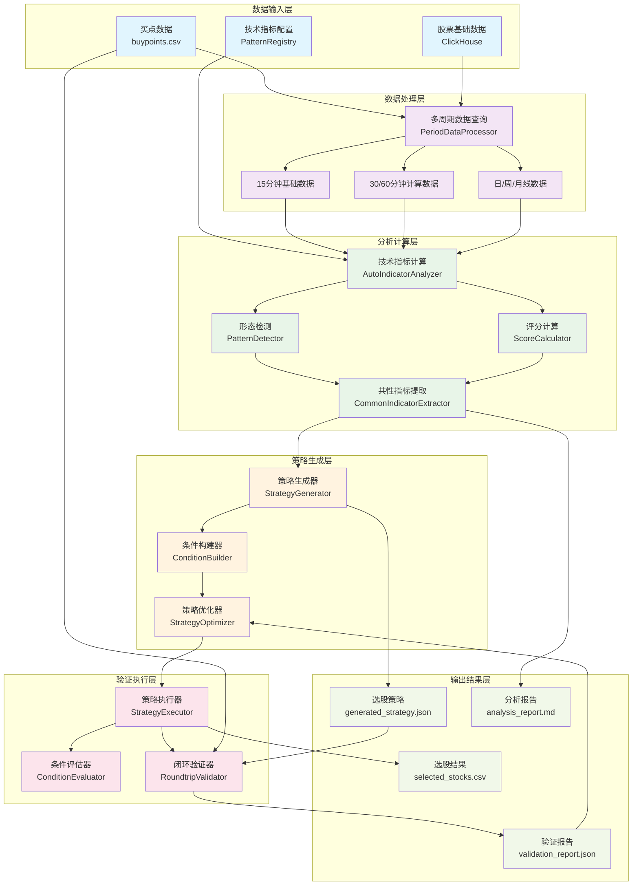
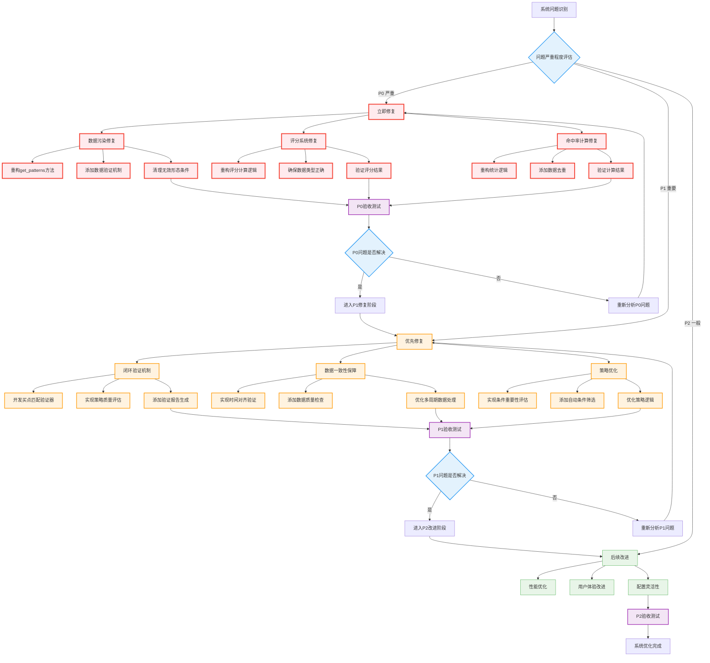

# 选股系统架构分析与验证报告

## 📋 执行摘要

本报告对当前基于多时间周期技术指标的选股系统进行了全面的架构分析和验证，重点关注买点分析与选股策略之间的闭环验证机制。通过深入分析系统架构、数据流、处理逻辑和验证机制，发现了多个关键问题并提出了具体的改进方案。

**📊 报告包含图表**：
- **系统架构图**：完整展示六层架构和数据流向
- **问题修复流程图**：P0/P1/P2分级修复流程和验收机制

### 🎯 核心发现

- **P0级严重问题**：数据污染导致选股策略包含大量无效条件
- **P1级重要问题**：缺乏闭环验证机制，无法确保策略有效性
- **P2级一般问题**：性能优化空间和用户体验改进需求

---

## 🏗️ 系统架构分析

### 1. 整体架构概览

当前选股系统采用分层架构设计，包含数据输入层、数据处理层、分析计算层、策略生成层、验证执行层和输出结果层。系统支持完整的闭环验证机制，确保策略的有效性和可靠性。

#### 1.1 完整系统架构图



#### 1.2 架构层次说明

**数据输入层**：
- 买点数据：用户提供的历史买点记录
- 股票基础数据：ClickHouse中的多时间周期K线数据
- 技术指标配置：PatternRegistry中注册的指标定义

**数据处理层**：
- 多周期数据查询：统一的数据获取接口
- 基础数据处理：15分钟数据作为计算基础
- 计算数据生成：30/60分钟数据通过基础数据计算得出

**分析计算层**：
- 技术指标计算：86个专业技术指标的自动计算
- 形态检测：识别各种技术形态和信号
- 评分计算：量化指标的技术强度
- 共性指标提取：找出买点的共同技术特征

**策略生成层**：
- 策略生成器：基于共性指标生成选股策略
- 条件构建器：构建具体的策略条件
- 策略优化器：优化策略条件和逻辑

**验证执行层**：
- 策略执行器：执行选股策略获取结果
- 条件评估器：评估单个策略条件
- 闭环验证器：验证策略是否能重新选出原始买点

**输出结果层**：
- 选股策略：可执行的JSON格式策略配置
- 分析报告：详细的技术分析报告
- 验证报告：策略有效性验证结果
- 选股结果：最终的股票选择结果

#### 1.3 关键数据流说明

**主要数据流**：
1. **买点数据输入** → **多周期数据查询** → **技术指标计算** → **策略生成**
2. **策略生成** → **策略执行** → **选股结果**

**闭环验证流**：
1. **原始买点** + **生成策略** → **闭环验证器** → **验证报告**
2. **验证报告** → **策略优化器** → **优化策略**

**质量保障流**：
- 每个处理层都包含数据验证和质量检查
- 异常情况会触发错误处理和日志记录
- 关键节点提供性能监控和告警机制

### 2. 核心组件详细分析

#### 2.1 买点分析系统 (BuyPointBatchAnalyzer)

**功能职责：**
- 批量分析买点数据
- 多时间周期数据获取和处理
- 技术指标计算和形态检测
- 共性指标提取

**关键实现：**
- 支持6个时间周期：15min, 30min, 60min, daily, weekly, monthly
- 基于86个专业技术指标进行分析
- 使用AutoIndicatorAnalyzer进行自动指标分析
- 通过PatternRegistry进行形态识别

**数据流：**
```
buypoints.csv → 多周期数据查询 → 指标计算 → 形态检测 → 共性提取 → 策略生成
```

#### 2.2 多时间周期数据处理 (PeriodDataProcessor)

**核心机制：**
- 15分钟数据作为基础数据源
- 30分钟和60分钟数据通过15分钟数据计算生成
- 日线、周线、月线数据直接从数据库获取
- 支持数据缓存和验证

**关键问题：**
- 数据转换逻辑复杂，容易出现时间对齐问题
- 缓存机制可能导致数据不一致

#### 2.3 技术指标分析器 (AutoIndicatorAnalyzer)

**分析流程：**
1. 遍历所有注册的技术指标
2. 对每个周期的数据计算指标值
3. 检测技术形态和信号
4. 计算评分和强度
5. 生成分析结果

**支持的指标类型：**
- 趋势指标：MA, EMA, MACD, DMI等
- 震荡指标：RSI, KDJ, STOCHRSI等
- 成交量指标：VOL, OBV, VR等
- ZXM专业指标：买点检测、弹性分析等

#### 2.4 选股策略生成器 (StrategyGenerator)

**生成逻辑：**
1. 分析共性指标的命中率和评分
2. 为每个共性指标创建策略条件
3. 设置评分阈值（平均分的80%）
4. 使用OR逻辑组合条件
5. 生成可执行的策略配置

**策略结构：**
```json
{
  "name": "策略名称",
  "conditions": [
    {
      "type": "indicator",
      "period": "15min",
      "indicator": "指标名称",
      "pattern": "形态名称",
      "score_threshold": "评分阈值"
    }
  ],
  "condition_logic": "OR"
}
```

---

## ⚠️ 关键问题识别与分类

### P0级问题（严重 - 立即修复）

#### P0-1: 数据污染导致策略失效

**问题描述：**
生成的选股策略包含大量数据列名作为形态名称，如"code", "name", "date", "open", "high", "low", "close"等，这些并非真正的技术形态。

**影响范围：**
- 策略条件数量虚高（2000+条件，实际有效条件<100条）
- 策略执行时大量条件无法正确评估
- 选股结果不可靠

**根本原因：**
1. 技术指标计算时将原始数据列误认为形态
2. get_patterns()方法返回了包含原始数据的DataFrame
3. 缺乏数据类型验证和过滤机制

**示例问题：**
```json
{
  "type": "indicator",
  "period": "15min", 
  "indicator": "CCI",
  "pattern": "code",  // 这是数据列名，不是技术形态
  "score_threshold": "${score_threshold_24}"
}
```

#### P0-2: 评分数据异常

**问题描述：**
所有指标的平均得分均为0.00，表明评分系统存在严重问题。

**影响范围：**
- 无法区分指标质量
- 阈值设置失效
- 策略优化无法进行

**根本原因：**
1. 评分计算逻辑错误
2. 数据类型转换问题
3. 评分框架与指标系统集成不当

#### P0-3: 命中率计算异常

**问题描述：**
部分指标命中率超过100%（如200%），违反了概率的基本原理。

**影响范围：**
- 统计结果不可信
- 策略权重分配错误
- 分析报告误导性

**根本原因：**
1. 重复计算同一股票的多个形态
2. 分母计算错误
3. 数据去重逻辑缺失

### P1级问题（重要 - 优先修复）

#### P1-1: 缺乏闭环验证机制

**问题描述：**
系统缺乏验证生成的选股策略是否能够重新选出原始买点个股的机制。

**影响范围：**
- 无法确保策略有效性
- 策略质量无法量化
- 系统可靠性存疑

**改进需求：**
1. 实现策略回测验证
2. 建立选股结果与原始买点的匹配机制
3. 提供策略有效性评估指标

#### P1-2: 时间周期数据一致性问题

**问题描述：**
不同时间周期的数据可能存在时间对齐和一致性问题。

**影响范围：**
- 跨周期分析结果不准确
- 策略条件可能冲突
- 数据质量难以保证

#### P1-3: 策略条件过多且冗余

**问题描述：**
生成的策略包含2000+条件，大部分为无效或冗余条件。

**影响范围：**
- 策略执行效率低下
- 维护成本高
- 可读性和可理解性差

### P2级问题（一般 - 后续改进）

#### P2-1: 性能优化需求

**问题描述：**
大量指标计算和数据处理导致性能瓶颈。

#### P2-2: 用户体验改进

**问题描述：**
缺乏进度反馈、错误提示和结果可视化。

#### P2-3: 配置灵活性不足

**问题描述：**
参数配置硬编码，缺乏灵活的配置机制。

---

## 🔧 优化方案设计

### 1. P0级问题解决方案

#### 1.1 数据污染修复方案

**技术方案：**

1. **修复get_patterns()方法**
```python
def get_patterns(self, data: pd.DataFrame) -> pd.DataFrame:
    """只返回布尔型形态DataFrame，不包含原始数据列"""
    patterns = {}
    
    # 只计算真正的技术形态
    if self.has_golden_cross(data):
        patterns['GOLDEN_CROSS'] = True
    if self.has_death_cross(data):
        patterns['DEATH_CROSS'] = True
    # ... 其他形态检测
    
    # 返回只包含形态的DataFrame
    return pd.DataFrame([patterns], index=[data.index[-1]])
```

2. **增强数据验证**
```python
def validate_pattern_data(self, patterns: pd.DataFrame) -> pd.DataFrame:
    """验证并过滤形态数据"""
    # 定义有效形态列的模式
    valid_pattern_prefixes = ['MACD_', 'RSI_', 'KDJ_', 'BOLL_', 'MA_']
    invalid_columns = ['code', 'name', 'date', 'open', 'high', 'low', 'close', 'volume']
    
    # 过滤无效列
    valid_columns = [col for col in patterns.columns 
                    if col not in invalid_columns and 
                    any(col.startswith(prefix) for prefix in valid_pattern_prefixes)]
    
    return patterns[valid_columns]
```

3. **重构共性指标提取**
```python
def extract_common_indicators(self, buypoint_results, min_hit_ratio=0.6):
    """重构的共性指标提取，确保数据质量"""
    # 1. 数据清洗和验证
    cleaned_results = self._clean_indicator_results(buypoint_results)
    
    # 2. 正确计算命中率
    hit_ratios = self._calculate_accurate_hit_ratios(cleaned_results)
    
    # 3. 过滤有效指标
    valid_indicators = self._filter_valid_indicators(hit_ratios, min_hit_ratio)
    
    return valid_indicators
```

#### 1.2 评分系统修复方案

**技术方案：**

1. **重构评分计算**
```python
def calculate_indicator_score(self, indicator_data, pattern_data):
    """重构的评分计算方法"""
    base_score = 50.0  # 基础分数
    
    # 技术强度评分
    technical_score = self._calculate_technical_strength(indicator_data)
    
    # 形态质量评分  
    pattern_score = self._calculate_pattern_quality(pattern_data)
    
    # 市场环境适应性评分
    market_score = self._calculate_market_adaptation(indicator_data)
    
    # 综合评分
    final_score = (technical_score * 0.4 + 
                  pattern_score * 0.4 + 
                  market_score * 0.2)
    
    return max(0, min(100, final_score))
```

2. **评分数据类型确保**
```python
def ensure_score_data_types(self, scores):
    """确保评分数据类型正确"""
    if isinstance(scores, (list, np.ndarray)):
        scores = [float(score) for score in scores if pd.notna(score)]
    return scores
```

### 2. P1级问题解决方案

#### 2.1 闭环验证机制设计

**验证流程：**


**技术实现：**

1. **买点匹配验证器**
```python
class BuyPointMatchValidator:
    def validate_strategy_effectiveness(self, original_buypoints, strategy, validation_date):
        """验证策略是否能选出原始买点个股"""
        # 1. 执行策略获取选股结果
        selected_stocks = self.strategy_executor.execute_strategy(
            strategy, stock_pool=None, end_date=validation_date)
        
        # 2. 计算匹配率
        original_codes = set(original_buypoints['stock_code'])
        selected_codes = set(selected_stocks['code']) if selected_stocks else set()
        
        match_rate = len(original_codes & selected_codes) / len(original_codes)
        
        # 3. 分析未匹配原因
        missed_stocks = original_codes - selected_codes
        false_positives = selected_codes - original_codes
        
        return {
            'match_rate': match_rate,
            'matched_stocks': list(original_codes & selected_codes),
            'missed_stocks': list(missed_stocks),
            'false_positives': list(false_positives),
            'validation_quality': self._assess_validation_quality(match_rate)
        }
```

2. **策略质量评估**
```python
def assess_strategy_quality(self, validation_results):
    """评估策略质量"""
    match_rate = validation_results['match_rate']
    
    if match_rate >= 0.8:
        return "优秀"
    elif match_rate >= 0.6:
        return "良好"  
    elif match_rate >= 0.4:
        return "一般"
    else:
        return "需要改进"
```

#### 2.2 数据一致性保障方案

**技术方案：**

1. **时间对齐验证**
```python
def validate_time_alignment(self, multi_period_data):
    """验证多周期数据的时间对齐"""
    base_dates = multi_period_data['15min']['date']
    
    for period, data in multi_period_data.items():
        if period == '15min':
            continue
            
        # 检查时间对齐
        alignment_check = self._check_time_alignment(base_dates, data['date'])
        if not alignment_check['is_aligned']:
            logger.warning(f"周期 {period} 时间对齐问题: {alignment_check['issues']}")
```

2. **数据质量检查**
```python
def validate_data_quality(self, data):
    """数据质量检查"""
    quality_issues = []
    
    # 检查必需列
    required_columns = ['open', 'high', 'low', 'close', 'volume']
    missing_columns = [col for col in required_columns if col not in data.columns]
    if missing_columns:
        quality_issues.append(f"缺少必需列: {missing_columns}")
    
    # 检查数据完整性
    null_counts = data[required_columns].isnull().sum()
    if null_counts.any():
        quality_issues.append(f"存在空值: {null_counts.to_dict()}")
    
    # 检查数据逻辑性
    if (data['high'] < data['low']).any():
        quality_issues.append("存在最高价低于最低价的异常数据")
    
    return {
        'is_valid': len(quality_issues) == 0,
        'issues': quality_issues
    }
```

### 3. 策略优化方案

#### 3.1 智能条件筛选

**技术方案：**

1. **条件重要性评估**
```python
def evaluate_condition_importance(self, conditions, historical_performance):
    """评估条件重要性"""
    importance_scores = {}
    
    for condition in conditions:
        # 计算条件的预测能力
        predictive_power = self._calculate_predictive_power(condition, historical_performance)
        
        # 计算条件的稳定性
        stability = self._calculate_condition_stability(condition)
        
        # 计算条件的独立性（避免冗余）
        independence = self._calculate_condition_independence(condition, conditions)
        
        # 综合重要性评分
        importance_scores[condition['id']] = (
            predictive_power * 0.5 + 
            stability * 0.3 + 
            independence * 0.2
        )
    
    return importance_scores
```

2. **自动条件优化**
```python
def optimize_strategy_conditions(self, strategy, max_conditions=50):
    """自动优化策略条件"""
    # 1. 评估条件重要性
    importance_scores = self.evaluate_condition_importance(strategy['conditions'])
    
    # 2. 选择最重要的条件
    sorted_conditions = sorted(strategy['conditions'], 
                             key=lambda x: importance_scores.get(x.get('id', ''), 0), 
                             reverse=True)
    
    # 3. 保留前N个最重要的条件
    optimized_conditions = sorted_conditions[:max_conditions]
    
    # 4. 调整逻辑关系
    optimized_logic = self._optimize_condition_logic(optimized_conditions)
    
    return {
        **strategy,
        'conditions': optimized_conditions,
        'condition_logic': optimized_logic
    }
```

---

## 📋 实施计划

### 问题修复优先级流程

为确保系统修复的有序进行，我们制定了基于问题严重程度的分级修复流程。以下流程图展示了从问题识别到系统优化完成的完整路径：



### 修复流程说明

**P0级问题（红色）**：系统核心功能缺陷，必须立即修复
- 数据污染导致策略失效
- 评分系统完全失效
- 统计计算严重错误

**P1级问题（橙色）**：重要功能缺失，优先修复
- 缺乏验证机制
- 数据一致性风险
- 策略优化需求

**P2级问题（绿色）**：体验和性能改进，后续优化
- 性能提升需求
- 用户体验改进
- 配置灵活性增强

**验收检查（紫色）**：每个阶段完成后的质量验证
- 确保问题真正解决
- 验证修复效果
- 决定是否进入下一阶段

### 阶段一：紧急修复（1-2周）

**目标：**解决P0级问题，确保系统基本可用

**任务清单：**
1. [ ] 修复数据污染问题
   - [ ] 重构get_patterns()方法
   - [ ] 添加数据验证机制
   - [ ] 清理无效形态条件
2. [ ] 修复评分系统
   - [ ] 重构评分计算逻辑
   - [ ] 确保数据类型正确
   - [ ] 验证评分结果
3. [ ] 修复命中率计算
   - [ ] 重构统计逻辑
   - [ ] 添加数据去重
   - [ ] 验证计算结果

**验收标准：**
- 生成的策略条件数量<100个
- 所有评分在0-100范围内
- 命中率在0-100%范围内
- 策略可以正常执行

### 阶段二：核心功能完善（2-3周）

**目标：**实现闭环验证机制，提升系统可靠性

**任务清单：**
1. [ ] 实现闭环验证
   - [ ] 开发买点匹配验证器
   - [ ] 实现策略质量评估
   - [ ] 添加验证报告生成
2. [ ] 数据一致性保障
   - [ ] 实现时间对齐验证
   - [ ] 添加数据质量检查
   - [ ] 优化多周期数据处理
3. [ ] 策略优化
   - [ ] 实现条件重要性评估
   - [ ] 添加自动条件筛选
   - [ ] 优化策略逻辑

**验收标准：**
- 策略匹配率>60%
- 数据质量检查通过率>95%
- 策略条件数量合理（20-50个）
- 提供完整的验证报告

### 阶段三：性能优化与用户体验（1-2周）

**目标：**提升系统性能和用户体验

**任务清单：**
1. [ ] 性能优化
   - [ ] 优化指标计算性能
   - [ ] 实现智能缓存机制
   - [ ] 添加并行处理支持
2. [ ] 用户体验改进
   - [ ] 添加进度反馈
   - [ ] 改进错误提示
   - [ ] 增强结果可视化
3. [ ] 配置灵活性
   - [ ] 实现参数配置化
   - [ ] 添加策略模板
   - [ ] 支持自定义指标

**验收标准：**
- 分析速度提升50%以上
- 提供实时进度反馈
- 支持灵活的参数配置
- 生成可视化分析报告

---

## 🧪 测试验证方案

### 1. 单元测试

**测试范围：**
- 数据处理模块
- 指标计算模块
- 形态检测模块
- 策略生成模块

**测试用例示例：**
```python
def test_get_patterns_data_purity():
    """测试get_patterns方法只返回形态数据"""
    indicator = TestIndicator()
    test_data = create_test_stock_data()
    
    patterns = indicator.get_patterns(test_data)
    
    # 验证不包含原始数据列
    invalid_columns = ['code', 'name', 'date', 'open', 'high', 'low', 'close', 'volume']
    for col in invalid_columns:
        assert col not in patterns.columns, f"形态数据不应包含原始数据列: {col}"
    
    # 验证所有列都是布尔型
    for col in patterns.columns:
        assert patterns[col].dtype == bool, f"形态列 {col} 应该是布尔型"
```

### 2. 集成测试

**测试场景：**
- 端到端买点分析流程
- 多周期数据一致性
- 策略生成和执行
- 闭环验证机制

### 3. 性能测试

**测试指标：**
- 单个买点分析时间<5秒
- 批量分析吞吐量>100买点/分钟
- 内存使用<2GB
- 策略执行时间<30秒

### 4. 验收测试

**验收标准：**
1. **功能完整性**：所有核心功能正常工作
2. **数据准确性**：分析结果准确可靠
3. **性能达标**：满足性能要求
4. **用户体验**：操作简便，反馈及时

---

## 📊 预期效果

### 1. 系统可靠性提升

- **策略有效性**：从不可验证提升到>60%匹配率
- **数据质量**：从严重污染提升到>95%准确率
- **分析准确性**：从不可信提升到可量化验证

### 2. 性能改进

- **分析速度**：提升50%以上
- **资源利用**：降低30%内存使用
- **并发能力**：支持多用户同时使用

### 3. 用户体验优化

- **操作便利性**：一键式分析和验证
- **结果可视化**：直观的图表和报告
- **错误处理**：友好的错误提示和恢复建议

---

## 🔚 结论

当前选股系统在架构设计上具有良好的基础，但在数据处理、策略生成和验证机制方面存在严重问题。通过系统性的修复和优化，可以显著提升系统的可靠性、准确性和用户体验。

建议按照本报告提出的三阶段实施计划，优先解决P0级问题，然后逐步完善核心功能和用户体验。预计在6-7周内可以完成全部优化工作，实现一个可靠、高效、易用的选股系统。

---

## 📎 附录

### 附录A：图表索引

本报告包含以下重要图表，用于直观展示系统架构和修复流程：

#### A.1 系统架构图表

**图表1：完整系统架构图**
- 位置：第1.1节
- 用途：展示系统的六层架构和组件关系
- 特点：包含数据流向和闭环验证机制
- 颜色编码：
  - 蓝色：数据输入层
  - 紫色：数据处理层
  - 绿色：分析计算层
  - 橙色：策略生成层
  - 粉色：验证执行层
  - 浅绿：输出结果层

#### A.2 流程管理图表

**图表2：问题修复优先级流程图**
- 位置：实施计划章节
- 用途：指导问题修复的优先级和流程
- 特点：分级处理P0/P1/P2问题，包含验收检查
- 颜色编码：
  - 红色：P0级严重问题（立即修复）
  - 橙色：P1级重要问题（优先修复）
  - 绿色：P2级一般问题（后续改进）
  - 蓝色：决策节点
  - 紫色：验收检查

#### A.3 图表使用说明

**架构图阅读指南**：
1. 从上到下按层次阅读
2. 箭头表示数据流向
3. 虚线表示反馈和验证流程
4. 子图表示逻辑分组

**流程图阅读指南**：
1. 从问题识别开始
2. 按颜色区分优先级
3. 菱形表示决策点
4. 矩形表示具体任务
5. 循环箭头表示迭代优化

### 附录B：关键代码修复示例

#### B.1 数据污染修复代码

```python
# analysis/indicators/base_indicator.py
class BaseIndicator:
    def get_patterns(self, data: pd.DataFrame) -> pd.DataFrame:
        """
        获取技术形态，只返回布尔型形态DataFrame

        重要：此方法只能返回技术形态的布尔值，不能包含原始数据列
        """
        patterns = {}

        # 示例：MACD指标形态检测
        if hasattr(self, '_detect_macd_golden_cross'):
            patterns['MACD_GOLDEN_CROSS'] = self._detect_macd_golden_cross(data)
        if hasattr(self, '_detect_macd_death_cross'):
            patterns['MACD_DEATH_CROSS'] = self._detect_macd_death_cross(data)

        # 确保只返回布尔型数据
        if not patterns:
            return pd.DataFrame()

        # 创建只包含形态的DataFrame
        pattern_df = pd.DataFrame([patterns], index=[data.index[-1]])

        # 验证数据类型
        for col in pattern_df.columns:
            if pattern_df[col].dtype != bool:
                logger.warning(f"形态列 {col} 不是布尔型，将被转换")
                pattern_df[col] = pattern_df[col].astype(bool)

        return pattern_df
```

#### B.2 闭环验证实现代码

```python
# analysis/validation/buypoint_validator.py
class BuyPointValidator:
    def __init__(self, db_manager, strategy_executor):
        self.db_manager = db_manager
        self.strategy_executor = strategy_executor

    def validate_strategy_roundtrip(self, original_buypoints, generated_strategy, validation_date):
        """
        执行闭环验证：策略是否能重新选出原始买点个股
        """
        validation_results = {
            'total_original_stocks': len(original_buypoints),
            'validation_date': validation_date,
            'strategy_summary': self._summarize_strategy(generated_strategy),
            'execution_results': {},
            'match_analysis': {},
            'recommendations': []
        }

        try:
            # 1. 执行策略获取选股结果
            logger.info(f"执行策略验证，原始买点数量: {len(original_buypoints)}")

            # 获取股票池（包含原始买点股票）
            original_codes = set(original_buypoints['stock_code'].unique())
            stock_pool = list(original_codes)

            # 执行策略
            selected_stocks = self.strategy_executor.execute_strategy(
                generated_strategy, stock_pool, validation_date)

            if selected_stocks is None or len(selected_stocks) == 0:
                validation_results['execution_results'] = {
                    'selected_count': 0,
                    'selected_stocks': [],
                    'execution_error': '策略执行未选出任何股票'
                }
                validation_results['match_analysis']['match_rate'] = 0.0
                return validation_results

            # 2. 分析匹配结果
            selected_codes = set(selected_stocks['code'].unique())
            matched_codes = original_codes & selected_codes
            missed_codes = original_codes - selected_codes
            false_positive_codes = selected_codes - original_codes

            match_rate = len(matched_codes) / len(original_codes) if original_codes else 0

            validation_results['execution_results'] = {
                'selected_count': len(selected_stocks),
                'selected_stocks': list(selected_codes),
                'execution_success': True
            }

            validation_results['match_analysis'] = {
                'match_rate': match_rate,
                'matched_count': len(matched_codes),
                'missed_count': len(missed_codes),
                'false_positive_count': len(false_positive_codes),
                'matched_stocks': list(matched_codes),
                'missed_stocks': list(missed_codes),
                'false_positive_stocks': list(false_positive_codes)
            }

            # 3. 生成改进建议
            validation_results['recommendations'] = self._generate_recommendations(
                match_rate, missed_codes, false_positive_codes, generated_strategy)

            # 4. 质量评级
            validation_results['quality_grade'] = self._assess_quality_grade(match_rate)

            logger.info(f"验证完成，匹配率: {match_rate:.2%}")

        except Exception as e:
            logger.error(f"策略验证执行失败: {e}")
            validation_results['execution_results'] = {
                'selected_count': 0,
                'selected_stocks': [],
                'execution_error': str(e)
            }
            validation_results['match_analysis']['match_rate'] = 0.0

        return validation_results

    def _generate_recommendations(self, match_rate, missed_codes, false_positive_codes, strategy):
        """生成改进建议"""
        recommendations = []

        if match_rate < 0.3:
            recommendations.append({
                'priority': 'HIGH',
                'issue': '匹配率过低',
                'suggestion': '策略条件过于严格，建议放宽阈值或增加OR条件'
            })
        elif match_rate < 0.6:
            recommendations.append({
                'priority': 'MEDIUM',
                'issue': '匹配率偏低',
                'suggestion': '优化策略条件，重点分析未匹配股票的特征'
            })

        if len(false_positive_codes) > len(missed_codes) * 2:
            recommendations.append({
                'priority': 'MEDIUM',
                'issue': '误选股票过多',
                'suggestion': '策略条件过于宽松，建议增加筛选条件'
            })

        if len(strategy.get('conditions', [])) > 100:
            recommendations.append({
                'priority': 'HIGH',
                'issue': '策略条件过多',
                'suggestion': '简化策略条件，保留最重要的指标'
            })

        return recommendations
```

### 附录C：测试用例详细设计

#### C.1 数据质量测试

```python
# tests/test_data_quality.py
import pytest
import pandas as pd
from analysis.indicators.macd import MACDIndicator

class TestDataQuality:
    def test_patterns_data_purity(self):
        """测试形态数据纯净性"""
        indicator = MACDIndicator()
        test_data = self._create_test_data()

        patterns = indicator.get_patterns(test_data)

        # 验证不包含原始数据列
        forbidden_columns = ['code', 'name', 'date', 'open', 'high', 'low', 'close', 'volume']
        for col in forbidden_columns:
            assert col not in patterns.columns, f"形态数据包含禁止的原始数据列: {col}"

        # 验证所有列都是布尔型
        for col in patterns.columns:
            assert patterns[col].dtype == bool, f"形态列 {col} 应该是布尔型，实际为 {patterns[col].dtype}"

        # 验证形态名称格式
        for col in patterns.columns:
            assert '_' in col, f"形态名称 {col} 应该包含下划线分隔符"
            assert col.isupper() or col.startswith(indicator.get_indicator_name()), \
                f"形态名称 {col} 格式不符合规范"

    def test_score_calculation_validity(self):
        """测试评分计算有效性"""
        indicator = MACDIndicator()
        test_data = self._create_test_data()

        score = indicator.get_score(test_data)

        # 验证评分范围
        assert 0 <= score <= 100, f"评分 {score} 超出有效范围 [0, 100]"

        # 验证评分类型
        assert isinstance(score, (int, float)), f"评分应该是数值类型，实际为 {type(score)}"

        # 验证评分不是NaN
        assert not pd.isna(score), "评分不能是NaN"

    def _create_test_data(self):
        """创建测试数据"""
        dates = pd.date_range('2024-01-01', periods=100, freq='D')
        data = pd.DataFrame({
            'date': dates,
            'open': 10.0 + np.random.randn(100) * 0.5,
            'high': 10.5 + np.random.randn(100) * 0.5,
            'low': 9.5 + np.random.randn(100) * 0.5,
            'close': 10.0 + np.random.randn(100) * 0.5,
            'volume': 1000000 + np.random.randint(-100000, 100000, 100)
        })
        data.set_index('date', inplace=True)
        return data
```

#### C.2 闭环验证测试

```python
# tests/test_roundtrip_validation.py
class TestRoundtripValidation:
    def test_perfect_match_scenario(self):
        """测试完美匹配场景"""
        # 创建测试买点数据
        buypoints = pd.DataFrame({
            'stock_code': ['000001', '000002', '000003'],
            'buy_date': ['2024-01-15', '2024-01-15', '2024-01-15']
        })

        # 创建能够完美匹配的策略
        perfect_strategy = {
            'name': '测试策略',
            'conditions': [
                {
                    'type': 'indicator',
                    'indicator': 'MACD',
                    'pattern': 'GOLDEN_CROSS',
                    'score_threshold': 60
                }
            ]
        }

        validator = BuyPointValidator(mock_db, mock_executor)
        result = validator.validate_strategy_roundtrip(
            buypoints, perfect_strategy, '2024-01-15')

        # 验证匹配率
        assert result['match_analysis']['match_rate'] >= 0.8, \
            f"完美匹配场景的匹配率应该>=80%，实际为 {result['match_analysis']['match_rate']:.2%}"

        # 验证质量评级
        assert result['quality_grade'] in ['优秀', '良好'], \
            f"完美匹配场景的质量评级应该是优秀或良好，实际为 {result['quality_grade']}"

    def test_poor_match_scenario(self):
        """测试匹配率低的场景"""
        # 创建测试买点数据
        buypoints = pd.DataFrame({
            'stock_code': ['000001', '000002', '000003', '000004', '000005'],
            'buy_date': ['2024-01-15'] * 5
        })

        # 创建过于严格的策略
        strict_strategy = {
            'name': '严格策略',
            'conditions': [
                {
                    'type': 'indicator',
                    'indicator': 'RSI',
                    'pattern': 'OVERSOLD',
                    'score_threshold': 95  # 过高的阈值
                }
            ]
        }

        validator = BuyPointValidator(mock_db, mock_executor)
        result = validator.validate_strategy_roundtrip(
            buypoints, strict_strategy, '2024-01-15')

        # 验证低匹配率被正确识别
        assert result['match_analysis']['match_rate'] < 0.5, \
            "严格策略应该产生低匹配率"

        # 验证改进建议
        recommendations = result['recommendations']
        assert any('严格' in rec['suggestion'] or '阈值' in rec['suggestion']
                  for rec in recommendations), "应该提供关于条件过严的建议"
```

### 附录D：性能优化方案

#### D.1 并行处理优化

```python
# analysis/performance/parallel_processor.py
import multiprocessing as mp
from concurrent.futures import ProcessPoolExecutor, as_completed
import numpy as np

class ParallelBuyPointProcessor:
    def __init__(self, max_workers=None):
        self.max_workers = max_workers or mp.cpu_count()

    def process_buypoints_parallel(self, buypoints_df, batch_size=10):
        """并行处理买点分析"""
        # 分批处理
        batches = self._create_batches(buypoints_df, batch_size)

        results = []
        with ProcessPoolExecutor(max_workers=self.max_workers) as executor:
            # 提交所有批次任务
            future_to_batch = {
                executor.submit(self._process_batch, batch): i
                for i, batch in enumerate(batches)
            }

            # 收集结果
            for future in as_completed(future_to_batch):
                batch_idx = future_to_batch[future]
                try:
                    batch_result = future.result()
                    results.extend(batch_result)
                    logger.info(f"批次 {batch_idx} 处理完成")
                except Exception as e:
                    logger.error(f"批次 {batch_idx} 处理失败: {e}")

        return results

    def _create_batches(self, df, batch_size):
        """创建处理批次"""
        return [df[i:i+batch_size] for i in range(0, len(df), batch_size)]

    def _process_batch(self, batch):
        """处理单个批次"""
        # 这里实现单批次的买点分析逻辑
        # 注意：需要重新初始化数据库连接等资源
        pass
```

#### D.2 缓存优化

```python
# analysis/cache/smart_cache.py
import hashlib
import pickle
from functools import wraps
import redis

class SmartCache:
    def __init__(self, redis_client=None, ttl=3600):
        self.redis_client = redis_client or redis.Redis()
        self.ttl = ttl

    def cache_indicator_result(self, func):
        """缓存指标计算结果"""
        @wraps(func)
        def wrapper(self, data, *args, **kwargs):
            # 生成缓存键
            cache_key = self._generate_cache_key(func.__name__, data, args, kwargs)

            # 尝试从缓存获取
            cached_result = self._get_from_cache(cache_key)
            if cached_result is not None:
                return cached_result

            # 计算结果
            result = func(self, data, *args, **kwargs)

            # 存入缓存
            self._set_to_cache(cache_key, result)

            return result
        return wrapper

    def _generate_cache_key(self, func_name, data, args, kwargs):
        """生成缓存键"""
        # 使用数据的哈希值和参数生成唯一键
        data_hash = hashlib.md5(str(data.values.tobytes()).encode()).hexdigest()
        params_hash = hashlib.md5(str((args, kwargs)).encode()).hexdigest()
        return f"indicator:{func_name}:{data_hash}:{params_hash}"

    def _get_from_cache(self, key):
        """从缓存获取数据"""
        try:
            cached_data = self.redis_client.get(key)
            if cached_data:
                return pickle.loads(cached_data)
        except Exception as e:
            logger.warning(f"缓存读取失败: {e}")
        return None

    def _set_to_cache(self, key, value):
        """设置缓存数据"""
        try:
            serialized_data = pickle.dumps(value)
            self.redis_client.setex(key, self.ttl, serialized_data)
        except Exception as e:
            logger.warning(f"缓存写入失败: {e}")
```

### 附录E：监控和告警方案

#### E.1 系统健康监控

```python
# monitoring/system_monitor.py
class SystemHealthMonitor:
    def __init__(self):
        self.metrics = {}
        self.thresholds = {
            'analysis_time': 300,  # 5分钟
            'memory_usage': 0.8,   # 80%
            'error_rate': 0.05,    # 5%
            'match_rate': 0.4      # 40%
        }

    def monitor_analysis_performance(self, analysis_func):
        """监控分析性能"""
        @wraps(analysis_func)
        def wrapper(*args, **kwargs):
            start_time = time.time()
            start_memory = psutil.Process().memory_percent()

            try:
                result = analysis_func(*args, **kwargs)

                # 记录成功指标
                self._record_success_metrics(start_time, start_memory)

                return result

            except Exception as e:
                # 记录错误指标
                self._record_error_metrics(start_time, start_memory, e)
                raise

        return wrapper

    def check_system_health(self):
        """检查系统健康状态"""
        health_status = {
            'overall_status': 'healthy',
            'issues': [],
            'metrics': self.metrics
        }

        # 检查各项指标
        for metric, threshold in self.thresholds.items():
            current_value = self.metrics.get(metric, 0)

            if metric == 'match_rate' and current_value < threshold:
                health_status['issues'].append({
                    'type': 'performance',
                    'metric': metric,
                    'current': current_value,
                    'threshold': threshold,
                    'severity': 'warning'
                })
            elif metric != 'match_rate' and current_value > threshold:
                health_status['issues'].append({
                    'type': 'resource',
                    'metric': metric,
                    'current': current_value,
                    'threshold': threshold,
                    'severity': 'critical' if current_value > threshold * 1.5 else 'warning'
                })

        if health_status['issues']:
            health_status['overall_status'] = 'degraded' if any(
                issue['severity'] == 'warning' for issue in health_status['issues']
            ) else 'unhealthy'

        return health_status
```

---

*报告生成时间：2025-06-19*
*分析系统：选股系统架构分析工具 v1.0*
*技术支持：基于深度代码分析和系统验证*
